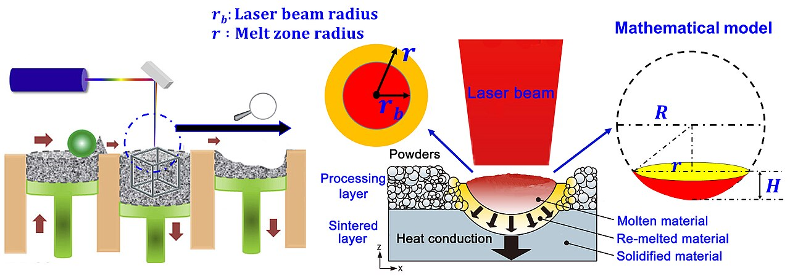
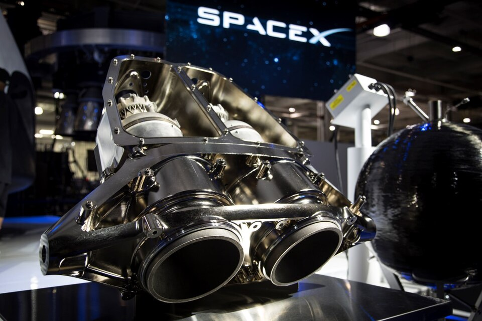

About 2007, by the company's reckoning, engineers at CFM International, the joint venture of **[GE Aviation](kloom:e/ge-aerospace)** and France's Safran, began designing a fuel-efficient engine for single-aisle airliners, the **[CFM International LEAP](kloom:e/cfm-international-leap)**. A key to it was the fuel nozzle. Its tip, which sprays fuel into the combustor, had an interior so intricate that it took more than twenty pieces, welded and brazed together. "We tried to cast it eight times, and we failed every time," Mohammad Ehteshami, a GE Aviation engineering chief who later ran GE Additive, told the company's magazine in 2017. So they sent the drawing to Greg Morris, a Cincinnati engineer whose small firm used lasers to weld hair-thin layers of metal powder into parts. He printed the tip in one piece from a nickel alloy. In GE's account it weighed 25% less and lasted more than five times as long. GE bought Morris's company in 2012, and in 2015 its plant at Auburn, Alabama, became the first to make jet-engine parts by printing in mass production. Each LEAP has 18 or 19 nozzles; the engine entered service in 2016, and in 2021 Auburn shipped its 100,000th tip. (GE's own pages give the old part count as "about 20", "more than 20" and "all 20".)

## Melting, not sintering

The process Morris used is **[selective laser melting](kloom:e/selective-laser-melting)**, or laser powder bed fusion. It grew from laser sintering, but in sintering the grains are only partly melted, or held by a binder, and a metal part that must carry load has to be fully dense. On 2 December 1996 three researchers at the **[Fraunhofer-Gesellschaft](kloom:e/fraunhofer-gesellschaft)**'s laser institute in Aachen, Wilhelm Meiners, Konrad Wissenbach and Andres Gasser, filed the patent that defined the difference. Their powder carried no binder and no flux; the laser's energy was chosen to melt each layer right through, so it fused to the one below; each track overlapped the last; and a protective gas covered the melt.

## The build

The plate shows a build in section. A blade spreads a layer of powder across a steel build plate, a laser steered by mirrors melts that layer's slice of the part, the plate drops by one layer, and the cycle repeats, in a chamber flooded with argon so the hot metal does not oxidize. A study of **[Inconel](kloom:e/inconel)** 625, a nickel superalloy, published its settings in full, and they are a fair example:

| Setting              | In the Inconel 625 study                |
| -------------------- | --------------------------------------- |
| Powder               | gas-atomized spheres, 15–45 µm across   |
| Layer                | 40 µm                                   |
| Laser                | 250 W, moving at 750 mm/s               |
| Space between tracks | 0.11 mm                                 |
| Atmosphere           | argon, held at 0.2% oxygen              |
| Build plate          | preheated to 80 °C                      |
| After the build      | 870 °C for one hour, still on the plate |

By our arithmetic, a part 50 mm tall at 40 µm a layer is 1,250 layers, and the melt pool, a fraction of a millimeter across, runs over every square millimeter of every slice. Wikipedia gives oxygen below 1,000 parts per million (0.1%) as the usual limit, half the level this study allowed.

## Stress, and the plate

What goes wrong is **[residual stress](kloom:e/residual-stress)**. Peter Mercelis and Jean-Pierre Kruth, at Leuven, set out its two causes in 2006. As the laser heats the top layer it tries to expand, but the cold metal below holds it, so it is squeezed until it yields; when it cools it is too short, and pulls. And a layer that was liquid shrinks as it freezes onto solid metal that does not. Either way each new layer is left in tension on top of metal in compression, and while the part stays welded to its plate the stress near the top reaches the alloy's yield strength. Cut it free and the stress lets go at once: the part shrinks and bends. A bridge-shaped test piece, as the plate draws, curls up at its ends and pulls its feet in.

So the part is heat-treated before it is cut off. In the Inconel 625 study, an hour at 870 °C on the plate cut the bridge's distortion by 39% to 63%, depending on the scan pattern. Mercelis and Kruth found the pattern matters too: short tracks gave the highest stress, long tracks the lowest, and scanning in small squares in turn came between. NASA's standard for flight hardware makes taking the part off the plate a controlled step, planned around the stress relief, and requires hot isostatic pressing to reduce the internal defects the laser leaves.

## Rockets

Rocket engines, made in tens rather than thousands, took to it too. **SpaceX** printed the regeneratively cooled combustion chamber of its **[SuperDraco](kloom:e/superdraco)** escape thruster in Inconel; it went from concept to first firing in just over three months, and by July 2014 had fired more than 80 times. Rocket Lab's Rutherford engine prints its chamber, injectors, pumps and main valves.

A printed part is no longer a prototype: it is in the engines of airliners and on a spacecraft built to carry people. The last segment turns to making now, beginning with the most precise machines anyone makes in quantity.
