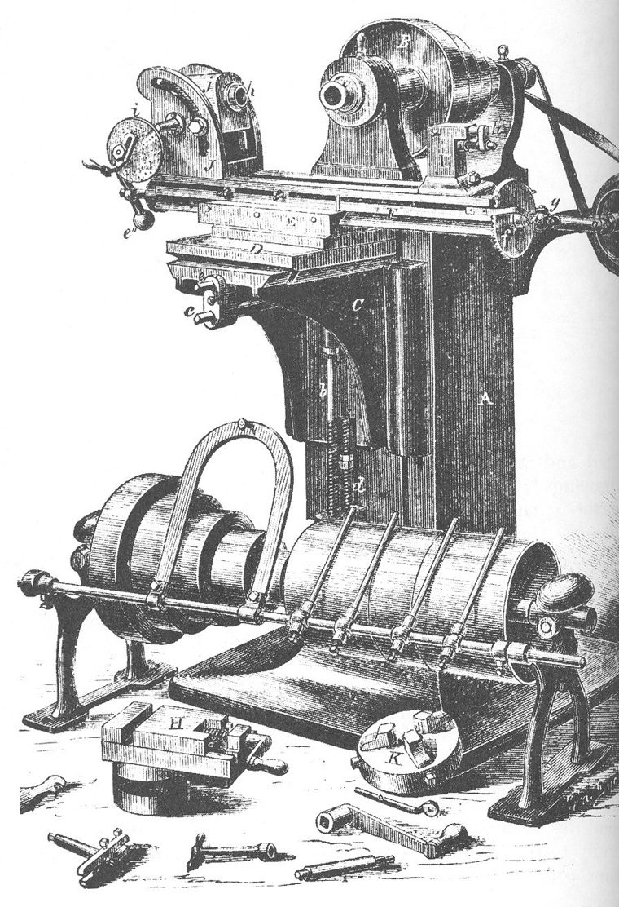
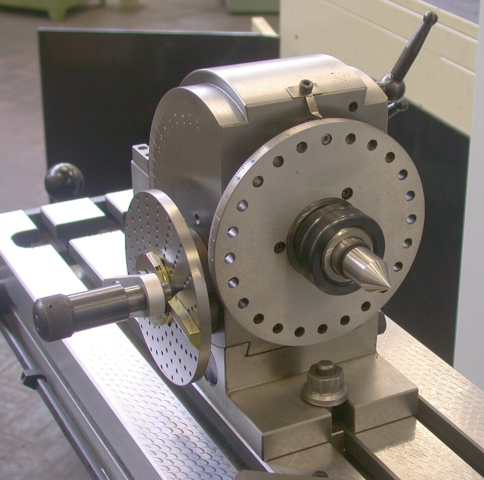

A lathe can only make things round. The flats, slots and curves of a gun lock were shaped by hand, with a file. **[Milling](kloom:e/milling-machining)** replaced the file with a machine: a cutter with many teeth, turning on a spindle, while the work is fed past it on a table that can be moved in length, across and up and down. Every tooth takes a small chip, and the table's screws, not a hand, decide where the cutter goes. The machine that gave it its mature form, Joseph R. Brown's universal milling machine of 1862, was built to solve one awkward job, the spiral grooves of a twist drill, and turned out to do nearly everything.

## Who milled first

The first milling machines were built in the arms works of New England in the 1810s, and nobody kept a record of which came first. For decades the honour went to **[Eli Whitney](kloom:e/eli-whitney)**. In 1912 the historian Joseph W. Roe found a small, crude machine at New Haven that Whitney's grandson had been shown since boyhood as his grandfather's, and dated it to 1818 from a line in the _Encyclopaedia Britannica_ about "a gun factory in Connecticut". Robert S. Woodbury, writing his history of the milling machine in 1959, kept it as the oldest that survives but showed that the date was an assumption: the first clear evidence that Whitney milled anything is a letter of March 1823, by which time the federal armories at Springfield and Harpers Ferry were milling too. In 1966 Edward Battison of the Smithsonian went further, concluding, as the historian Peter Baida quotes him, that "there is no evidence that Whitney developed or used a true milling machine", and that the New Haven machine was probably made after Whitney died in 1825.

The rival claims are hardly better documented. Robert Johnson, an English gunmaker at Middletown, Connecticut, told a visitor in 1851 that his hand-cranked machine had gone to work in 1818, but the machine itself was melted down and is known only from a reconstruction that visitor made from memory in 1900. Woodbury notes that **[Simeon North](kloom:e/simeon-north)**, the pistol maker whose factory was also at Middletown, may have milled as early as 1808, and Wikipedia's article on North credits him with a machine of about 1816. The honest answer is that milling grew up in several shops at once. Whitney's wider legend belongs to the frame on interchangeable parts.

## Brown's universal machine

In 1861 **[Frederick W. Howe](kloom:e/frederick-w-howe)**, superintendent of the Providence Tool Company, asked Joseph R. Brown of **[Brown & Sharpe](kloom:e/brown-and-sharpe)**, the Providence instrument makers, for a way to mill the flutes of twist drills, which were then filed out of the rod by hand. A flute is a helix: the drill must turn as it slides past the cutter. Brown's drawings are dated October 1861, the first machine was sold in March 1862, and _Scientific American_ described it that December. Its table rode on a knee that a vertical screw raised and lowered, it swivelled on a graduated arc so that it could feed at an angle, and at one end it carried a head that held the work between centres, turned by a worm and worm wheel. Geared to the table's feed screw, that head turned the work as the table advanced, and the cutter traced a spiral. Unclutched and turned by hand, it divided a circle into equal parts. None of that, Woodbury points out, was needed for drills. Brown had built a machine ready for any work, which is what "universal" meant.

## Indexing with a dividing head

That second job, cutting the teeth of a gear one space at a time, is done with the **[dividing head](kloom:e/indexing-head)**. Brown & Sharpe's own manual of 1914 gives the arithmetic. The worm is single-threaded and the worm wheel on the spindle has 40 teeth, so 40 turns of the crank turn the work once. For _N_ equal divisions, the crank turns 40 ÷ _N_ times. The fraction is made with an index plate: a disc drilled with circles of holes, into one of which a pin on the crank drops. The three plates supplied held circles of 15 to 20, 21, 23, 27, 29, 31 and 33, and 37, 39, 41, 43, 47 and 49 holes.

| Teeth wanted | 40 ÷ _N_ | Circle used | Crank moves per tooth        |
| ------------ | -------- | ----------- | ---------------------------- |
| 40           | 1        | any         | one full turn                |
| 7            | 5 5/7    | 21 holes    | 5 turns and 15 holes         |
| 27           | 1 13/27  | 27 holes    | 1 turn and 13 holes          |
| 59           | 40/59    | none fits   | differential: 22 holes of 33 |

A gear of 27 teeth needs a turn and thirteen twenty-sevenths, so the pin goes in the 27-hole circle and the crank makes one turn and thirteen holes for each tooth, 27 times round. Two sector arms are set to span the thirteen, so the count is not made afresh each time, and the manual warns that the hole the pin is in counts as zero: counting it as one cuts every tooth a hole short.

Plain indexing reaches every number to 50. A prime such as 59 has no circle. For those Brown & Sharpe geared the plate itself to the spindle, so that it creeps round as the crank turns. The manual's example indexes 22 holes of 33, which would make 60 divisions, and gears the plate at two thirds of the spindle's motion through gears of 32 and 48 teeth, adding the missing sliver each time. The firm said the method reached every number from 1 to 382.

Brown's machine made precision a matter of counting holes. The next frame measures what such machines made, with blocks of steel.
