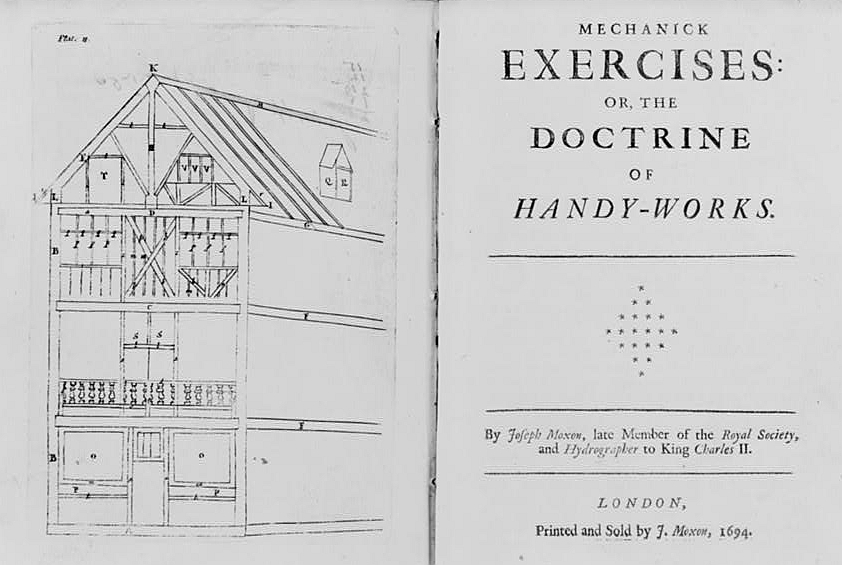

A **[mortise and tenon](kloom:e/mortise-and-tenon)** is a hole and a tongue. The tenon is cut on the end of one timber, the rail; the mortise is cut into the side of another, the stile; and the tenon is driven into the mortise until its shoulders bear on the stile's face. Glue, a wedge or a wooden peg keeps it there. The earlier frames of this subject have already met it: wedged through its mortise in the base frame of a Neolithic well at Altscherbitz, and cut into the edges of the planks of the **[Khufu ship](kloom:e/khufu-ship)** around 2500 BC, where the tenons were not pegged and the hull was held together by rope.

## The peg

What changed next was the peg. About 1320 BC (tree rings and radiocarbon put it between about 1330 and 1305 BC) a merchant ship 15 metres long sank off Uluburun, on the south coast of Turkey, carrying some six tons of copper. The **[Uluburun shipwreck](kloom:e/uluburun-shipwreck)**, found by a sponge diver in 1982 and excavated by the Institute of Nautical Archaeology from 1984 to 1994, kept part of its hull. Its planks and keel are Lebanese cedar, and the planks are joined edge to edge by tenons of a harder wood, probably oak, set into mortises in both planks and locked by wooden pegs driven through plank and tenon on each side of the seam. It is the earliest seagoing ship known to be built that way, and Greek and Roman shipwrights built their hulls with the same pegged joint for centuries afterwards. The hull was built shell first: planks joined to planks, and frames added afterwards.

On land the pegged mortise and tenon became the skeleton of **[timber framing](kloom:e/timber-framing)**, the heavy oak frames of medieval houses, barns and roofs across northern Europe. A frame was cut and fitted on the ground, its joints marked, then taken apart, raised and pegged.

## Cutting one

The first instructions for cutting one in English were printed by **[Joseph Moxon](kloom:e/joseph-moxon)**, a London printer and maker of globes, in the monthly parts of his _Mechanick Exercises_ from 1677. His example is a quarter of oak four inches broad and two thick. Here is his method, with what a twentieth-century joiner's book, William Fairham's _Woodwork Joints_, adds:

| Step              | Moxon                                                                                                                  | Fairham                                                                            |
| ----------------- | ---------------------------------------------------------------------------------------------------------------------- | ---------------------------------------------------------------------------------- |
| Set out           | gauge the mortise 1 inch wide, leaving 1½ inches each side; prick its length, 2 inches                                 | the tenon "one-third the thickness of the timber"                                  |
| Chop the mortise  | an inch mortise chisel, bevel away from you, started ⅛ inch inside each end; work down from both ends, then the middle | bore out most of the waste first; leave a "horn" on the stile so it does not burst |
| Saw the cheeks    | a tenon saw a little outside the line, blade upright, then pare to the line                                            | saw from both edges, then square down                                              |
| Saw the shoulders | pare them so the stile makes "a close Joint" with the rail                                                             | cut a small channel at the knife line to guide the saw                             |
| Bore and pin      | see below                                                                                                              | see below                                                                          |

The proportions are where the two disagree. Fairham gives a rule: a single tenon a third of the timber's thickness, so that each cheek of the mortise is as strong as the tenon. Moxon, two and a half centuries earlier, says there is no such rule. Strength, he writes, depends on the kind of wood and its position as well as its size, so a tenon on fir going into oak must be thicker than an oak one, and since "no Rule is extant" it is left "to the Judgment of the Operator". His own example takes a quarter of the breadth, not a third. A mortise cut too wide leaves weak cheeks, and a tenon pared too thin cannot be mended: "you have spoiled your Work".

## Drawing it tight

Moxon's last step is the drawbore. He bores two holes through the cheeks of the mortise, half an inch in from each end of it, knocks the tenon in, and pricks the holes' centres onto the tenon. Then he takes the tenon out again and bores its holes "about the thickness of a Shilling" nearer the shoulder than the marks, so "that the Pins you are to drive in, may draw the Sholder of the Tennant the closer". The holes no longer line up. A tapering peg, driven through, bends a little as it finds the tenon's hole and pulls the shoulder hard against the stile, as the plate shows. Fairham, using a ⅜-inch bit, makes the offset about ⅛ inch, a little over 3 millimetres, and recommends the method "when it is not convenient to obtain the necessary pressure by using a cramp".

The tenon locks one way; the next frame's joint, the dovetail, locks by its shape alone.
