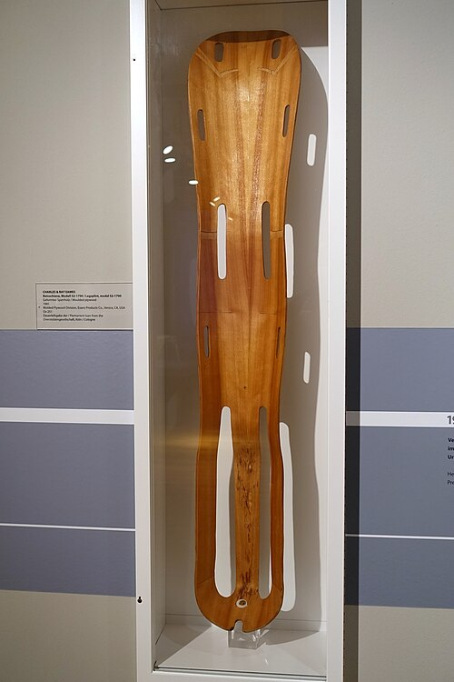
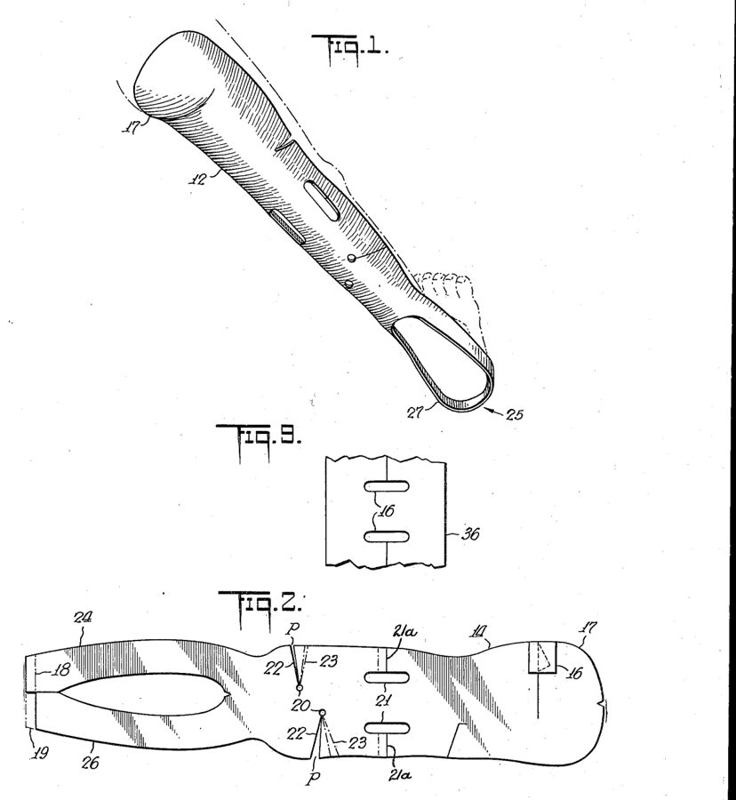

On 28 May 1942 Charles Eames, who was working with his wife Ray from their flat in Los Angeles, filed a patent for a way of pressing thin sheets of wood into curves that bend two ways at once, like the inside of a shell. Its first product was a leg splint for the **[United States Navy](kloom:e/united-states-navy)**, and its makers were **[Charles and Ray Eames](kloom:e/charles-and-ray-eames)**, a designer and a painter. Metal splints vibrated against the wound as a stretcher was carried; the Eameses' splint, molded over a cast of Charles's own leg, held it still and weighed, by the patent, "a scant 700 grams". Made by the Molded Plywood Division of the Evans Products Company, an estimated 150,000 were used by the end of the war. The material was **[plywood](kloom:e/plywood)**, pressed hot into **[molded plywood](kloom:e/molded-plywood)**, and the technique was lamination, which turns wood from something you cut into something you mold.

## Why cross the grain

A board of wood moves with the weather, and not equally every way. From green to oven-dry, the US Forest Products Laboratory's _Wood Handbook_ gives yellow birch a shrinkage of 9.5% around the growth rings and 7.3% across them, but only 0.1 to 0.2% along the grain. By our arithmetic, a birch board 300 millimeters wide could lose 28 millimeters in width and well under one in length. It warps, too, because its two faces shrink by different amounts.

Plywood is veneers, thin sheets peeled or sliced from a log, glued with the grain of each running at right angles to the next. Each layer wants to shrink across its grain and is held by its neighbors, which barely change length in that direction. The handbook credits plywood with excellent dimensional stability along its length and across its width, and strength in both directions that differs far less than a board's. It also resists splitting, so it can be nailed close to its edge. Panels are built with an odd number of layers, so that the two faces match and the sheet stays flat.

Glued veneers are ancient, and the Egyptians were laminating wood by about 2600 BC. In 1858 John Henry Belter of New York patented chair backs made of molded layers, and Michael Thonet had pressed glued strips into chair parts in the 1830s before he turned to solid wood. What held plywood back was glue. Animal and casein glues let go in damp; the thermosetting resins of the twentieth century did not.

## Bent one way, and two

A sheet of plywood bends easily round a cylinder, and by the 1930s designers were exploiting it. **[Alvar Aalto](kloom:e/alvar-aalto)** patented a method of bent laminated furniture in 1933, and his cantilevered birch Paimio chair, made for the patients of a tuberculosis sanatorium, bent wood about as far as the techniques of the time allowed. In England, the **[de Havilland Mosquito](kloom:e/de-havilland-mosquito)**, which first flew on 25 November 1940, had a fuselage of birch plywood skins over a balsa core, laid in two halves over mahogany or concrete molds. In 1940–41 Charles Eames and Eero Saarinen won the Museum of Modern Art's Organic Design competition with chairs whose seat and back were to be one shell, but no factory could make it: plywood would bend into a cylinder, not a dome.

A dome is the hard case, because a flat sheet cannot cover one without stretching, and the handbook is blunt that plywood "cannot be stretched". The Eameses' answer was in the cutting. Their patent, US 2,395,468, takes a wedge-shaped dart out of each veneer, running in from the edge to a small hole. When the sheet is pressed, the edges of the dart close up and the hole becomes the crown of a dome, like a cone made by cutting a slice from a paper disc. A wider dart gives a taller dome. Each veneer's dart is turned a little from the next one's, so that no seam lies over another.

## Pressing the shell

At home, in 1942, the Eameses did it in a machine they called the Kazam!: a curved plaster mold threaded with heating coils, five to eleven veneers laid in it with glue between them, and a rubber balloon pumped up with a bicycle pump to press them against the mold. Charles later remembered climbing a power pole to take enough current from the transformer. The patent describes the factory version:

| Step  | What the patent says                                                                |
| ----- | ----------------------------------------------------------------------------------- |
| Cut   | veneer blanks with their grain in different directions, darts staggered             |
| Glue  | a thermosetting phenolic resin binder, applied to every blank                       |
| Stack | the blanks slid over pins through their holes, so they stay in register             |
| Bind  | the sheaf strapped down over a heated die, which may be concrete                    |
| Press | a rubber bladder pumped to about 30 pounds per square inch, the die at about 165 °C |
| Cure  | about an hour, until the resin sets for good                                        |

Thirty pounds per square inch is about 0.2 megapascals. A flat-panel plywood press, by Wikipedia's figures, more commonly runs at 1.4, so by our arithmetic the bladder pressed at about a seventh of that. Darts and a bag let each veneer creep over the next as it formed, and low pressure was enough. The binder was **[phenol formaldehyde resin](kloom:e/phenol-formaldehyde-resin)**, the chemistry of **[Bakelite](kloom:e/bakelite)**, which sets hard with heat and never softens again, so a molded shell holds its shape even when wet.

After the splints came stretchers and aircraft parts, and in 1945 and 1946 the molded-plywood chairs that Herman Miller went on to make for decades. Plywood had become a material you could shape like clay. The next segment returns to an older one that is shaped hot: metal, shaped by fire.
