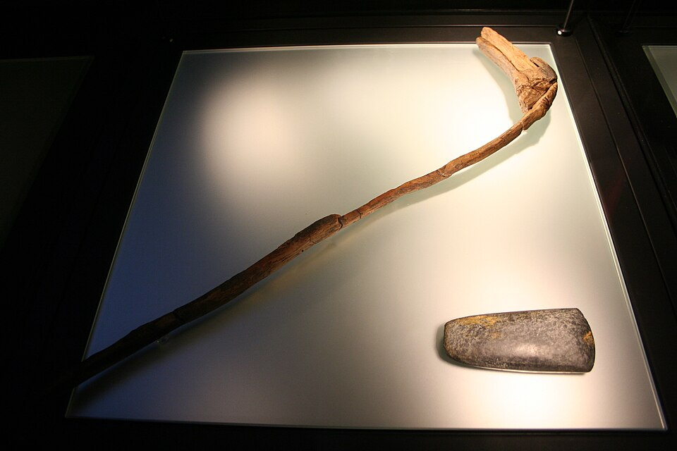
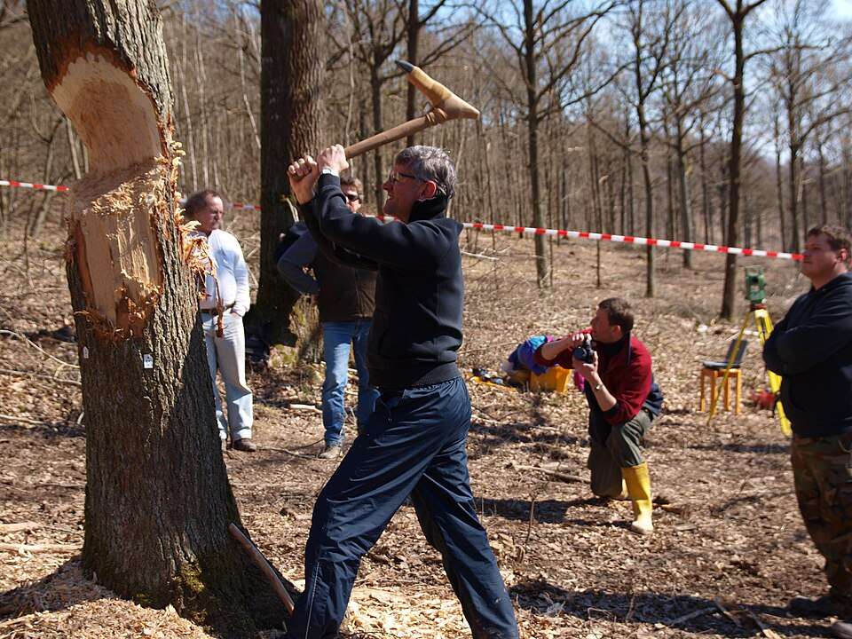

At Altscherbitz, near Leipzig, at the edge of a settlement of nearly a hundred longhouses, archaeologists came on the bottom of a well. Rather than dig it out in the field, they cut it free in a block of earth weighing 70 tonnes, lifted it, and excavated it indoors, scanning every timber in three dimensions as it came out. The well's square lining was of split **[oak](kloom:e/oak)**, and its timbers were waterlogged and perfect. Their tree rings, matched against the long oak chronologies of central Europe, gave the year the trees were felled: 13 oaks, 80 to 100 centimeters across, cut down in 5102 BC. A plank from the construction pit gave the year the well was built, 5099 BC. In 2012 Willy Tegel and his colleagues published it, with three more wells from Saxony, as the oldest dated wooden architecture in the world, and concluded that "the first farmers were also the first carpenters".

## Wells of the first farmers

Those farmers were the people of the **[Linear Pottery culture](kloom:e/linear-pottery-culture)**, named after the curving bands incised on their pots, who brought crops, cattle, longhouses and the polished stone tools of the **[Neolithic](kloom:e/neolithic)** into central Europe from about 5500 BC. Their houses survive only as postholes. Their wells survive because they were dug down to the water table, as much as seven meters, and wood below the water does not rot. About a hundred are known from 53 sites between north-eastern France and Hungary, sixteen of the sites with their timber. Every year of each lining's wood can be counted, which is why **[dendrochronology](kloom:e/dendrochronology)** dates them closely when nothing else of the period can be. Some are older than Altscherbitz. One found in 2018 at **Ostrov**, in eastern Bohemia, was published in 2020 as the oldest dendro-dated timber structure of all; Wikipedia's article on wells dates it to 5265 BC. The same article puts the well at Kückhoven, in the Rhineland, at 5300 BC, where its article on Erkelenz says about 5100 BC.

They were lined four ways: with wickerwork, with a hollowed trunk, with planks laid log-cabin fashion and notched together at the corners, or with corner posts grooved to take planks slid down between them, as at Ostrov. The log-cabin and post-and-plank linings were always of oak, which is tough, durable and splits well.

## From tree to plank

Metal woodworking tools were more than a thousand years away. The carpenters' tool was the **[adze](kloom:e/adze)**, a ground stone blade lashed across the end of a handle, so that it swings like a hoe rather than an axe. The marks on the Altscherbitz timbers, read with the help of later experiments, give the order of work:

| Step | Work                                           | Tool                                   |
| ---- | ---------------------------------------------- | -------------------------------------- |
| 1    | Fell the oak, cutting just above breast height | narrow, high adzes                     |
| 2    | Split the log in half                          | wooden wedges driven with wooden mauls |
| 3    | Cut the halves to length                       | a small adze and burning charcoal      |
| 4    | Split again, along or across the rings         | wedges                                 |
| 5    | Smooth the faces of the planks                 | a flat adze, an edge 50 mm or wider    |
| 6    | Notch the corner joints                        | bone chisels                           |

The ends of the timbers are charred where fire helped to cut them. Planks in one lining match ring for ring, so they came from the same tree, and were split and built in while still green. Narrow marks under 20 millimeters wide, from small blades, trimmed the ends; broad ones from flat blades dressed the faces. The joints were the hardest part, because a stone edge is too blunt to cut across the grain, and experiments found that only a chisel made from the foot bone of a cow-sized animal left marks like the ones in the notches. The base frame of the Altscherbitz well was even joined with tenons, wedged through their mortises, a joint whose history the Joinery trail follows.

## Learning the adze again

Could an adze fell a big oak at all? Some archaeologists doubted it, and from 2011 a group of experimental archaeologists, among them Rengert Elburg and Wulf Hein, tried, in an oak wood at Ergersheim in Bavaria. An adze cuts with overhead strokes, steeply and with the grain, so that the chips are levered and split away rather than sliced, and the angle between blade and handle matters. Their first heavy blade, hafted at 60°, broke its bevel twice; hafts at 70° to 80°, bound with rawhide, worked. The handles found in the wells are set the other way, at 95° to 115°, and seem to have carried the flat dressing blades.

| Trial             | Oak across | Hours to fell                |
| ----------------- | ---------: | ---------------------------- |
| Stone adzes, 2011 |      42 cm | well over 8, over three days |
| Stone adzes, 2012 |      55 cm | under 5                      |
| Steel axe, 2012   | comparable | a little over 1              |

The bigger tree fell in less time because the team had learned. By our arithmetic, the cross-section they cut went from about 0.018 to 0.048 square meters an hour, nearly three times as fast, with the same stone. Up to three people worked on the adzed tree at once, while one practiced man swung the steel axe.

The farmers who built these wells did more than carpentry. In the Altscherbitz well lay pots that had broken and been mended with [birch tar](kloom:e/birch-bark-tar), a glue first cooked by Neanderthals, and two of them had been redecorated with patterns cut from birch bark and pasted on with it. The next frame takes the carpenter's kit into metal, in Egypt.
