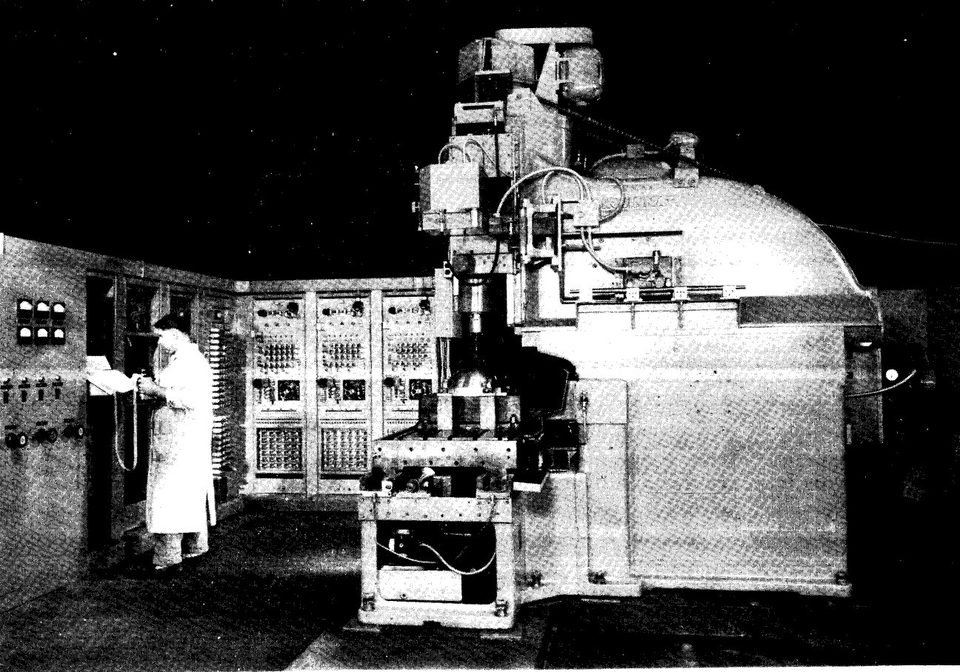

In the 1940s the shape of a helicopter rotor blade's ribs came to **[John T. Parsons](kloom:e/john-t-parsons)**, of Traverse City, Michigan, as a list of 17 points. His firm made the ribs for Sikorsky, and someone had to fill in the curve between the points with a French curve and cut it by hand. In 1946 Parsons hired an engineer, **[Frank L. Stulen](kloom:e/frank-l-stulen)**, who was running stress calculations on punched-card machines. Parsons asked him whether the machines could compute 200 points instead of 17, each one offset by the radius of the cutter that would follow it. They could. Machinists then read the tables of numbers aloud and moved a mill to each point in turn. From that "by the numbers" method grew **[numerical control](kloom:e/computer-numerical-control)**: a machine tool moved by numbers, not by a hand or a template.

## From cards to tape

Parsons wanted the card reader to drive the machine itself. In 1949 he took the problem, with Air Force money, to the Servomechanisms Laboratory at **[MIT](kloom:e/massachusetts-institute-of-technology)**, which had built gun turrets and radar trackers run by feedback. The laboratory soon fitted motors to a milling machine of its own and took the work over under a new contract. Parsons said later that he "never dreamed" MIT would take his project. He filed a patent with Stulen on 5 May 1952, granted in 1958 as US 2,820,187. It describes a shape defined mathematically, closely spaced points computed on it, and the cutter's path punched onto cards.

MIT's machine was shown in September 1952. Its controller was a wall of cabinets with about 250 valves and 175 relays, and its program came on seven-track paper tape. Credit was argued for decades. The laboratory's own account of 1957 calls its machine "the first fully automatic numerically controlled machine tool" and never names Parsons; in 1985 Parsons and Stulen were given the National Medal of Technology for it.

## How a tape of numbers moves a cutter

Each axis of the machine is a servo: a motor, a measurement of where the slide really is, and a circuit that drives the motor until the two agree. The tape tells the controller, which MIT called the director, only where to go next. In the words of MIT's 1959 description of the system, it gives "one number for each controlled axis of motion" and one more "representing time", and the director moves the cutter from where it is to the new point "along some simple curve, usually a straight line". It does that by sending pulses to every axis at once, spread evenly over the time given, so that a move of 178 steps in _Y_ and 4 in _X_ makes a staircase too fine to see along a straight line.

So every curve has to be cut as straight chords, and the question is how many. A chord across an arc of radius _R_ leaves a gap, the sagitta _s_, at its middle; for a chord of length _c_ it is very nearly *c*² ÷ 8*R*. Here is a circle of 2 inches radius, with tolerances that are invented but of the size the MIT programs asked for (their examples write 0.005 and 0.0005 inch). The chord counts are by our arithmetic:

| Tolerance _s_ | Chord length | Chords round the circle |
| ------------- | -----------: | ----------------------: |
| 0.005 in      |     0.279 in |                      45 |
| 0.0005 in     |     0.089 in |                     141 |
| 0.00005 in    |     0.028 in |                     445 |

Ten times the accuracy costs about three times the chords. At the middle tolerance the first chord anticlockwise from the circle's rightmost point is −0.00199 in in _X_ and +0.08909 in in _Y_. Wikipedia's account of the machine gives each step of a control as half a thousandth of an inch, which makes that chord the 178 steps and 4 of the staircase above. Every chord needed a line of tape and a calculation, and each point had first to be moved out by the cutter's radius, since the cutter's center follows the chords.

## Computers write the tape

Done with desk calculators, that arithmetic was slow and full of mistakes. Between 1952 and 1954 John Runyon wrote subroutines for MIT's **[Whirlwind](kloom:e/whirlwind-i)** computer to do it; by Wikipedia's account they cut one part's preparation and machining from eight hours to fifteen minutes. In January 1955 Arnold Siegel proposed a program that would read a description of a part in words and symbols ("TOOL RADIUS", "TOLERANCE", lines and circles) and punch the tape itself, and he had it working on Whirlwind that year.

In June 1956 the Air Force contract was turned towards that kind of programming, for parts cut in three dimensions, and **[Douglas T. Ross](kloom:e/douglas-t-ross)** led the work. His group called the result **[APT](kloom:e/apt-programming-language)**, for Automatically Programmed Tools. A part programmer wrote "CIR 1 = CIRCLE/ WITH, CTR AT, 0, 0, 0, RADIUS, 6, INCH" and "TOLER/ +.005, INCH", and the computer worked out the chords, the length of each step "determined by the required tolerance" and the curvature. Programmers from thirteen aircraft plants, IBM and MIT wrote the system together for the **[IBM 704](kloom:e/ibm-704)**, and it was shown to the press in February 1959.

Who gained by all this is disputed too. Ross wrote that the skill of the machinist had been "transferred" to the part programmer. In _Forces of Production_ (1984) the historian David Noble argued, as Wikipedia summarizes him, that this was the point for the Air Force: to move control of the work off a unionized shop floor and into the office. The next frame is the curve that the chords approximate, and two men at rival carmakers who found how to describe one to a machine.
