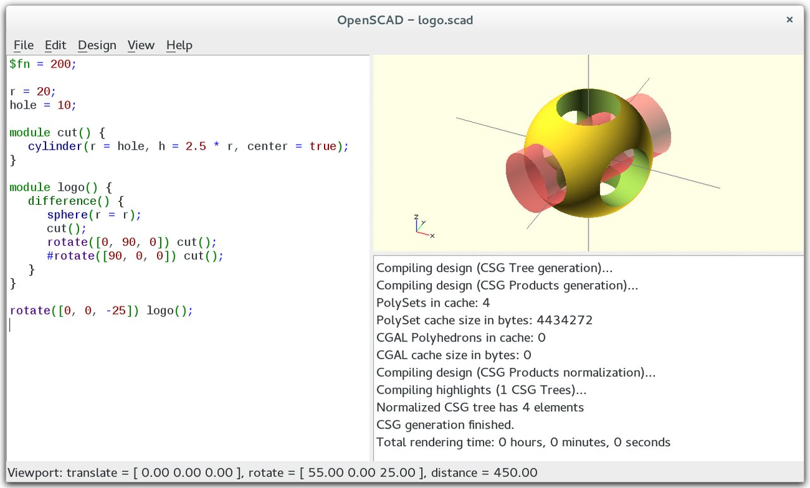
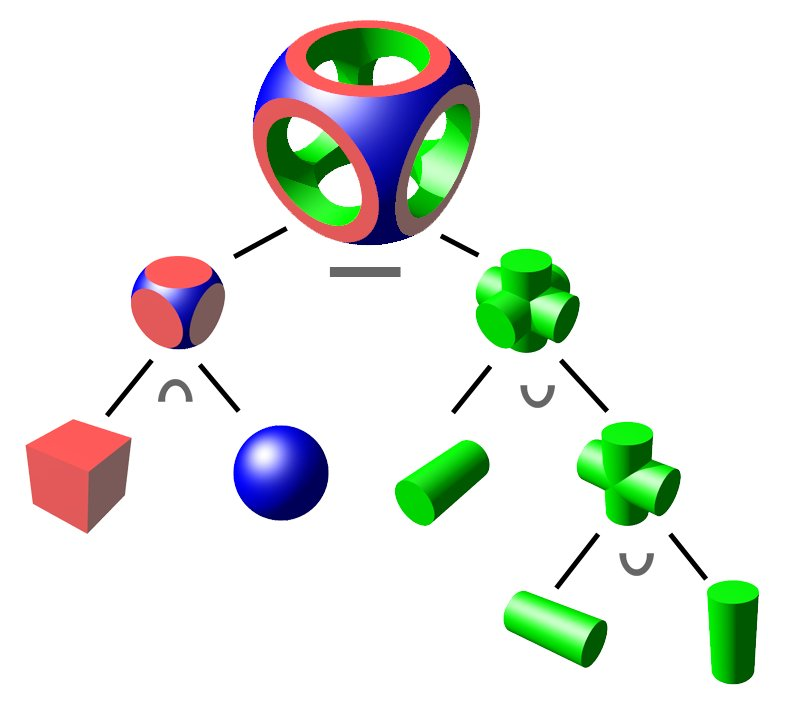

Most design programs work like a drawing board: you sketch an outline on the screen, pull it into a solid, and push its faces about with a mouse. **[OpenSCAD](kloom:e/openscad)** works like a compiler. Its README of 2010 calls it "something like a 3D-compiler": you write a short program that says which simple solids to make and how to combine them, and the program builds the part. Change a number in the program and the part is built again to fit. The programmer Clifford Wolf created its source repository on 20 June 2009, and the first release, version 2010.02, followed on 19 February 2010, with Marius Kintel, who maintains it today, among the developers. It is free software under the GNU General Public License, and it became the RepRap world's favourite way to design a printable part: Josef Průša's [Prusa i3](kloom:e/prusa-i3) of 2012 was drawn in it, as a set of parametric files for printers of several sizes.

## Solids from sums

The idea underneath is **[constructive solid geometry](kloom:e/constructive-solid-geometry)**. Every object is built from a few primitives (a cube, a cylinder, a sphere) moved into place and combined by three operations borrowed from the algebra of sets: _union_, which joins two solids into one; _difference_, which cuts one out of another; and _intersection_, which keeps only what two share. The mathematics of such solid modelling was worked out in the 1970s at the **[University of Rochester](kloom:e/university-of-rochester)**, where the electrical engineer **[Herbert Voelcker](kloom:e/herbert-voelcker)** founded the Production Automation Project in 1972; it developed the foundations and core algorithms on which mechanical design by computer was built. Its great virtue is that a part built this way is always a closed solid, with an inside and an outside, which is what a machine that fills or cuts material needs to know.

What OpenSCAD added was the habit of writing the recipe down as **[parametric design](kloom:e/parametric-design)**: the program names its dimensions once, as variables, and everything else is computed from them. On [Thingiverse](kloom:e/thingiverse), the RepRap community's design-sharing site, a tool called the Customizer let anyone change an OpenSCAD design's parameters in a web page and download their own version.

## A nameplate, line by line

**Ken Hiatt**, who commissioned this subject, builds 3D printers. To sort the screws and nuts that work leaves behind, he printed new drawers for a parts cabinet, each with a small nameplate: a thin base 50 mm wide and 34 mm tall, a raised plate on top of it, and two lines of raised letters such as "M3x8" and "BHCS". He drew them first in a conventional CAD program and found each label took 30 to 60 seconds of opening a sketch, editing the text and exporting a file. So he learned OpenSCAD and wrote one. His repository calls itself "just playing with OpenSCAD" and "nothing of importance", and it is one maker's exploration, not a standard; it shows the method plainly.

| Line from his `drawer_nameplate.scad`                | What it does                                                           |
| ---------------------------------------------------- | ---------------------------------------------------------------------- |
| `difference () { union() { cube([width, …, thick]);` | the flat plate, before anything is cut from it                         |
| `os_length = sqrt(2 * pow(thick, 2)) + 2;`           | a cutter's size: the diagonal of the plate's edge, with 2 mm to spare  |
| `translate([0,-1,0]) rotate(a=[0,-45,0])`            | stand the cutter on the plate's left edge, turned 45° on its corner    |
| `cube([os_length, height+2, os_length]);`            | the cutter itself, 2 mm longer than the edge it cuts                   |
| `translate([…, base_thick-0.001])`                   | sit the raised plate on the base, sunk a thousandth of a millimetre in |
| `linear_extrude(text_thick) text(…);`                | the letters, pulled up 0.4 mm from their outlines                      |

The chamfers are the difference at work. A cube turned 45° and set with its corner on the plate's edge cuts away a triangle, leaving a 45° slope as deep as the plate is thick: for the 0.6 mm base, √2 × 0.6 ≈ 0.85 mm of slope, by our arithmetic, which is why the cutter is sized from √2 × _t_. The spare millimetres matter more than they look. If a cutter's face lies exactly on the face of the solid it cuts, the program cannot tell which side of the face is meant, and OpenSCAD's manual warns that coincident faces give undefined results: a face of zero thickness or a part left out. So every cutter overshoots, by a millimetre each side, and the raised plate is sunk 0.001 mm into the base rather than resting on it. His own comment on that line says it is there to "keep things from being exact".

Then come the parameters. A second file reuses the same module for the cabinet's larger drawers, changing chiefly the width, to 109.25 mm, and the height, to 50.5 mm. A small script reads a list of 34 labels and runs OpenSCAD once for each, with the text set on its command line, and writes 34 print files, from "Locknut M3/M5" to "Round Hygrometer". The design is drawn once. Every plate after that is a number or a word.

That is the trade OpenSCAD makes. A drawing program is quicker for a shape you see; a program is better for a family of shapes, and its designs are plain text, which travel well in git and on GitHub, where Ken keeps his. The next frame leaves plastic for metal, where a printed part can fly.
