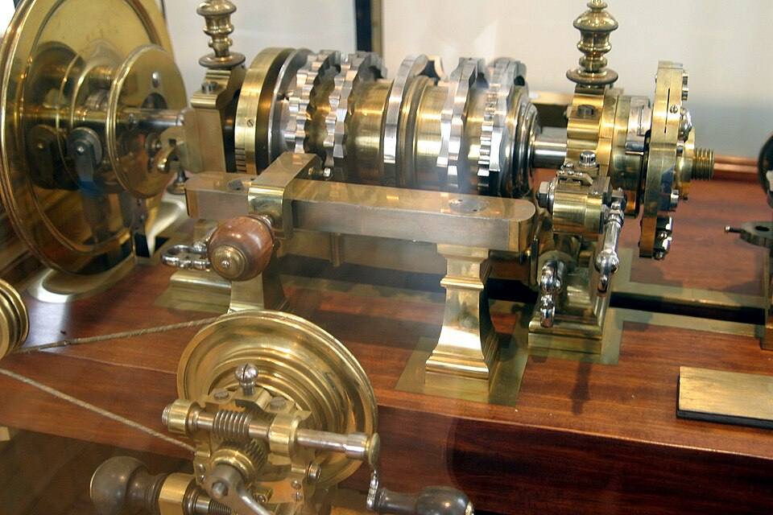
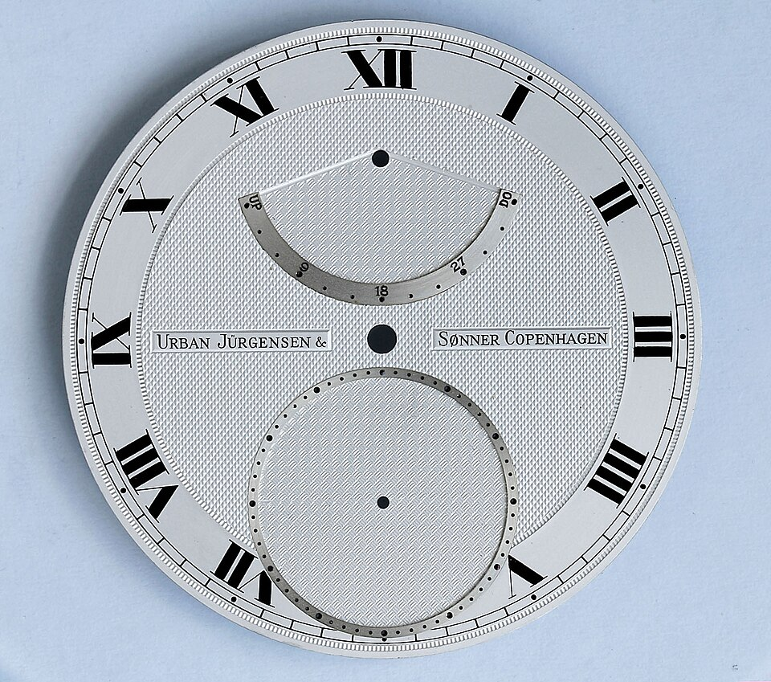

**[Peter the Great](kloom:e/peter-the-great)** kept a turnery in his palace at St Petersburg, and from 1712 until the tsar's death in 1725 its master, working beside him, was **[Andrey Nartov](kloom:e/andrey-nartov)**, who built lathes for copying medals and for cutting the wavy engraved patterns called **[guilloché](kloom:e/guilloche)**; one of 1721 stands in the Hermitage. A Russian translation of **[Charles Plumier](kloom:e/charles-plumier)**'s _L'Art de tourner_, a French friar's treatise on the lathe first printed in 1701, was made at Peter's court, by the tsar himself according to Wikipedia. Peter was not alone: turning was a favourite pastime of European princes, and what they turned was not chair legs. **[Ornamental turning](kloom:e/ornamental-turning)** makes shapes whose sections are not circles: flutes, spirals, ovals, and the rippling bands of the [rose engine](kloom:e/rose-engine-lathe).

## How a rose engine cuts

In plain turning the work spins about a fixed axis, so every point on it passes the tool at the same distance. A **rose engine** lets the axis move. The spindle carries a _rosette_, a disc whose edge is cut into regular waves, and a fixed roller or pin called the _rubber_ bears against that edge. The whole headstock is hung on a pivot and pulled by a spring, so that as the spindle turns the rosette rides its waves over the rubber and the work rocks towards and away from the tool. The tool stands still during each cut, and so the line it cuts on the work repeats the waves of the rosette. A face rosette makes the spindle slide along its own length instead, a motion turners call _pumping_. Each cut is one revolution, and the pattern is built from many.

**[John Jacob Holtzapffel](kloom:e/holtzapffel)**'s volume on ornamental turning, of 1884, gives the recipe for the pattern on the backs of watches. Watchmakers' rosettes have many small waves; he showed it with one of 24, on a rose cutting frame of his own that rocks the tool instead of the work:

| Step | What the turner does                                                                   |
| ---- | -------------------------------------------------------------------------------------- |
| 1    | Sets the tool to the outer edge and cuts one revolution with the rosette on the rubber |
| 2    | Turns the rosette half a wave, 1⁄48 of a turn, with two turns of its tangent screw     |
| 3    | Moves the tool 0.025 in nearer the centre with the slide rest's screw                  |
| 4    | Cuts again, and repeats steps 2 and 3 to the centre                                    |

The art is in the reduction. The tool must come in just enough that the crest of each new wave touches the trough of the line before, and the half-wave shift puts every crest beside a trough, so the lines close into a mesh of small cells. With less, the lines would cross; with more, they would stand apart. With 24 waves each wave spans 15°, and since a half wave takes two turns of the tangent screw, the screw needs 96 turns to bring the rosette once round, by our arithmetic.

## The Holtzapffels

The firm that made England the centre of the pastime was founded in Long Acre, London, in 1794 by John Jacob Holtzapffel, a turner from Strasbourg who had worked for the instrument maker Jesse Ramsden. Holtzapffel sold its first lathe in 1795 for £25 4s 10d, an enormous price, and had sold about 1,600 by his death in 1835; Wikipedia's articles put its total at 2,557 and its last lathe in 1927 or 1928, depending on the article. His son Charles began _Turning and Mechanical Manipulation_ in 1843, and Charles's son, the second John Jacob, finished the fifth volume, on ornamental turning, in 1884. Its title page promised six; he died in 1897 without writing the sixth. That fifth volume puts the rise of ornamental turning no earlier than the first half of the eighteenth century, while Wikipedia's article on the craft places its origin in Bavaria late in the fifteenth. The books Holtzapffel names as the earliest on the subject are Plumier's and two that followed it in German and in French.

## Guilloché

The rose engine's patterns are hard to copy by any other means, and that made them useful. The backgrounds of the first British postage stamps, the Penny Black of 1840 among them, were cut on a rose engine to defeat forgers. From the 1880s Peter Carl Fabergé laid translucent enamel over guilloché metal, so that the cut pattern glowed through the colour, most famously on the **[Fabergé eggs](kloom:e/faberge-egg)** made for the tsars. Guilloché is still cut on fine watch dials, and a few makers still build the engines.

Ornamental turning was the lathe as a prince's art. The lathe of this trail's anchor, Maudslay's, put the same slide rest and screw to work making machines.
