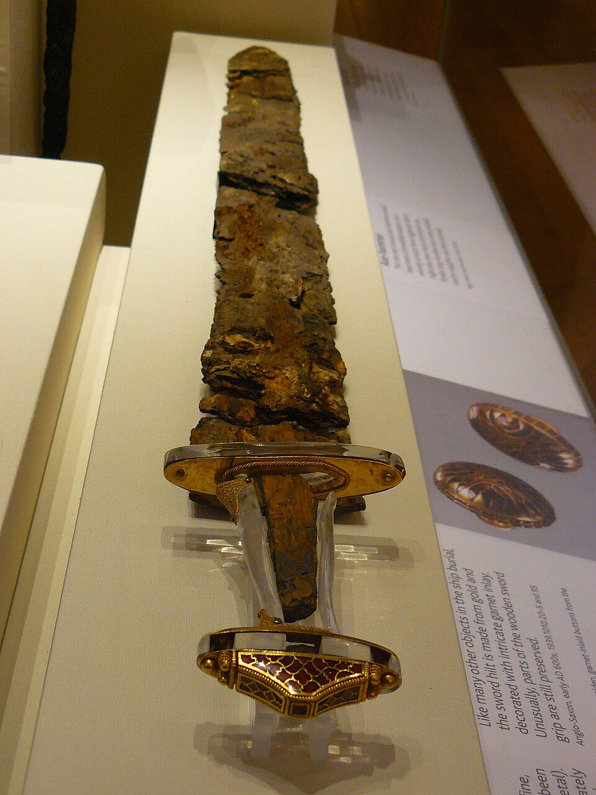
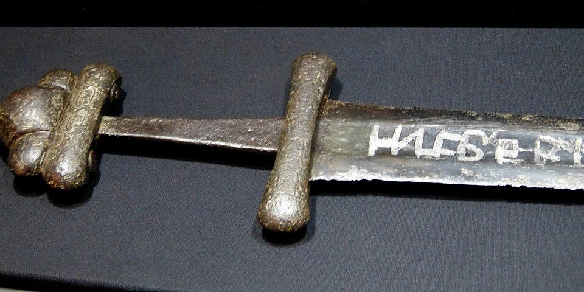

In 1939 the burial chamber of a ship buried under a mound at **[Sutton Hoo](kloom:e/sutton-hoo)**, in Suffolk, gave up a sword. Its pommel was gold and garnet, and it lay in its scabbard beside the place where a body had been. The burial is dated by its coins to about 610–635 and is usually taken to be that of **[Rædwald](kloom:e/raedwald-of-east-anglia)**, king of the East Angles, who died around 624, though that is argued. In 1944 the British Museum brought a sculptor and metalworker, **[Herbert Maryon](kloom:e/herbert-maryon)**, out of retirement to conserve the finds. The blade was not plain iron but strips twisted and welded together, and in a paper of 1948, on another sword of the kind found near Ely, Maryon gave the technique its name: **[pattern welding](kloom:e/pattern-welding)**. "I do not know of finer smith's work," he wrote.

## Iron and steel in one blade

The smiths who made such swords had only bloomery iron, which came out of the furnace soft, with patches that had taken up carbon and become steel. As the archaeometallurgist Alan Williams explains, nobody could yet make a bar of steel of even, chosen carbon content. Welding together small pieces of carburised and plain iron was one way to make something that behaved like steel, and twisting them made a pattern that buyers wanted. The poem **[Beowulf](kloom:e/beowulf)** calls such a blade a _wægsweord_, a "wave-sword".

Williams dates the swords from the third century AD to the tenth. Maryon, in the passage Wikipedia quotes, gave the third century to the Viking Age. Wikipedia's article itself takes pattern welding back to Celtic swords of the first millennium BC. The method was laborious: when J. W. Anstee and L. Biek made a pattern-welded blade, it took them 43 hours of forging. Anstee also found that strips of plain wrought iron alone, twisted and welded, still made the herringbone pattern, because slag trapped in the welds marks the boundaries. Many smiths, Williams suggests, may have worked pure iron into beautiful patterns without ever knowing that the blade would only take an edge if the iron had first been given carbon.

## The billet, worked

The weld that joins two bars, in the frame before this one, can join many. A smith makes a billet: a stack of strips, iron and steel in turn, welded at a sparkling heat into one bar. Drawn out to double its length and folded back on itself, it is welded again, and the layers double. Here is the count for an invented billet of seven strips, by our arithmetic:

| Folds | Layers | The rule |
| ----: | -----: | -------- |
|     0 |      7 | 7 × 2⁰   |
|     1 |     14 | 7 × 2¹   |
|     3 |     56 | 7 × 2³   |
|     5 |    224 | 7 × 2⁵   |
|    10 |  7,168 | 7 × 2¹⁰  |

Each fold doubles, so ten folds give over seven thousand layers: on a blade 5 millimetres thick, by our arithmetic, each would be less than a thousandth of a millimetre, far too fine to see. The early medieval smiths started from about half a dozen strips, Williams writes, and made their figure with a twist.

The twist is the second step. The billet is drawn into a rod, heated and twisted like a rope, so that the layers run round it in a spiral. Three or more rods are laid side by side, often twisted alternately one way and the other, welded into the core of the blade, and edges of steel are welded on along both sides. Then the smith files and grinds the faces flat. The flat face cuts through the spiralling layers at a slant, so each rod shows a row of slanting stripes, a herringbone; two rods twisted in opposite directions and laid side by side make a chevron, Wikipedia's article notes. Polished and etched, the different metals take the acid differently, and the pattern stands out. A sword of about 550–650 found in Northumberland and recorded by the Portable Antiquities Scheme shows the build: two layers of four or five welded strands each, with the edges forged on outside them.

Pattern welding is often called Damascus steel, and it is not. Williams insists the two are "entirely different". A Damascus blade was forged from a single cake of crucible steel from India, whose pattern grows out of the metal itself, as the frame on wootz explains.

## Ulfberht

From the ninth century, pattern welding gave way to blades piled from a few pieces of iron and steel, or forged from a single piece of steel. The most famous are the **[Ulfberht swords](kloom:e/ulfberht-swords)**, inlaid on the blade with the Frankish name +VLFBERH+T. Williams counted about a hundred, and analysed 44; Wikipedia's article gives 167. Of the fourteen spelled +VLFBERH+T, he found nine made of steel holding more than 0.8 per cent carbon, and in places over 1.5, which a bloomery could not make on purpose. He took it for crucible steel, perhaps brought from the Middle East up the Volga by Viking traders, and steel like that, he notes, had to be forged at a lower heat than smiths were used to. Other workshops copied the name, misspelled it, and used poorer iron.

None of these blades is finished until it has been hardened, and the next frame is how a smith did that: hardening and tempering.
