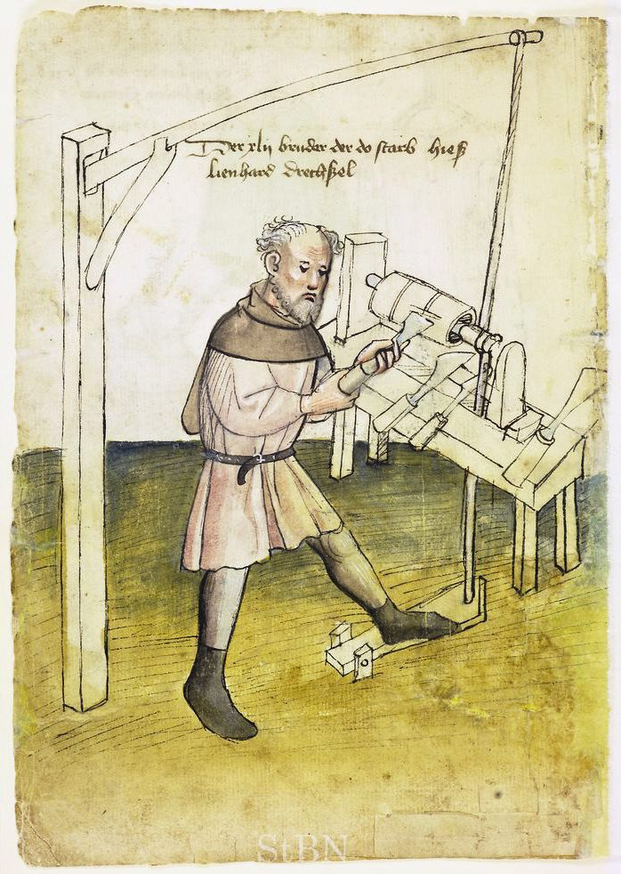
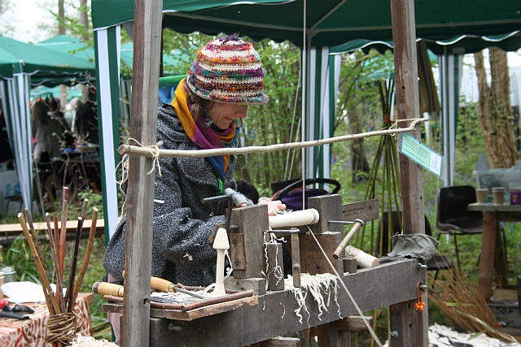

On a wall of a tomb at **[Tuna el-Gebel](kloom:e/tuna-el-gebel)**, in Middle Egypt, two craftsmen squat facing each other with a small wooden column held between them. The tomb was built around 300 BC for **[Petosiris](kloom:e/petosiris)**, high priest of Thoth at Hermopolis, and its reliefs show the trades of his estate. The column is set in a frame on the ground, caught at each end on a hook. One man has passed a cord round it and holds both ends, pulling them back and forth; the other grips a gouge in both hands and holds it to the turning wood. A third craftsman finishes the column with an adze. That is how Gustave Lefebvre, who cleared the tomb, described the scene in 1923, and it is the oldest known picture of a **[lathe](kloom:e/lathe)**. Turned wood is older: Wikipedia's article gives fragments of an Etruscan bowl from the sixth century BC, and a tentative find from Mycenaean Greece older still. But the picture shows the machine's first and longest-lived trick. The wood turns one way and then the other, and the tool cuts only while it comes towards the edge.

## The pole and the treadle

The **[pole lathe](kloom:e/pole-lathe)** took the helper's job and gave it to a tree. A springy pole is fixed overhead with its thin end above the work. A cord runs from that end, once or twice round the wood, and down to a treadle under the turner's foot. Treading down spins the work towards the tool; letting the treadle rise, the pole springs back and spins it the other way. Wikipedia's article dates it at least to the Viking town of Jórvík, under modern York. A Nuremberg almshouse book of about 1425 shows a turner standing at one, the cord running up to the pole.

The first full instructions in English are **[Joseph Moxon](kloom:e/joseph-moxon)**'s, in _Mechanick Exercises_, published in parts from 1677. His pole is a fir pole pinned to a ceiling timber, thinned with a drawknife if it is too stiff for the work. The treadle is three to four feet long, hinged to the floor with "the Upper-leather of an old Shoe". The cord is sheep's gut. The farther the treadle reaches beyond the lathe, he explains, the more cord each tread pulls down, and the more turns the work makes. Suppose, with invented numbers, that a tread pulls down 40 centimeters of cord over a groove 5 centimeters across: by our arithmetic the work turns two and a half times towards the tool and two and a half times back. Cutting the groove deeper gives more turns a tread, Moxon warns, but less grip. For light work some turners hung an archer's bow overhead instead of a pole; for heavy work they used a great wheel turned by iron handles, which "rids Work faster off than the Pole can do" because the work always runs the same way.

## A cylinder, Moxon's way

Moxon's first exercise is a cylinder two inches across and eight long, in soft wood such as maple, alder, birch or beech:

| Step | What the turner does                                                                                                                        |
| ---- | ------------------------------------------------------------------------------------------------------------------------------------------- |
| 1    | Splits or hews a billet about 2¼ in across and 10–11 in long, rounded with a hatchet and drawknife                                          |
| 2    | Presses it onto the steel points, treads gently, and holds a finger near it: if one side comes closer, he knocks it over until it runs true |
| 3    | Cuts a groove near one end for the cord with a gouge                                                                                        |
| 4    | Roughs the length with the gouge, round side down on the rest, its edge ¼ in above the axis                                                 |
| 5    | Smooths with a broad flat chisel, held askew so that only its lower corner cuts                                                             |
| 6    | Checks with calipers set to 2 in, and squares the ends with the chisel's corner                                                             |

The rhythm is the craft. The tool bears on the work as the treadle goes down and is drawn back "just off the Work" as the pole springs up. Held square to the work, the chisel catches and runs in, cutting a "dawk" round the cylinder "like the Grooves of a Screw"; take too much from any part and, since a cylinder must be one size all along, the whole piece is spoiled. Moxon's flat chisel is beveled on both faces, so either face can ride the work: much like the skew chisel turners still use.

## The bodgers

The pole lathe outlived its rivals in the woods, because it could be carried to the timber. In the beech woods of the **[Chiltern Hills](kloom:e/chiltern-hills)**, turners called **[bodgers](kloom:e/bodging)** made the legs and stretchers of Windsor chairs from green wood and sold them to the furniture factories of **[High Wycombe](kloom:e/high-wycombe)**. Wikipedia's article gives about thirty of them early in the twentieth century; one, Samuel Rockall, was paid 19 shillings in 1908 for a gross of legs and stretchers.

A survey of rural industries published in 1926 by Helen FitzRandolph and Doriel Hay watched the lathe at work: a sapling set aslant, its butt weighted with a bucket of sand, the wood held between two metal points, and a turner who "can only use his chisel" on the downward stroke. A chair-leg turner from the Chilterns had set up a working camp in the woods near Chilgrove, in Sussex. The same survey noted that in a factory an unskilled hand on an automatic lathe made ten chair legs while a skilled turner made one. The last working bodgers gave up in the 1950s, and since about 1980 the craft has been revived by green woodworkers.

Every pole lathe already held its work on two points, as the Egyptian turners' column hung on its hooks. The next frame is what those two points are for: turning between centers.
