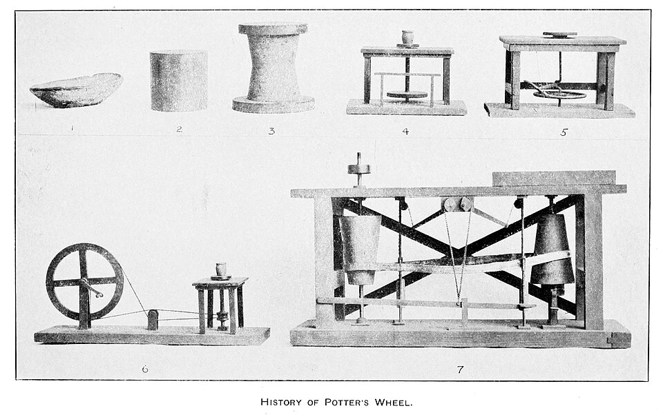

For most of the twentieth century the story of the **[potter's wheel](kloom:e/potters-wheel)** was a story about cities. In southern **[Mesopotamia](kloom:e/mesopotamia)**, in the fourth millennium BC, the first cities rose, and coarse, mass-produced "bevelled-rim bowls" turned up in every one of them. The wheel, it was assumed, was how: a machine for standard pots in quantity. Excavation and close study of the pots since the 1990s have taken that story apart. The bevelled-rim bowls were not made on a wheel at all. What the wheel did make, at first, was rare, small and precious, and it was not thrown, the way a potter throws today, but built up from coils of clay and then turned.

## Coils on a turntable

The archaeologist Johnny Samuele Baldi, reviewing the sites of the fourth millennium in 2021, puts the arrival of the wheel in northern Mesopotamia and among the people of **[Uruk](kloom:e/uruk)** at about 3900–3800 BC, and in the southern Levant a few centuries earlier, in the middle of the fifth millennium. The first wheel-made vessels are small bowls and little jars, between 0.4 and 0.8 per cent of the pottery found. They turn up in monumental buildings, in specialised kilns and in the richest graves, and their rims vary in diameter by only about 2 per cent: the work, Baldi argues, of a few specialists attached to an elite. At Uruk itself, the eponymous site, they come from a deep sounding under the temple precinct of Eanna.

Their makers used what is called wheel-coiling. They built a rough pot from coils, flattened coils about 3.5 centimetres thick in the Uruk tradition and rounder ones about 2 centimetres thick in the north, then set it spinning to join, thin and smooth the walls. No stone wheel parts survive from the fourth millennium, which suggests light wooden turntables. A turntable that light has too little momentum to throw a lump of clay of more than a kilogram or two. Baldi's potters, copying the ancient bowls, worked at 50 to 60 revolutions a minute for the northern style and about 100 for the Uruk style; replicas of Egyptian turntables reach about 120. Even the two stone tournettes of the third millennium BC found at **[Tel Yarmuth](kloom:e/tel-yarmuth)**, in Israel, were used only to thin and shape coiled pots.

Wikipedia's article tells it differently: a stone wheel from Ur of about 3129 BC, and a wheel from the Cucuteni–Trypillia culture of Ukraine in the middle of the fifth millennium. Neither claim is in the studies of the pots themselves, which date the first turning by the marks it left.

## Throwing

Throwing, raising a whole pot from a spinning lump, appears clearly in Egypt under the pharaoh **[Sneferu](kloom:e/sneferu)**, about 2600 BC. Miniature offering jars from the foundation deposit of his pyramid at **[Meidum](kloom:e/meidum)**, no taller than 8 centimetres, carry the marks of being thrown "off the hump", one after another from a cone of clay, and a tomb at Saqqara three centuries later shows a potter pressing such a cone down to centre it. The steps have not changed since. Charles Fergus Binns, who ran the New York State School of Clay-Working and Ceramics, set them out for students in _The Potter's Craft_ (1910; second edition 1922):

| Step   | What the hands do                                                                           | Why                                                       |
| ------ | ------------------------------------------------------------------------------------------- | --------------------------------------------------------- |
| Centre | Wheel fast; the braced palm presses the clay inward, raising a cone, then pushes it down    | Lumps and stiff spots are squeezed out until it runs true |
| Open   | The thumb presses down the axis and outward, leaving a floor                                | Makes a thick ring of even height                         |
| Pull   | Wheel a little slower; fingers inside, knuckle outside, held a set gap apart, rise together | Thins the wall evenly and draws it up into a cylinder     |
| Shape  | Pressure from inside swells the form, from outside narrows it                               | Every shape starts from the cylinder                      |

The wheel has to be heavy and fast because the potter's hands are a brake. A spinning disc stores energy as ½*I*ω², where _I_ grows with its mass and the square of its radius. A replica of an ancient Greek wheel at the University of Arizona has a wheelhead 0.81 metres across weighing 27.8 kilograms. Brandon Neth and Eleni Hasaki measured it at 71 to 74 revolutions a minute when a potter began, 54 to 57 while finishing and 47 to 51 while smoothing, its speed falling with every pull until the assistant spun it again. Treating the wheelhead as a uniform disc, by our arithmetic it holds about 70 joules at 75 revolutions a minute; halve the speed and only a quarter is left.

| Speed   | Where it comes from                            | Energy, our arithmetic |
| ------- | ---------------------------------------------- | ---------------------: |
| 50 rpm  | smoothing on the Greek replica                 |                   31 J |
| 75 rpm  | throwing on the Greek replica                  |                   70 J |
| 100 rpm | Baldi's experiments copying Uruk bowls         |                  125 J |
| 120 rpm | the most measured on Egyptian turntable copies |                  180 J |

## Reading a pot

How do archaeologists tell these methods apart from a sherd? The French archaeologist Valentine Roux and her colleagues set out the criteria in the 1990s, and they are still used. A wheel-coiled pot shows fine horizontal striations, but also cracks, ridges and bulges where the coils were joined, and coil junctions under the microscope. A thrown pot shows rilling, the even rings left inside and out by fingers rising through the turning clay, often a deep hollow in the floor and string marks where it was cut from the hump. Inside the wall, Richard Thér and Petr Toms have shown that throwing leaves its own grain: the grit and pores near both surfaces tilt inward, sheared by the lifting fingers.

The wheel turned clay. The next frame turns to a material that fire makes out of sand and ash, glass, and to the breath that taught it a new shape.
