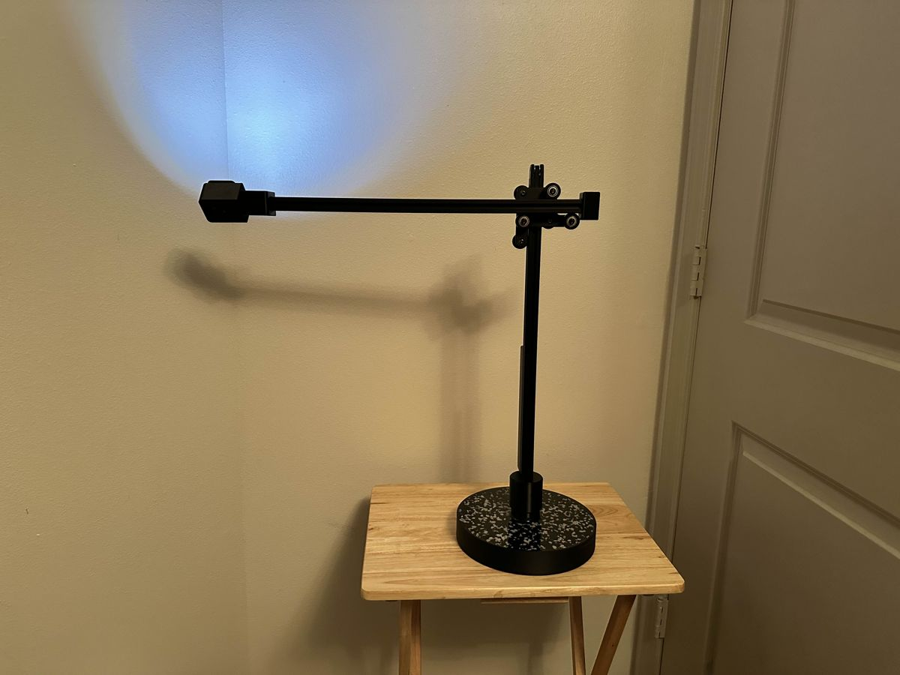

A printed part is rarely alone. It holds a magnet, slides on a rod, takes a screw or turns on a pin, and a part that is the right shape but a few tenths of a millimeter too tight is scrap. The **[International Organization for Standardization](kloom:e/international-organization-for-standardization)**'s system of limits and fits gives each pairing of hole and shaft a code: an H8/f7 "close running" fit on a 50 millimeter shaft, for instance, leaves between 0.025 and 0.089 millimeter of clearance. A desktop printer cannot hold anything like that. **[Prusa Research](kloom:e/prusa-research)** says its printers are accurate to at least 0.2 millimeter, that parts which must move need at least 0.3 millimeter of clearance as a starting point, and that there is no universal value: size, orientation, the shapes of the parts, the printer's calibration, the settings and the plastic all change it. Designing a printed part to fit is knowing which way the printer errs, and by how much.

## Why holes come out small

The commonest surprise is a hole that will not take its pin. The Slic3r manual lists the reasons. Plastic shrinks as it cools. More plastic is laid on the inside of a curve than the outside, which pulls an inner edge inward. A circle reaches the slicer as a polygon of chords, each inside the true circle. The filament cuts the corners of that polygon as it is dragged round. A wobble in the Z axis, an uneven filament or slack in a belt makes the hole the envelope of slightly different layers, smaller than any one of them.

In February 2011 the [RepRap](kloom:e/reprap) builder who blogs as nophead, on HydraRaptor, measured the polygon part. A polygon with its corners on a circle is smaller by a factor of cos(π/_n_): 10 sides lose 5 per cent of the radius and 22 sides 1 per cent. But printing holes of 1 to 10 millimeters with from 3 to 32 sides, he found that holes with few sides did not shrink at all, because their straight flats were laid where they were drawn and only the corners got rounded. His rule, written as a function for **[OpenSCAD](kloom:e/openscad)**, is a _polyhole_: give a hole of diameter _d_ millimeters about 2*d* sides, at least three, and enlarge it by 1 ÷ cos(π/_n_), so that the flats rather than the corners touch the circle. For a 3 millimeter hole that is six sides, a hexagon whose corners lie 1.73 millimeters from the center. The plate draws both: the twelve-sided polygon inside the circle, and the hexagon outside it.

The first layer errs the other way. Pressed against the bed, it spreads, and the bottom of a part flares out in a lip called elephant's foot, which can stop a printed peg entering its hole or a box closing on its lid. Slicers shrink the first layer to pay for it: Prusa suggests about 0.2 millimeter for a 0.4 millimeter nozzle, and Cura has a negative "initial layer horizontal expansion" for the same purpose.

## Choosing a clearance

The way to find a fit is a test piece: a row of pegs or holes at a range of clearances, printed and tried, as Prusa advises. With a clearance in hand, the arithmetic is simple. Here it is for two parts, with invented sizes and Prusa's starting clearances:

| Part                    | Drawn                               | Why                                                     |
| ----------------------- | ----------------------------------- | ------------------------------------------------------- |
| A 6 mm peg that slides  | hole 6.4 mm                         | 0.2 mm a side, about Prusa's stated accuracy            |
| A print-in-place hinge  | pin 4.0 mm, knuckle bored to 4.6 mm | 0.3 mm all round, the least for a moving part           |
| The hinge's knuckle gap | 0.4 mm between knuckles             | at 0.2 mm layers a gap must be a whole number of layers |

The last row is the trap in a hinge printed standing up. The gaps between its knuckles run horizontally, so they are built from layers: ask for 0.3 millimeter at 0.2 millimeter layers and the slicer can only give 0.2 or 0.4, and at 0.2 the knuckles may fuse. By our arithmetic, a vertical gap should be drawn as a multiple of the layer height.

## A lamp, and a magnet that changed

Ken Hiatt's task lamp, kTaskLight, published on [GitHub](kloom:e/github) in September 2025, shows the craft in a real design. Its arm turns on a pair of ring magnets, sold as 0.98 inch across with a 0.62 inch hole, each held in a printed mount. In the mount's STL file, by our own measurement, the pocket for the magnet is 25.25 millimeters across, 0.36 millimeter more than the magnet's 24.89: about 0.18 a side. A boss passes up through the magnet's 15.75 millimeter hole at 15.5 millimeters, a quarter of a millimeter loose. His assembly notes record the rest of the work by hand: the magnets "must be proud" of the mount, adjusted with printed shims; a ball bearing in a test detent sleeve needed the inside lightly sanded in **[ABS](kloom:e/acrylonitrile-butadiene-styrene)**; and the press-fitted magnets that held without glue in **[PLA](kloom:e/polylactic-acid)** needed a drop of superglue in ABS, the same design in two plastics fitting two ways.

Then, in November 2025, the magnet was no longer to be had from Amazon, where he had bought it. The likely replacement was slightly smaller across, and Ken's note says he would redo the design "to allow for different sizes of ring magnets". A printed fit is not a dimension but a relationship, between the drawing, the mesh, the slicer, the printer and the part it must hold, and when any one of them changes the drawing changes with it. The trail ends here; the main spine goes on from fused deposition modeling.
