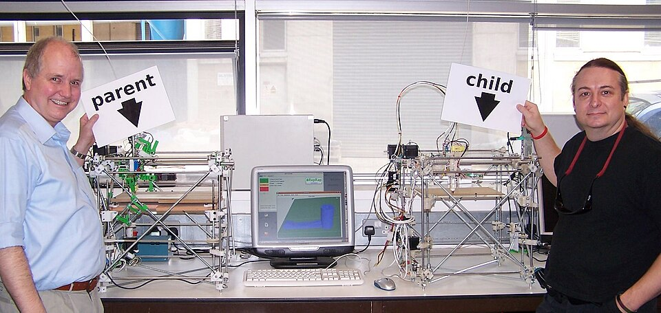
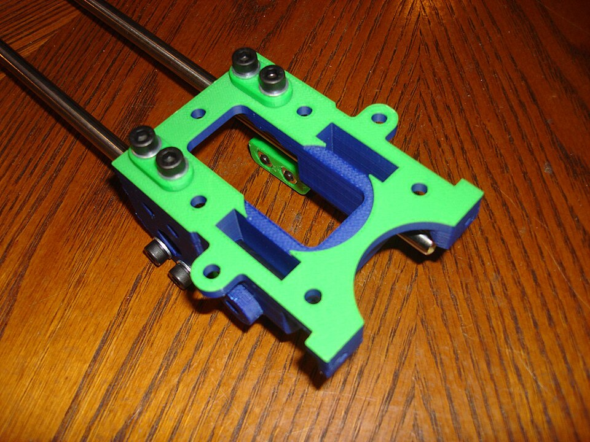

On 2 February 2004 **[Adrian Bowyer](kloom:e/adrian-bowyer)**, a senior lecturer in mechanical engineering at the **[University of Bath](kloom:e/university-of-bath)**, put a short essay on the university's website called "Wealth without money". Its argument was that one machine would matter more than all the other advances in rapid prototyping put together: one that could make itself. The mathematician **[John von Neumann](kloom:e/john-von-neumann)** had described a universal constructor, a machine that copies itself, in the middle of the twentieth century. Bowyer proposed building a practical one on a desk. In 2005, with money from the Engineering and Physical Sciences Research Council, the project began, and he named it **[RepRap](kloom:e/reprap)**, for _replicating rapid prototyper_.

## A printer that breeds

Bowyer's reasoning, as he and his colleagues set it down in 2011, came from biology rather than from engineering. Almost no living thing reproduces alone: a clover needs a bee. So RepRap would not try to build a whole copy of itself. It would print a kit of its own parts, and people would assemble it, rewarded, as the bee is with nectar, by everything else the machine could print for them. They chose to extrude melted plastic, since a laser or an inkjet head was something the machine could never make for itself, and coined the name _fused filament fabrication_ because the obvious name, FDM, was Stratasys's trademark. The machines were named after biologists. The first, "Darwin", was built in May 2007, a cube about half a metre on a side of threaded steel rods held at its corners by plastic blocks, its first set of parts printed on a commercial Stratasys machine.

On 29 May 2008, at Bath, a child Darwin whose printed parts had all been made by its parent made its own first part, a timing-belt tensioner, in about twenty minutes, finished at 14:00 UTC. Bowyer and Vik Olliver, the project's first volunteer, posed with the pair.

## What "self-replicating" meant

The technique is a piece of bookkeeping: count the parts. The team's paper gives Darwin's count, and the share of it the machine printed.

| Darwin's parts, by count | All parts | Leaving out nuts, bolts and washers |
| ------------------------ | --------: | ----------------------------------: |
| Printed by a RepRap      |       13% |                                 48% |
| Nuts, bolts and washers  |       73% |                                   — |
| Other bought parts       |       14% |                                 52% |

The last row is by our arithmetic, from the paper's other figures. The bought parts the community came to call _vitamins_: anything a RepRap needs that a RepRap cannot yet print. On Darwin they were the threaded rods, the stepper motors, the electronics, the belts and the MDF build plate, chosen so that they could be bought in any hardware shop, and the whole machine ran on 12 volts from an old PC power supply or a car battery. The fasteners alone outnumbered everything else, which is why the team always quoted 48%. They noted that gluing the frame instead of bolting it would have raised the share, at the cost of a machine nobody could take apart to mend.

The printed half had its own price in time. Darwin needed 1,200 mL of printed parts and laid down plastic at 15 mL an hour, which with its air-filled infill made 19 mL of finished part an hour: by our arithmetic, about 63 hours of printing to make a child. A child also had to be set up as accurately as its parent, with screw adjusters and a pair of digital calipers, and the paper counted the calipers among the things outside the machine. Without that, errors would grow from one generation to the next.

## Descendants

Bowyer released every design under the **[GNU General Public License](kloom:e/gnu-general-public-license)**, the copyleft licence of the Free Software Foundation, so that anyone who improved the machine had to publish the improvement on the same terms. The machine evolved, as he had hoped, by artificial selection. In 2010 the team counted about 4,500 RepRaps and derived machines, from four at the start of 2008. **[MakerBot](kloom:e/makerbot)**, founded in New York in January 2009 by Bre Pettis, Adam Mayer and the RepRap member Zach Smith, sold laser-cut kits and, as the licence required, published their designs; Bowyer and his wife put $25,000 into its seed round. The second RepRap, "Mendel", printed the same 48% of itself in a lighter frame.

The greatest descendant, **[Prusa i3](kloom:e/prusa-i3)**, came from Josef Průša, a Czech developer who had begun designing printers at nineteen, in May 2012. It traded the rod frame for a single water-jet-cut aluminium plate, built for rigidity and easy assembly rather than around the simplest hardware. The RepRap wiki lists 26 printed parts, without the extruder, against about 337 bought ones: by our arithmetic, about 7% of the machine by count, less than Darwin's 13%. Yet Průša's company makes the printed parts for the printers it sells on a farm of its own printers, and the RepRap wiki now calls "vitamin" obsolete jargon.

RepRap never printed its own motors, and few of its users wanted it to. What it bred was an idea: a machine whose design anyone could copy and change. The next frame is a way of designing parts that suited it, as a program anyone can read.
