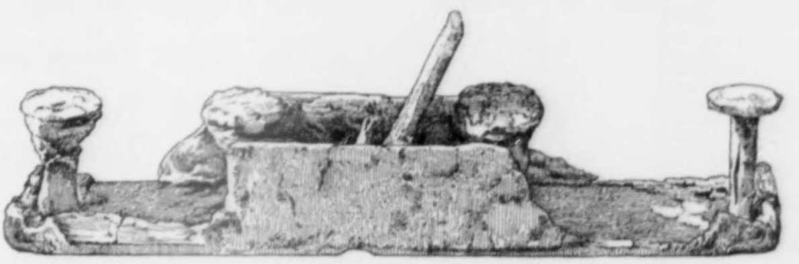

In his [_Natural History_](kloom:e/natural-history-pliny), published about AD 77, **[Pliny the Elder](kloom:e/pliny-the-elder)** stopped among the trees to say something about carpenters. Fir, he wrote, is the wood for doors and indoor joinery, and "the shavings of this wood when briskly planed, always curl up in circles like the tendrils of the vine." A little later he explained why saws cut green wood badly: the sawdust packs between the teeth, "and it is for this reason that the teeth are often made to project right and left in turns, a method by which the saw-dust is discharged." Pliny died in AD 79, in the eruption of Vesuvius that buried **[Pompeii](kloom:e/pompeii)**, and in Pompeii's ruins four planes have been found. In 1917 **[Flinders Petrie](kloom:e/flinders-petrie)**, surveying the tools of the ancient world, concluded that the **[plane](kloom:e/plane-tool)** "seems to have been a Roman invention".

## An iron-shod box

A Roman plane was a block of wood shod with iron. In the Pompeii planes a single iron plate runs from the back along the sole, over the front and across the top, and a bolt through the body holds the wedge that holds the blade. Others are known from the Rhineland and from Britain. In 1890 the Society of Antiquaries, digging the Roman town at **[Silchester](kloom:e/calleva-atrebatum)** in Hampshire, found a pit holding nearly sixty iron objects, tools of several trades: anvils, axes, adzes, hammers, chisels, gouges and one plane. Sir John Evans measured it:

| Part                | Silchester plane, by Evans (1894)        |
| ------------------- | ---------------------------------------- |
| Sole                | 13¼ in long, 2¼ in wide, faced with iron |
| Mouth               | about 6 in from the front, 1½ × ⅜ in     |
| Iron (the blade)    | about 4½ in long, 1⅜ × 5⁄16 in           |
| Angle of the iron   | 70° to the sole                          |
| What holds the iron | probably a wedge against an iron rivet   |

The body had rotted, and Evans could not tell its wood. Another plane, from Cologne, he described from a colleague's report as a framework of iron with no wood in it at all; Wikipedia's article calls the Cologne plane bronze. A blade from the Saalburg fort carries a maker's stamp, which Evans read as _Peregrinus fecit_, "Peregrinus made it".

## How a plane cuts

A plane is a chisel held at a fixed angle by a block that rides on the wood. The edge stands below the sole by exactly the thickness of the shaving. The sole rests on the two highest points under it and the blade crops them off, so the plane cannot reach a hollow shorter than itself, and a longer plane leaves a straighter surface. **[Charles Holtzapffel](kloom:e/charles-holtzapffel)**, of the London tool and lathe makers, whose _Turning and Mechanical Manipulation_ of 1846 set this down, gave the lengths: a smoothing plane 6½ to 8 inches, a jack plane 12 to 17, a jointer 28 to 30. The Silchester plane falls among the jack planes.

Three settings decide how cleanly it cuts. The first is the angle at which the blade is bedded, which joiners called its pitch. Holtzapffel gives the English pitches, with the Silchester plane for comparison:

| Pitch            | Blade to the sole | Holtzapffel's use                             |
| ---------------- | ----------------: | --------------------------------------------- |
| Common           |               45° | bench planes for deal and other soft woods    |
| York             |               50° | bench planes for mahogany and hard woods      |
| Middle           |               55° | moulding planes for deal, smoothing mahogany  |
| Half             |               60° | moulding planes for mahogany, difficult woods |
| Silchester plane |               70° | (Evans's measurement)                         |

The higher the pitch, the more sharply the shaving is bent as it rises up the blade, so that it breaks before it can split the wood ahead of the edge. Holtzapffel's top iron, a second blade screwed over the first, worked the same way, giving the shaving a steeper wall to climb: the work came out smoother, and the plane pushed harder. At 90° the blade only scrapes.

The second is the mouth, the slot in the sole in front of the blade. A wide one lets the fibres split ahead of the edge and tear up out of the surface, so the work is left "rough and torn"; a close one holds the wood down until the edge reaches it. By our arithmetic, a blade 5⁄16 inch thick at 70° fills about a third of an inch of the sole's length, so if Evans's "about ⅜ inch" was exact, the Silchester plane's mouth had a gap of about a millimetre in front of the edge, a fine mouth for a smoothing cut. The third is the edge itself: Holtzapffel grinds it at 25° and hones it at 35°, which at common pitch leaves 10° of clearance beneath it.

## The saw that clears itself

The Pompeii painting of a carpenters' procession shows two men on a float, ripping a board with a frame saw, a thin blade held taut in a wooden frame. Pliny's set teeth, bent alternately left and right, cut a kerf wider than the blade so that it cannot bind, and do away with the wedge the Egyptian sawyer needed. Petrie, though, writing in 1917, found no ancient saw whose teeth showed such a set: Pliny describes what the surviving blades do not.

The plane went wherever Rome did, and in Egypt, the furniture historian Geoffrey Killen notes, carpenters first took it up in the Roman period. The next frame goes east, to the temple carpenters of Japan, who reached the same smooth surfaces by a different road.
