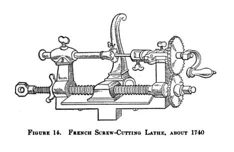
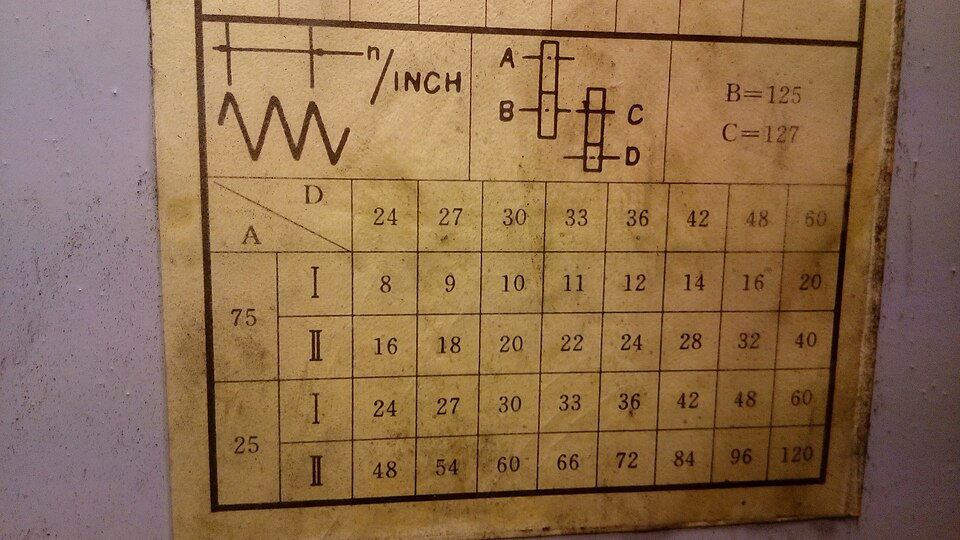

A screw thread is a groove wound round a cylinder at a constant pitch. To cut one in a lathe, the work machinists call **[threading](kloom:e/threading-manufacturing)**, the tool must travel along the work by exactly one pitch for every turn. The answer was to let a second screw, the **[lead screw](kloom:e/leadscrew)**, move the tool, and to tie it to the spindle with gears.

The idea is older than the machine that made it work. **[Jacques Besson](kloom:e/jacques-besson)**, engineer to Charles IX of France, published a lathe in his _Theatrum Instrumentorum_ in which a cord turned the work and a lead screw together, the operator pulling and releasing it. Joseph Wickham Roe, the historian of machine tools, dated the book to 1569; Wikipedia's article on Besson says 1571 or 1572. A French book of 1741 showed a lathe whose lead screw was driven from the work by gears, but "if the idea of change gears was contemplated", Roe wrote, "it was not developed." Meanwhile big screws were made by hand. At the Soho works in Birmingham, Anthony Robinson laid out one seven feet long on inked paper wrapped round the cylinder, and cut and filed its grooves by hand. Making one lead screw serve for many pitches, through a set of interchangeable gears, was **[Henry Maudslay](kloom:e/henry-maudslay)**'s own idea in Roe's account, though Wikipedia's article on Andrey Nartov credits Russian lathes of 1718 and 1749 with sets of gears. Roe counted 28 change wheels, of 15 to 50 teeth, with the lathe of about 1800 now in London's Science Museum. The anchor tells how his lathe copied a screw; this frame does the arithmetic.

## Gear arithmetic

The work turns with the spindle. A gear on the spindle drives, through an idler, a gear on the lead screw, and a half-nut on the carriage rides the lead screw. In one turn of the work the tool moves the lead screw's pitch times the ratio of the gears:

pitch cut = lead-screw pitch × (teeth on the driving gears ÷ teeth on the driven gears)

The idler changes only the direction of turning and the spacing of the shafts, never the ratio. On a lathe with a lead screw of 8 threads to the inch, a pitch of 3.175 millimetres, 20 threads to the inch needs a ratio of 8 ÷ 20, which a 20-tooth gear driving a 50-tooth gear gives. A metric thread is harder. For a pitch of 1.5 millimetres, by our arithmetic:

| Step              | Working                                             |
| ----------------- | --------------------------------------------------- |
| Lead-screw pitch  | 25.4 ÷ 8 = 3.175 mm                                 |
| Ratio wanted      | 1.5 ÷ 3.175 = 12 ÷ 25.4                             |
| Clear the decimal | 12 ÷ 25.4 = 60 ÷ 127                                |
| Gears             | 60 teeth on the spindle drive 127 on the lead screw |
| Check             | 3.175 × 60 ÷ 127 = 1.5000 mm                        |

The 127 is there because an inch is exactly 25.4 millimetres, and 25.4 is 127 ÷ 5. Whatever the metric pitch, the conversion needs a factor of 127, which is prime, so no train of ordinary gears gives it exactly; lathes therefore carry a 127-tooth _transposing gear_, and a metric lathe uses the same gear the other way round to cut inch threads. The 25.4 itself is newer than the gear trains. **[Carl Edvard Johansson](kloom:e/carl-edvard-johansson)** made his inch gauge blocks to exactly 25.4 millimetres in 1912, British and American industry adopted that "industrial inch" in 1930 and 1933, and Canada made it law in 1951, the United States in 1959 and Britain from 1964. The old American inch, 25.4000508 millimetres, differed by two parts in a million, which no shop-floor thread could show. Where a 127 will not fit, a pair of 37 and 47 teeth comes within 0.02 per cent, about 0.01 millimetre over a 50-millimetre thread.

## Half-nut and thread dial

A thread is cut in many passes, and each must follow the last. The US Army's manual of 1996 sets out the routine. Turn the work to the thread's major diameter and chamfer the end. Grind the tool to 60°, checked in a centre gauge. Set the compound slide at 29° and feed the tool in with it, so that one flank does most of the cutting and the chip curls free. Close the _half-nut_ on the lead screw and take a scratch cut no deeper than three thousandths of an inch, and measure the pitch. At the end of each pass, back the tool out, open the half-nut, run the carriage back by hand, and close it again only when the _thread dial_, a small wheel turned by the lead screw, shows a mark that puts the tool back in its groove: any graduation for an even number of threads to the inch, a numbered one for an odd number.

The dial fails for a metric thread, whose pitch does not repeat in step with the lead screw. Then the half-nut must never be opened until the thread is finished: the turner backs the tool out and runs the spindle in reverse to bring the carriage home. Open it by mistake and the tool has to be set back into its groove before the next cut.

## Pitches for everyone

Change gears made any pitch possible, and so every workshop chose its own. Around 1828 **[Joseph Clement](kloom:e/joseph-clement)**, who had worked for Maudslay, began cutting threads to a fixed pitch for each diameter, and **[Joseph Whitworth](kloom:e/joseph-whitworth)**, who worked for him, proposed in 1841 the thread that became Britain's standard, which the main spine takes up. Later the Hendey Machine Company's quick-change gearbox put the commonest ratios behind levers. The last frame of the trail leaves threads for patterns: the rose engine, which made a lathe draw.
