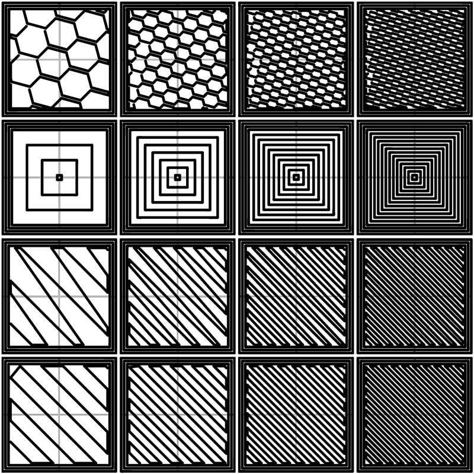

A printer cannot read a triangle. It reads moves: go here, at this speed, pushing this much plastic. The program that turns one into the other is the **[slicer](kloom:e/slicer-3d-printing)**. It cuts the model into horizontal layers, decides how each layer will be filled, and writes the result as [G-code](kloom:e/g-code), the same language of numbered words that machine tools run. Nearly every print made today passes through one, and the history of the programs is a family tree, because most of them are copies of one another.

## Skeinforge, Slic3r and their descendants

One of the first slicers that home printers used was **Skeinforge**, written for the **[RepRap](kloom:e/reprap)** project's printers. When the RepRap wiki gave it a page, on 8 November 2008, it was a script run inside the free 3D program Art of Illusion, and had earlier been called Threadforge and, before that, Export Slices. Its author signed himself Enrique. The sample on that page carries the line "GCode generated by March 29,2007 Skeinforge", and it shows how crude the first printers' instructions were: the extruder was simply switched on with M101 and off with M103, at a speed set once with M108, while G1 moved the head. Skeinforge grew into a chain of Python scripts, and only later versions, with their "dimension" module loaded, wrote how much filament each move should use.

In 2011 **Alessandro Ranellucci**, from the RepRap community, began **[Slic3r](kloom:e/slic3r)** from scratch, aiming at code that others could read and maintain. David Braam's **[Cura](kloom:e/cura-software)**, maintained by the printer maker Ultimaker after it hired him, ran on a heavily modified Skeinforge until June 2013, when it got its own engine in C++. Slic3r's license was the GNU Affero General Public License, a form of **[copyleft](kloom:e/copyleft)**: anyone may copy and change the program, but every version they distribute must carry the same license and its source. So when **Prusa Research** forked it in 2016 as Slic3r Prusa Edition, renamed **[PrusaSlicer](kloom:e/prusaslicer)** in May 2019, its improvements stayed open. **[Bambu Lab](kloom:e/bambu-lab)**'s Bambu Studio says in its own description that it is based on PrusaSlicer, "which is from Slic3r", and OrcaSlicer is in turn a fork of Bambu Studio. Ken Hiatt's guide for his father, written in January 2026, sends a part from Fusion 360 to Bambu Studio for a Bambu Lab H2S: export the mesh, drag it onto the plate, press Slice Plate.

## What a slicer decides for each layer

The first step is geometry. For each layer height _z_, every triangle that spans _z_ is cut, and where one of its edges runs from a corner at height _z_₁ to a corner at _z_₂, the cut falls a fraction (_z_ − _z_₁) ÷ (_z_₂ − _z_₁) of the way along it. Take a triangle with corners at (0, 0, 0), (10, 0, 4) and (0, 10, 2), in millimetres, invented for the purpose, and slice it at _z_ = 1. The first edge is cut a quarter of the way along, at (2.5, 0); the second halfway, at (0, 5). That short segment is this triangle's share of the layer's outline. The slicer joins every such segment end to end into closed loops, which only works if the mesh is closed: a missing triangle leaves a loop with a gap, and the layer cannot be filled.

Then the loop is filled, in three kinds of path. Cura's defaults make the arithmetic plain:

| Decision       | Cura's default     | For a 0.2 mm layer and 0.4 mm line, by our arithmetic |
| -------------- | ------------------ | ----------------------------------------------------- |
| Perimeters     | walls 0.8 mm thick | 0.8 ÷ 0.4 = 2 loops, offset inward one line apart     |
| Top and bottom | 0.8 mm thick       | 0.8 ÷ 0.2 = 4 solid layers on each face               |
| Infill         | 20 percent, a grid | lines spaced to fill a fifth of the interior          |

The perimeters are the visible skin. The solid layers seal the top and bottom. The infill is a lattice inside, and the Slic3r manual's advice is that 20 percent is about the least that will hold up a flat ceiling and 40 percent strong enough for almost anything. Too few top layers and the skin sags into the gaps of the lattice beneath it.

## The lines it writes

Here is the start of a layer as a slicer might write it for PLA, with invented coordinates:

| G-code                 | What it does                                             |
| ---------------------- | -------------------------------------------------------- |
| M104 S210              | set the hot end to 210 °C                                |
| M109 S210              | wait until it gets there                                 |
| G90                    | coordinates are absolute                                 |
| M82                    | so are the extruder's                                    |
| G0 Z0.2 F9000          | lift to the first layer, at 9,000 mm a minute            |
| G0 X50 Y50             | travel to the start, not extruding                       |
| G1 X70 Y50 E0.67 F1800 | print 20 mm east at 30 mm/s, feeding 0.67 mm of filament |
| G1 X70 Y70 E1.35       | print 20 mm north; the E count runs on                   |

The E number is the volume worked in the frame on fused deposition: a bead 0.45 mm wide, PrusaSlicer's width for a 0.4 mm nozzle, and 0.2 mm high has a section of 0.081 mm², so 20 mm of it is 1.62 mm³, and 1.75 mm filament holds 2.41 mm² to the millimeter. That is 0.67 mm of filament, by our arithmetic. In the firmware Marlin, G0 and G1 move in straight lines, F is in millimeters a minute, and by convention G0 is a move that does not extrude. The G-code frame reads the language itself.

The next frame is the one thing a slicer cannot do by cutting alone: print a layer where there is nothing underneath it.
