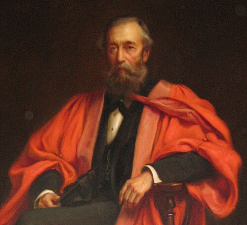
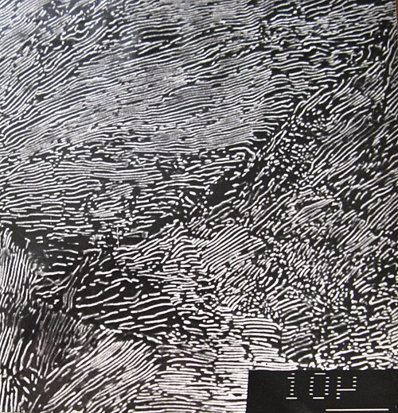

**[Henry Clifton Sorby](kloom:e/henry-clifton-sorby)** never needed a job. His family had been in the iron trade of **[Sheffield](kloom:e/sheffield)** since the early seventeenth century, and when his father died in 1847 he left the 21-year-old an income, with which Sorby built a laboratory at home. He made his name in geology, by grinding slices of rock so thin that light passed through them and looking at them under the microscope. "Mountains must indeed be examined with the microscope," he wrote. Steel lets no light through, however thin. So Sorby looked at its surface instead, by light reflected from it, and founded **[metallography](kloom:e/metallography)**, the study of metals under the microscope.

## A note at Bath

Wikipedia's article on Sorby dates his first etched steel to 1863. The first account in print is a short note to the **[British Association](kloom:e/british-science-association)** at its Bath meeting in September 1864. Sorby explained how to prepare sections of iron and steel "so as to exhibit their structure to a perfection that leaves little or nothing to be desired", and showed photographs, taken for him by Charles Hoole, of iron and steel at each stage of their making. They showed iron, slag, graphite and "two or three well-defined compounds of iron and carbon", mixed in different proportions. It drew little notice. **[Henry Marion Howe](kloom:e/henry-marion-howe)**, the American metallurgist, called these "brief notes"; Adolf Martens in Germany, working independently, published his own in 1878.

## How a specimen is made

The method Sorby worked out is still the method, with better materials. It is set out here as the French metallographer **[Floris Osmond](kloom:e/floris-osmond)** described it in 1904, crediting Sorby with its key steps.

| Step   | What is done                                                                                               | What goes wrong                                                   |
| ------ | ---------------------------------------------------------------------------------------------------------- | ----------------------------------------------------------------- |
| Cut    | a flat section is made in the workshop with a saw, file, lathe or grindstone                               | only a coarse view is possible until it is polished               |
| Grind  | the face is rubbed on emery papers laid on glass, each finer than the last                                 | loose grit wears pits instead of fine scratches                   |
| Polish | rubbed on damp parchment dressed with rouge, fine iron oxide, until it is a mirror                         | a workshop polish serves hard steel, but spoils soft or annealed  |
| Etch   | dilute nitric acid (Osmond used 2 or 20 per cent), or tincture of iodine, a drop to each square centimeter | the first drop is often a little too much; Osmond then diluted it |
| Look   | light enters the tube from the side, and a glass at 45° turns it down through the lens onto the face       | two aspects of one constituent can be taken for two constituents  |

The etch is the trick. The acid eats the iron without much dissolving the hard compound of iron and carbon, and it marks where one crystal meets the next, so the grains and what they hold stand out. Polishing on parchment does something similar on its own, Osmond found, because the hard parts wear more slowly: 500 to 2,000 strokes back and forth were usually enough. Today's etchant is nital, nitric acid in alcohol, which must be kept weak: above about 10 per cent it can explode.

## The pearly constituent

In May 1886 Sorby told the Iron and Steel Institute what he had seen with "very high powers": a magnification of 650, about ten times what he had used before. The small crystals of a medium steel split, under it, into alternating very thin plates. A grain about a thousandth of an inch across held "something like 60" of them. By our arithmetic, that is about 0.4 micrometers a plate, near the limit of any light microscope, which cannot resolve much below 0.2 to 0.3 micrometers. The hard plates, he reasoned, must hold the carbon, since they were absent from iron without carbon and grew with it.

Standing in relief, the fine plates broke the light into iridescent colors that recall mother-of-pearl, Osmond explained, and Sorby called the structure the pearly constituent. Osmond says the name **[pearlite](kloom:e/pearlite)** was proposed by Howe with Sorby's assent. Wikipedia's article on pearlite says it was first called sorbite. In Osmond's book and in the definitions Howe and Albert Sauveur proposed in 1912, sorbite is a different structure, one stage in the breakdown of hardened steel, named in Sorby's honor.

## A guess about heat

Sorby went further than what he saw. It looked, he said, as if a compound of iron with a little carbon existed at high temperature and, on cooling, broke up into iron with more carbon and iron with none. That is exactly right. Many of his specimens survive, and were cataloged in 1997.

Where that compound exists, and at what temperature it breaks up, is the subject of the next frame, the diagram of iron and carbon.
