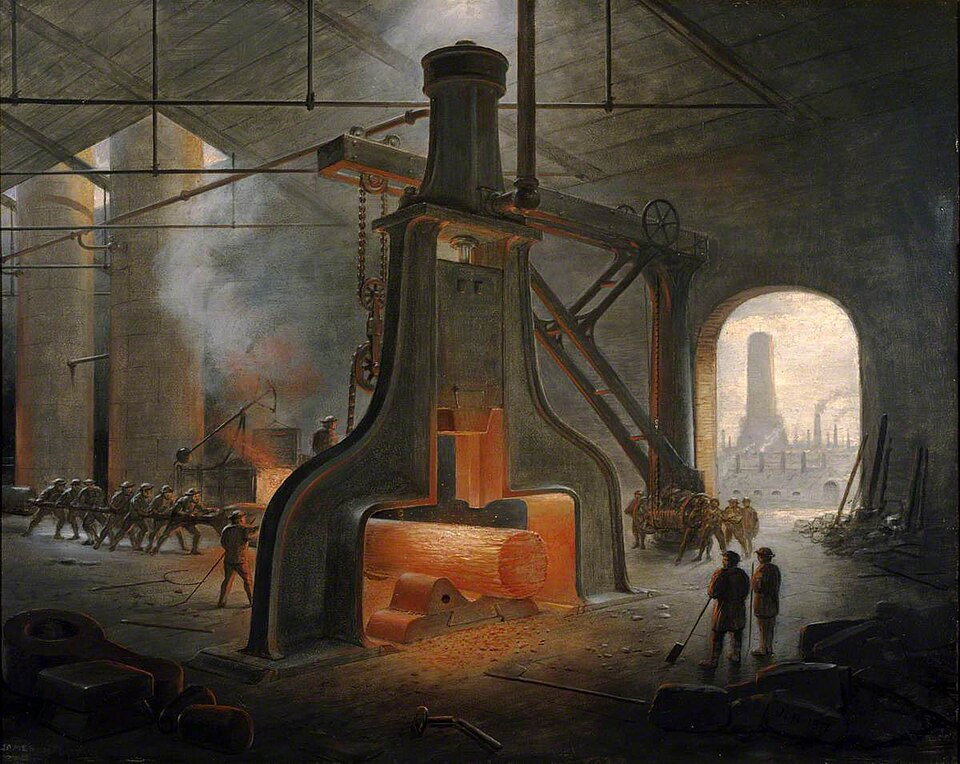
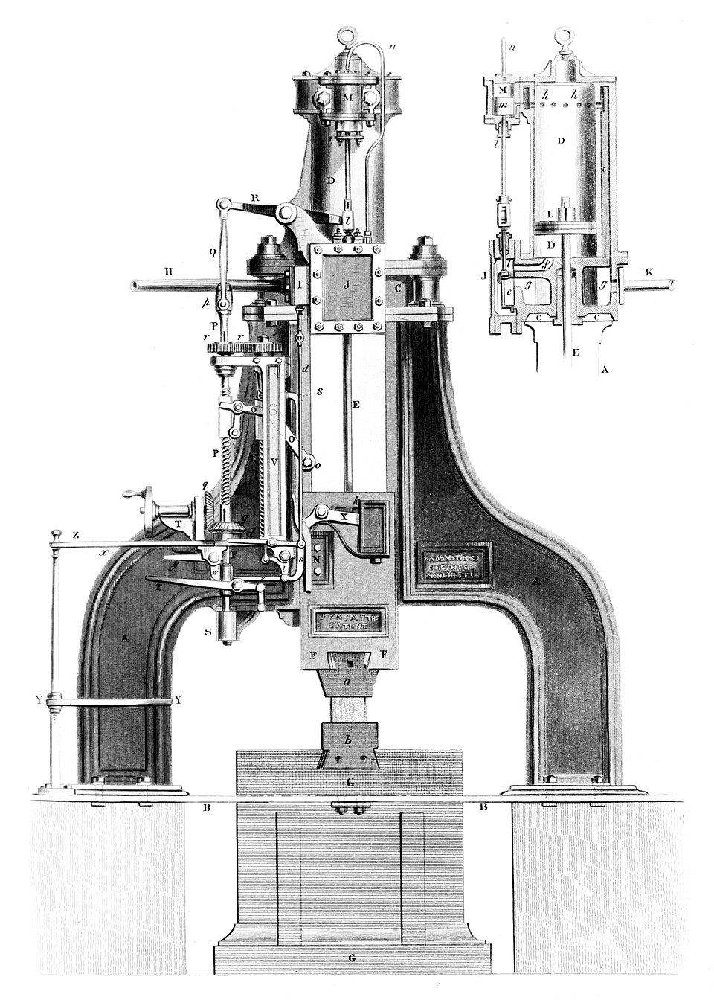

On 24 November 1839 a letter reached **[James Nasmyth](kloom:e/james-nasmyth)** at his Bridgewater Foundry in Patricroft, near Manchester. It came from Francis Humphries, engineer of the Great Western Steamship Company, which was building a ship larger than any yet built, the **[SS _Great Britain_](kloom:e/ss-great-britain)**. Its engines needed a wrought-iron paddle shaft thirty inches across, and "there is not a forge hammer in England or Scotland powerful enough to forge" it, Humphries wrote. "What am I to do?" Within half an hour, Nasmyth said, he had drawn the answer in his "Scheme Book": the **[steam hammer](kloom:e/steam-hammer)**. That is his telling, published in 1883 in an autobiography edited by Samuel Smiles, forty-three years after the event. The documents tell a more crowded story.

## Why the old hammers failed

A forge hammer of the 1830s was a tilt or helve hammer: a heavy head on the end of a beam, lifted by cams on a shaft turned by a waterwheel or an engine, and let fall. Its head swung through a short arc. Put a big piece of work on the anvil and it filled the gap, so that, in Nasmyth's word, the hammer was "gagged": the work that needed the hardest blow got next to none.

His remedy was to lift the hammer straight up. The sketch shows a massive anvil, a block of iron for the hammer, and above it an upside-down steam cylinder, its piston rod fixed to the block. Steam let in under the piston raises the block; a slide valve lets the steam out, and the block falls under its own weight. Since the man at the valve sets how high it rises and when it drops, he could, Nasmyth wrote, "think in blows". He liked to show visitors a blow that cracked the end of an egg in a wine glass on the anvil, followed by one that would "shake the parish".

The idea was not new. **[James Watt](kloom:e/james-watt)**'s steam engine patent of 1784 already described hammers worked "directly" by an engine's piston rod, though his swung on a beam, and others had patented steam hammers since.

## Who built it first

The paddle shaft was never forged. Early in 1840 **[Isambard Kingdom Brunel](kloom:e/isambard-kingdom-brunel)** saw a screw-driven steamer at Bristol, and the _Great Britain_ was rebuilt for a propeller. Nasmyth found no buyers in a slump. In the middle of 1840 Eugène Schneider and his engineer **[François Bourdon](kloom:e/francois-bourdon)** visited Patricroft while Nasmyth was away, and his partner showed them the Scheme Book. Later that year Bourdon built the world's first working steam hammer at **[Le Creusot](kloom:e/le-creusot)** in France, with a 2,500-kilogram block that rose 2 metres. Nasmyth saw it in April 1842, when Bourdon took him to "see my own child", and he hurried home to patent his own: in June 1842 by his account and the patent record, though Wikipedia's article on the steam hammer dates it 9 December 1842. Bourdon had drawn a hammer of his own, his _pilon_, in 1839, and historians now think the two men reached the idea independently, at the same time. Nasmyth won the argument in print.

## Forging under the hammer

What the hammer did is **[forging](kloom:e/forging)** with open dies: flat faces above and below, and a forgeman turning the work between blows so that it is drawn down evenly, until it cools and must go back to the furnace. Hot steel is forged today at about 950 to 1,250 °C, above the temperature at which its crystals form afresh. The blow's energy is the block's weight times its fall. With the figures Nasmyth and Wikipedia give, by our arithmetic:

| Hammer                                     | Block                  | Fall         | Energy of the fall |
| ------------------------------------------ | ---------------------- | ------------ | -----------------: |
| Bourdon's, Le Creusot, 1840                | 2,500 kg               | 2 m          |        about 49 kJ |
| Nasmyth's own first, Patricroft, 1842      | 30 cwt, about 1,520 kg | 4 ft, 1.22 m |        about 18 kJ |
| His first order, for Rushton and Eckersley | 5 tons, about 5,080 kg | 5 ft, 1.52 m |        about 76 kJ |

Wikipedia's article says his first hammer went to the Low Moor works at Bradford, which rejected it and took an improved one in 1843; Nasmyth lists Low Moor's as his second order. From 1843 Nasmyth let steam in above the piston as well, to drive the block down harder than gravity alone. Why so much? A hammer's blow lasts milliseconds and deforms mostly the metal nearest the dies, leaving the inside of a big forging little changed. To work a thick shaft through to its core takes heavy blows, repeated while it is hot. For wrought iron there was a second reason. Large pieces such as anchors had been built up "bit by bit" from small ones welded together, and broke at the welds. Under the steam hammer, Nasmyth wrote, "the slag was driven out during the hammering process", and an anchor was "sound throughout because it was welded as a whole".

Hammers grew: Krupp's "Fritz" of 1861 struck 50 tons, Schneider's at Le Creusot 100 tons in 1877. In the end hydraulic presses, squeezing slowly and evenly through the whole mass, replaced them for the biggest forgings. The next frame joins iron without any hammer, with an electric arc.
