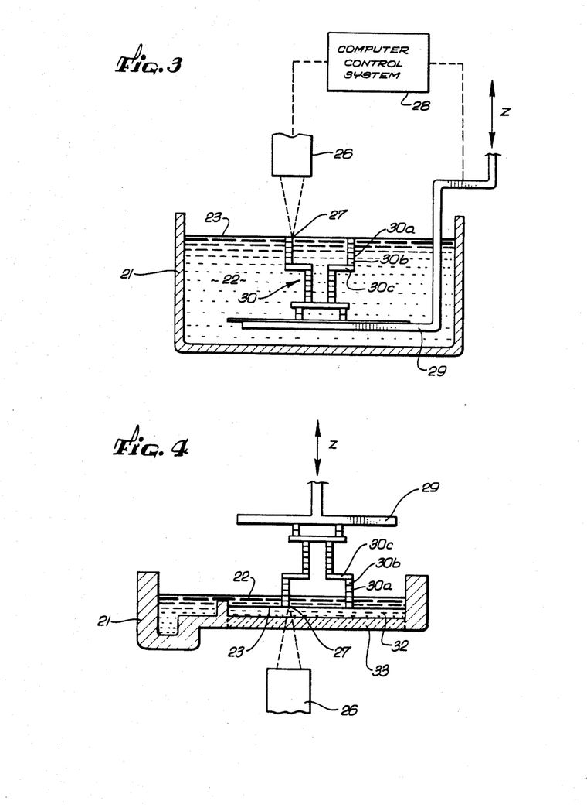
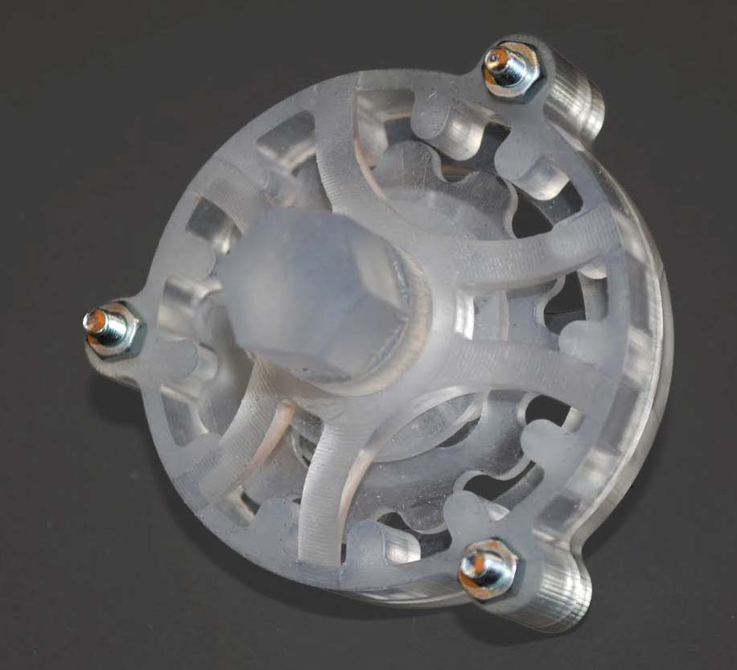

In 1983 **[Chuck Hull](kloom:e/chuck-hull)**, an engineer in California, was using ultraviolet light to harden thin coatings on tabletops. As his story is told, he saw that a liquid which light turns solid could be hardened one thin layer at a time, each layer drawn in the shape of a slice through an object, until the slices made the object. His employer, UVP, filed the patent on 8 August 1984. When it was granted on 11 March 1986, it gave the process a name, **[stereolithography](kloom:e/stereolithography)**, and it became the first commercial way of making a solid object directly from a computer's drawing: the beginning of **[3D printing](kloom:e/3d-printing)**.

## A plotter that drew in light

The patent explains its name. Lithography, it says, is "the art of reproducing graphic objects", from photography to the microlithography that patterns microchips; stereolithography would reproduce solid ones. Its raw material was already a commodity, a **[photopolymer](kloom:e/photopolymer)**: one of the "UV curable chemicals" then used as fast-drying printing inks, paper coatings and adhesives. Hull's working machine used Potting Compound 363, a modified acrylate made by Loctite.

The machine itself was improvised from office equipment. A 350-watt mercury arc lamp shone into a fiber-optic bundle 1 mm across, whose far end was focused to a spot a little under a millimeter wide. The lens was clamped to the pen carriage of a Hewlett-Packard 9872 plotter, which a computer drove with ordinary graphics commands. The spot drew one slice on the surface of a vat of resin, a platform under it sank by one layer, and the spot drew the next. The finished part was rinsed in acetone and given a final cure under a strong ultraviolet lamp. Commercial machines replaced the lamp and plotter with an ultraviolet laser steered by mirrors.

The patent's second drawing turns the machine upside down. The resin floats in a thin layer on a heavier liquid that will not mix with it, the light comes up through a quartz window in the floor, and the part is pulled up out of the vat. That arrangement is typical of desktop resin printers today.

## Who was first

Hull was not the first to try it. In April 1980 **Hideo Kodama**, at the Nagoya Municipal Industrial Research Institute in Japan, built machines that hardened a photopolymer layer by layer, through masks or with a scanning optical fiber, and published them in 1981, including a transparent model whose inside could be seen through it. His patent application was published that year and then abandoned, his research budget was 60,000 yen a year, and nobody took it up. In France, Alain Le Méhauté, Olivier de Witte and Jean-Claude André filed a patent on 16 July 1984, three weeks before Hull; their sponsors dropped it "for lack of business perspective". Hull's held. He founded **[3D Systems](kloom:e/3d-systems)** in Valencia, California, in 1986, and its first machine, the SLA-1, reached customers in 1988. The company also gave the industry STL, a way of describing a part as a mesh of triangles, which the frame on STL meshes in the trail _Slicers and supports_ takes up.

## Curing a layer

Ultraviolet light is absorbed as it goes down into the resin, losing the same fraction for every equal depth it travels. The resin sets only where it has received at least a critical dose, *E*c. Paul Jacobs, in a 1992 textbook on the process, put the two together as the _working curve_: a layer cures to a depth *C*d = *D*p ln(_E_ / *E*c), where _E_ is the dose at the surface and *D*p is the depth in which the light falls to 1/_e_, about 37 percent. Both numbers belong to the resin, and they are measured, not assumed. In 2017 Joe Bennett at NIST measured one commercial resin, PR48, at 405 nm: *D*p = 53 µm and *E*c = 6.3 mJ/cm². By our arithmetic, these are the depths it cures to:

| Dose at the surface (mJ/cm²) | Cure depth (µm) |
| ---------------------------: | --------------: |
|                         12.6 |              37 |
|                           25 |              73 |
|                           50 |             110 |
|                          100 |             146 |
|                          200 |             183 |

Every doubling of the dose adds the same 37 µm, *D*p × ln 2. So to print layers 100 µm thick, a maker picks a cure depth somewhat deeper, so that each layer bites into the one below; Hull's patent asks for laminae thick enough to adhere to their neighbors. Choosing 150 µm, our own figure, needs 6.3 × exp(150 ÷ 53) ≈ 107 mJ/cm², and a dose 10 percent off changes the depth by only 5 µm. The logarithm forgives a wandering lamp. Jacobs advised keeping the cure depth under four times *D*p, here 212 µm.

The resin does not forgive. Bennett found *D*p and *E*c differing by as much as ten times among five commercial resins, so a dose that suits one resin can be badly wrong for another; differences that large, his paper says, "will clearly affect printed part quality". Early 3D Systems machines carried a built-in test for it, WINDOWPANE, which relied on curing resin and measuring its thickness with callipers.

Stereolithography needs a liquid that light will set. The next frame does without the liquid: a laser, and a bed of powder.
