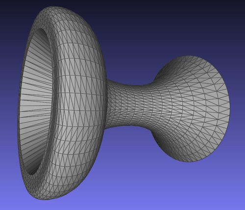

Before a printer can build anything, the object has to reach it as data, and for almost forty years that data has usually been a file ending in **[STL](kloom:e/stl-file-format)**. The format was written for **[3D Systems](kloom:e/3d-systems)**, the company **[Chuck Hull](kloom:e/chuck-hull)** founded to sell his stereolithography machines. Wikipedia dates it to 1987 and credits the Albert Consulting Group with writing it. The **[Library of Congress](kloom:e/library-of-congress)**, which keeps a description of the format for its collections, dates the first documentation to the company's _StereoLithography Interface Specification_ of 1988, with a second edition in 1989, and admits that its compilers could not find a copy of either. Hull has said that the three letters simply abbreviate "stereolithography"; others read them as "standard triangle language". The format itself is not in doubt, because it is almost nothing: a list of triangles.

## What the file holds

Each triangle, or facet, is twelve numbers: three for its normal, an arrow of length one pointing out of the solid, and three for each corner. Marshall Burns, reprinting the 1989 specification in his 1993 book _Automated Fabrication_, set out its rules. The corners are listed anticlockwise as seen from outside, so the facet says which side is out twice over. Every facet must meet each neighbor corner to corner, never a corner on another's edge. The original specification also required every coordinate to be positive, a rule nobody now keeps. There is no unit, no color and no curve. A binary file is an 80-byte header, a four-byte count, and then 50 bytes a triangle: twelve 32-bit floating-point numbers and two spare bytes.

Ken Hiatt's lamp, published on GitHub as kTaskLight, gives two real files to read, by our own count. Its counterweight shims are six thin blocks, 5.5 by 19.5 millimeters and from 0.2 to 1.2 millimeters thick. A block needs 8 corners and 12 triangles, and its corners minus its 18 edges plus its 12 faces give 2, the **[Euler characteristic](kloom:e/euler-characteristic)** of any closed solid without holes. Six blocks make 72 triangles and a file of 84 + 72 × 50 = 3,684 bytes, exactly its size on disk. Even the thinnest block is not quite what was drawn: 0.2 cannot be written exactly in binary floating point, and the file stores 0.200000003.

| Ken's file          | Triangles |   Bytes | Distinct corners | Times each corner is written |
| ------------------- | --------: | ------: | ---------------: | ---------------------------: |
| Counterweight shims |        72 |   3,684 |               48 |                          4.5 |
| Ring magnet mount   |     4,982 | 249,184 |            2,489 |                          6.0 |

The last column is the format's waste. A corner shared by six triangles is written out six times, the redundancy a 1997 study by Chua Chee Kai and colleagues pointed to, as the Library of Congress notes, and a program reading the file must find which copies are the same point before it can tell whether the surface is closed.

## How many triangles a curve needs

A flat facet cannot follow a curve, so every round thing in an STL file is a polygon, and the question is how close. Cut a circle of radius _r_ into _n_ equal chords. Each chord lies inside its arc, and the gap at the middle, the chord error or sagitta, is _s_ = _r_(1 − cos π/_n_). Turned round, _n_ = π ÷ arccos(1 − _s_/_r_). Ken's ring magnet mount has a round pocket 25.25 millimeters across, for a magnet sold as 0.98 inch, about 24.9 millimeters. Here is that circle, _r_ = 12.625 mm, worked by our arithmetic:

| Sides _n_ | Chord error _s_ | Where the number comes from                  |
| --------: | --------------: | -------------------------------------------- |
|        12 |         0.43 mm | the plate                                    |
|        36 |        0.048 mm | no facet turning more than 10° from the next |
|        96 |       0.0068 mm | Archimedes' polygon                          |
|       131 |       0.0036 mm | the fewest for a deviation of 0.003683 mm    |
|       172 |       0.0021 mm | the pocket as Ken's file actually holds it   |

The error falls with the square of _n_: double the sides and it drops to a quarter. That is why **[Archimedes](kloom:e/archimedes)**, doubling a hexagon four times to 96 sides, could pin π between two fractions, and why a printed hole needs no more than a hundred or so. **[Fusion 360](kloom:e/autodesk-fusion)**, the design program Ken uses, sets the tessellation by two limits, and his guide to its "save as mesh" dialog records them at the High setting: a surface deviation of 0.003683 millimeters and a normal deviation of 10 degrees. Each gives its own count, 131 sides from the first and 36 from the second, and the stricter one wins. The file as published has 172, more than either asks for, so other limits or settings were at work when it was saved; the file does not say which. Either way, its flats sit two thousandths of a millimeter inside the circle, about a hundredth of a 0.2-millimeter layer, and the magnet's fit is decided elsewhere. The header of each file begins "STLB ATF 14.10.0.0 COLOR=", Autodesk's translator writing a color into the header by a convention Wikipedia attributes to Materialise's Magics software. A reader that knows only the specification ignores it.

## After STL

In April 2015 a consortium of Autodesk, Dassault Systèmes, HP, Microsoft and others published the **[3D Manufacturing Format](kloom:e/3d-manufacturing-format)**, 3MF. It is still triangles, but each corner is stored once and the triangles name corners by number. A unit is part of the file, millimeters unless stated otherwise, and a mesh must be closed, every edge shared by exactly two triangles. It carries colors, materials and supports beside the shape. In 2025 it became the international standard ISO/IEC 25422. STL is still what most printable models are shared as. A triangle list is where a print begins, and cutting those triangles into layers is the next frame's work.
