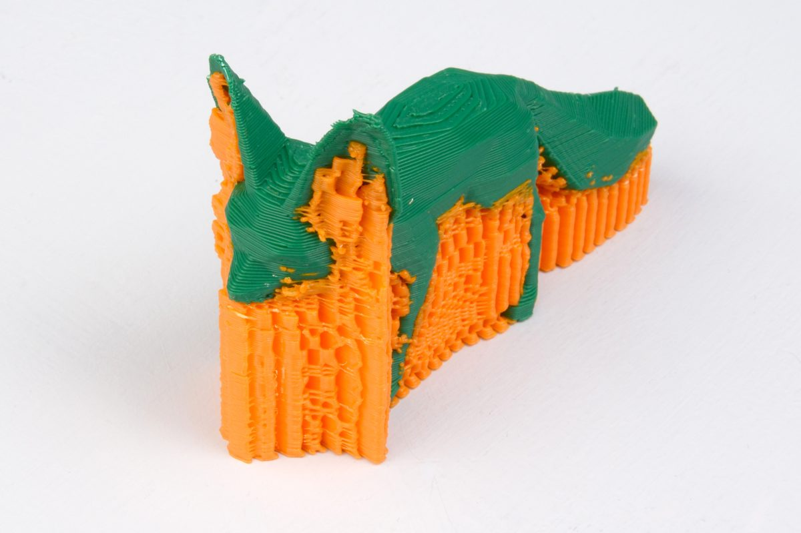

A printer that lays plastic in layers has one rule it cannot break: every layer must rest on the one below. A wall can lean, a little, because each new bead can sit partly on the last. A flat ceiling, an arm held out sideways or the underside of a sphere starts in mid-air, and molten plastic laid on nothing falls. **[Prusa Research](kloom:e/prusa-research)**'s guidance for its printers is that a clean overhang can lean between 45 and 60 degrees from the vertical, depending on the nozzle and the settings, less with a fine nozzle, and up to 75 degrees on its newest machines with fans blowing from every side. Everything steeper needs help, and deciding where, and how little, is the slicer's hardest job.

## Why about 45 degrees

The rule comes out of the shape of a bead. The Slic3r manual models a printed line in section as a rectangle with a round end on each side, as wide as the bead and as high as the layer. A bead can hang out past the one beneath it by about half its width before too little of it is resting on anything. **[PrusaSlicer](kloom:e/prusaslicer)**'s automatic detection says exactly that in its code: unless the user sets an angle, an area needs support where the layer reaches more than half an outer bead's width beyond the layer below. Each layer climbs one layer height and steps out half a width, so the steepest unsupported angle, measured from the vertical, is the angle whose tangent is (_w_ ÷ 2) ÷ _h_. For PrusaSlicer's 0.45 millimeter bead from a 0.4 millimeter nozzle, by our arithmetic:

| Layer height _h_ | Step _w_/2 | Steepest overhang from vertical |
| ---------------: | ---------: | ------------------------------: |
|          0.10 mm |   0.225 mm |                             66° |
|          0.15 mm |   0.225 mm |                             56° |
|          0.20 mm |   0.225 mm |                             48° |
|          0.30 mm |   0.225 mm |                             37° |

So, by this arithmetic, the familiar 45 degrees belongs to the 0.2 millimeter layer, the commonest setting, and thinner layers lean further. The slicers do not even agree on which way to measure. **[Cura](kloom:e/cura-software)** asks for a "support overhang angle" counted from the vertical, 50° by default, so that 0° supports everything. PrusaSlicer's "overhang threshold" is counted from the horizontal. The same number typed into each means different slopes: 30 in Cura supports far more of a part than 30 in PrusaSlicer.

A bridge is the other exception. A line stretched across a gap between two supports can be printed in mid-air, because both its ends are held. The Slic3r manual's flow model notes that a bridged line comes out round, as wide as the nozzle, and is laid with no overlap with its neighbor. Prusa's advice is to keep bridges short, slow and well cooled, with a little less plastic, so that the strand is pulled taut behind the nozzle rather than sagging.

## Scaffolding, and how to need less

The slicer's answer to everything else is a scaffold printed with the part and broken off afterwards. The usual kind is a grid or zigzag of thin walls dropped straight down under every overhang. Cura's defaults print it at 15 percent density, with a gap of 0.1 millimeter between its top and the part and 0.7 millimeter at the sides, so that it holds the part up but lets go when snapped away. In 2014 **Juraj Vanek**, Jorge García Galicia and Bedřich Beneš at **[Purdue University](kloom:e/purdue-university)** published "Clever Support", which found the points that needed holding and grew a branching tree up to them from the bed. On a **[MakerBot](kloom:e/makerbot)** Replicator 2 their trees cut printing time by 29.4 percent and material by 40.5 percent, on average, against the printer's own supports. Tree supports are now standard: Cura has them, and Prusa's "organic" supports, it says, are an evolution of Thomas Rahm's tree supports, which came from Cura. A printer with two nozzles can print the scaffold in a second material, such as **[polyvinyl alcohol](kloom:e/polyvinyl-alcohol)**, which dissolves in water.

Supports cost three ways: the plastic and the hours they take to print, and the surface they leave. Prusa warns that a face printed over supports will never be as clean as a wall or a top. So the best support is one designed away: a **[chamfer](kloom:e/chamfer)** in place of a rounded edge, a part split in two, a part turned over. Prusa's knowledge base gives the moves:

| Problem                         | Design it away                                                    |
| ------------------------------- | ----------------------------------------------------------------- |
| A rounded edge facing the bed   | a chamfer at 45° instead of a fillet, which starts flat           |
| A part with overhangs both ways | split it, print each half flat, and glue it                       |
| An arm or a ceiling             | turn the part over or on its side until it rests on what it needs |
| A long bridge                   | a support enforcer halfway along, or a shorter span               |

The plate draws both halves of the problem: the beads stepping out half a width a layer, and a tree reaching up under an arm that no bead could reach.

Supports decide whether a part can be printed. Whether it then fits the part it was made for is the next frame.
