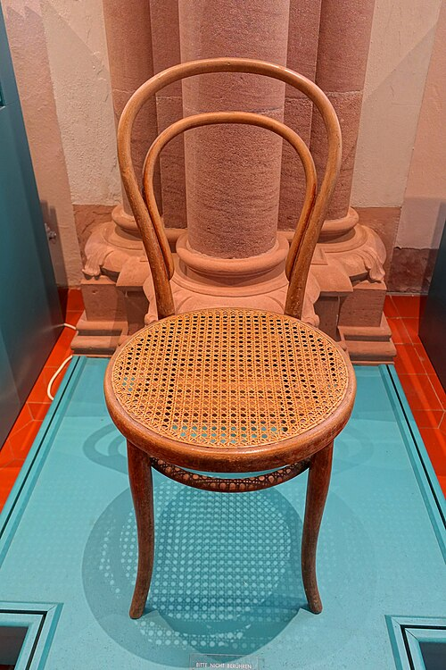
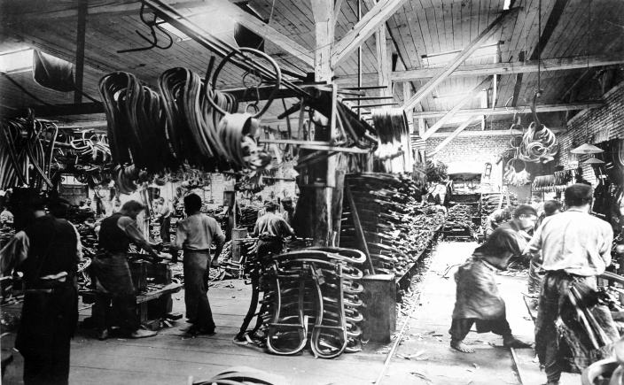

In 1859 the Viennese firm of **[Gebrüder Thonet](kloom:e/gebruder-thonet)** put on sale a new café chair. It had no carving, no joints for a cabinetmaker to cut and almost no glue. The **[No. 14 chair](kloom:e/no-14-chair)** is six pieces of steam-bent beech, ten screws and two nuts: a back that runs on down to become the back legs, a smaller loop inside it, a seat ring, two front legs and a ring that braces them. It could be made by workers who were not cabinetmakers, shipped in pieces and screwed together where it was sold. Some 50 million are said to have been sold by 1930, a figure the architect Ivan Margolius reports as a claim, and it is still made. How you bend a rod of solid beech into a hoop without breaking it is the trick that made all of it possible.

## From glue to steam

**[Michael Thonet](kloom:e/michael-thonet)** was a cabinetmaker in **[Boppard](kloom:e/boppard)**, on the Rhine, who began in the 1830s to make chair parts from thin strips of wood boiled in glue, stacked and clamped in moulds until they set in curves. In 1841, at a trade fair in Koblenz, the Austrian chancellor **[Metternich](kloom:e/klemens-von-metternich)** saw his chairs and urged him to move to Vienna, and in 1842 Thonet was granted an Austrian privilege "to bend every kind of wood, even the most refractory, by any chemico-mechanical means into any form or curve" (Margolius dates it 16 June 1842; the furniture shop smow's history gives 16 July). The laminated chairs had a weakness: their animal glues let go in damp. The design historian Mathias Schwartz-Clauss, as smow reports him, argues that orders from overseas after the Paris exhibition of 1855 forced the change, because laminated furniture could not survive a ship's hold.

So the Thonets learned to bend solid wood. On 10 July 1856 the firm, now run by Michael's five sons, was granted a privilege for "the manufacture of chairs and table legs made of bent wood, the bending facilitated by the action of steam or simmering liquids". That year it opened its first factory at **[Koryčany](kloom:e/korycany)** in Moravia, beside beech forests, and three years later came the No. 14. By 1900, Margolius writes, the firm had 6,000 workers making 4,000 pieces of furniture a day, and 36 knocked-down chairs went into a crate of one cubic metre.

## How solid wood bends

Wood is bundles of stiff cellulose fibres in a matrix of **[lignin](kloom:e/lignin)** and hemicelluloses. Lignin softens when heated, but dry it does so only at about 170 °C, hot enough that the fibres begin to decompose if held there. Water lowers that temperature, so wood that is hot and wet can be bent without charring, and holds its new shape once it cools and dries. The US Forest Products Laboratory's _Wood Handbook_ gives the rule: steam or boil the stock for about 15 minutes a centimetre of thickness if it is at 20 to 25% moisture, and about 30 minutes a centimetre if it is drier.

Hot, wet wood is lopsided, though. It can be squeezed 25 to 30% along the grain, but stretched only 1 to 2%. Bend a rod freely and its outer face stretches, and past a gentle curve the outer fibres tear. The answer is **[steam bending](kloom:e/steam-bending)** with a strap: a band of steel along the outer face, with end stops pressing on the rod's ends, so that the outer face keeps its length and the whole rod is compressed instead. The inner face wrinkles and shortens; nothing stretches. The handbook calls for a strap whenever the outer and inner faces must differ in length by much more than 3%. Thonet's makers today describe the band as the important part: without it, the wood breaks in two.

Here is the arithmetic, for an invented beech rod 25 millimetres thick:

| Bend                                      | Strain on the faces, by our arithmetic | Result                     |
| ----------------------------------------- | -------------------------------------- | -------------------------- |
| Free, round a form of 150 mm inner radius | outer face stretched about 7.7%        | breaks: wood gives 1–2%    |
| Free, gentlest bend at 1.5% stretch       | inner radius about 820 mm              | a shallow arc, no chair    |
| Strapped, round 150 mm                    | outer 0%, inner compressed about 14%   | bends                      |
| Strapped, tightest                        | inner compressed 25% at 75 mm radius   | the limit, three times _t_ |

Freely bent, the rod's middle keeps its length, so the outer face stretches by half the thickness over the radius of that middle line. Strapped, the outer face keeps its length and the inner face is shortened by the thickness over the outer radius. Steaming that rod at 20 to 25% moisture takes, by the handbook's rule, about 38 minutes.

## Fixing the bend

A bent part is held on its form, strap and all, while it cools and dries, and only then released. Wikipedia's account of the No. 14 says the parts were dried at about 70 °C for some 20 hours. Dried, the curve stays, though damp can relax it a little, which is one reason screws, which can be tightened again, suited the chair better than glued joints.

In December 1869 the firm gave up its privilege of its own accord, and rivals such as Jacob & Josef Kohn, with whom the Thonets merged in 1922, bent beech too. The next frame takes the other road Thonet had tried and left: thin veneers glued across one another, and pressed into curves no rod could take.
