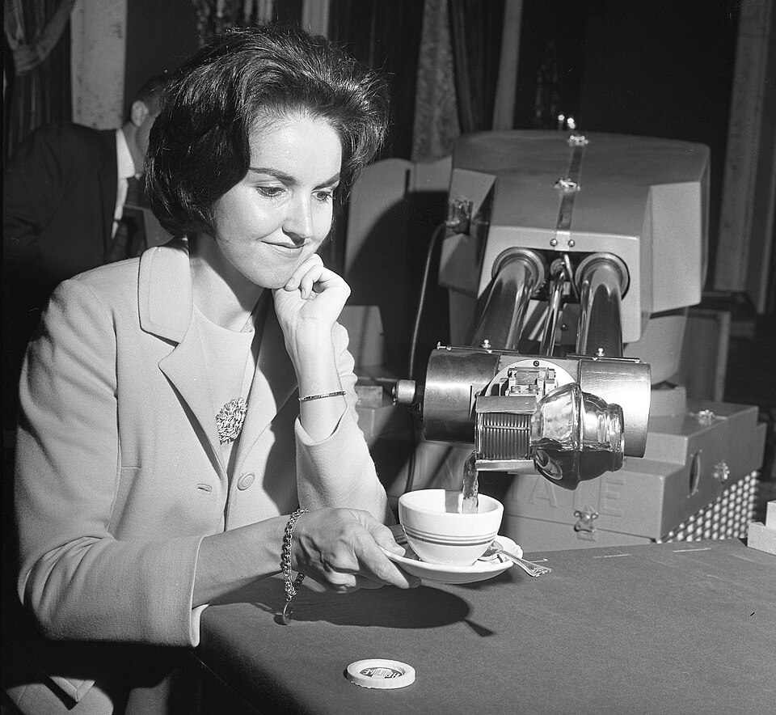
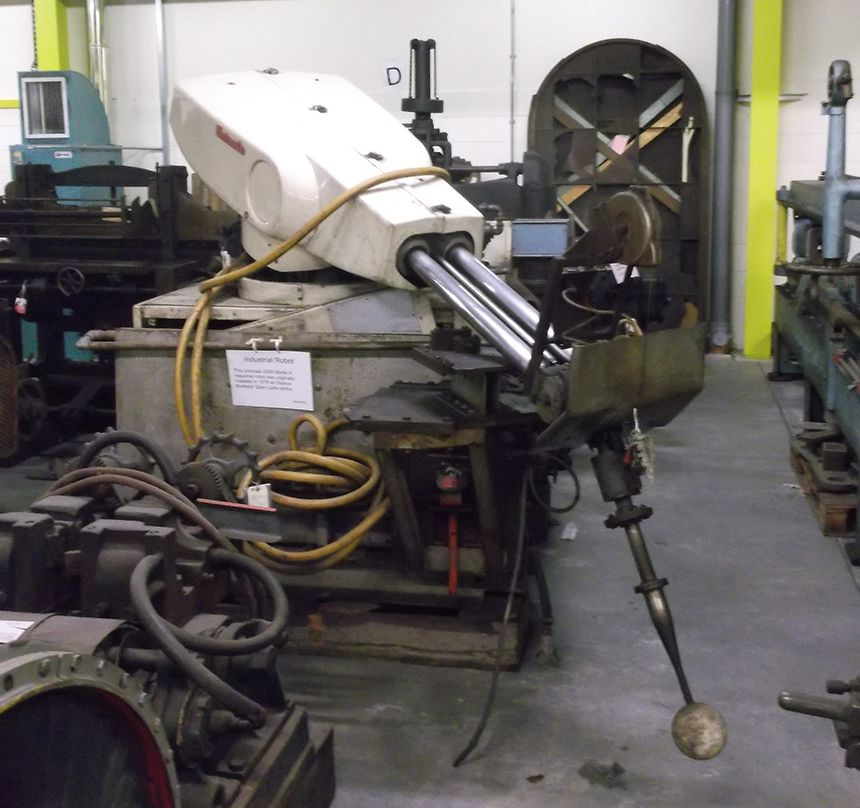

In 1961 a machine went to work at a **[General Motors](kloom:e/general-motors)** plant near Trenton, New Jersey, taking hot castings out of a casting machine and setting them down. **[Die casting](kloom:e/die-casting)** is injection molding in metal, and unloading the press was the kind of job its makers called dirty, dreary and dangerous. The machine was a hydraulic arm on a squat box, and it was the first industrial robot to work in a factory: **[Unimate](kloom:e/unimate)**. Accounts disagree on the plant's name. Wikipedia gives it as the Inland Fisher Guide plant in Ewing Township, and _IEEE Spectrum_ as GM's Ternstedt plant in Trenton. What the machine did there is not in dispute. It had been led through the job by hand, once, and it repeated it.

## A patent and a party

On 10 December 1954 **[George Devol](kloom:e/george-devol)**, an inventor in Greenwich, Connecticut, filed a patent for "Programmed Article Transfer". There had been, he wrote, only two ways to control a machine that moves things: by hand, which is flexible but costs wages, and by cams, which are costly to design and pay only on one large, unchanging job. His machine "makes available for the first time a more or less general purpose machine" that could be set to a new task without being rebuilt. He called the idea universal automation.

In 1956, at a cocktail party, Devol met **[Joseph Engelberger](kloom:e/joseph-engelberger)**, an engineer who, like him, read **[Isaac Asimov](kloom:e/isaac-asimov)**'s robot stories. Engelberger found the backing, from the Condec corporation, and became president of a company named from Devol's phrase, **[Unimation](kloom:e/unimation)**; when it was founded is given variously as 1956 and 1962. The patent was granted on 13 June 1961. By the account of Johanna Wallén's history, which _IEEE Spectrum_ follows, GM paid $18,000 for the first machine, which had cost $65,000 to build, so that it would pay for itself in its expected life of eighteen months. Wikipedia's biography of Engelberger says it was sold at a loss of $35,000.

## Teaching by hand

Devol's patent describes how such a machine is programmed. The operator drives the arm through its job with manual controls. At each point that matters, the program drum is turned to a fresh slot, and the position of every motion, read by an encoder on each, is recorded in that slot as a code, with any action, such as closing the gripper, on a track of its own. To work, the drum steps from slot to slot, and each motion runs until its encoder reads the code recorded for it. Stopping dead at full speed would overshoot, so an "anticipator" slows each motion as the codes close in, for "an accurate stop at coincidence ... with no overtravel". The patent's example gives each inch of travel its own code and says much finer steps are practical. Here is a program for unloading a die-casting machine, with invented values:

| Slot | Swing | Lift | Reach  | Gripper | What the arm does                     |
| ---- | ----- | ---- | ------ | ------- | ------------------------------------- |
| 1    | 0°    | 10°  | 300 mm | open    | waits clear of the die                |
| 2    | 0°    | 10°  | 900 mm | open    | reaches into the open die             |
| 3    | 0°    | 10°  | 900 mm | close   | grips the casting                     |
| 4    | 0°    | 18°  | 300 mm | closed  | lifts and draws it out                |
| 5    | 120°  | 5°   | 700 mm | closed  | swings over the cooling tank          |
| 6    | 120°  | 5°   | 700 mm | open    | lets it go, and the drum returns to 1 |

The arm that went to GM was more than the patent's. Its hydraulics ran at 1,000 pounds per square inch, 6.9 megapascals, and the prototype weighed about 1,360 kilograms and could lift 45. _Spectrum_ says the team began with five axes and moved to six; Wikipedia gives five, and IEEE's robot guide six. Either way it was programmed joint by joint: it stored angles and lengths, not positions in space.

That makes accuracy a matter of reach. An angle that is off by a little puts the gripper off by that angle times the length of the arm. Take an invented encoder that divides a turn into 1,024 steps, about 0.35° each. At 1.5 meters from the axis one step moves the gripper 1.5 × 2π ÷ 1,024 ≈ 9.2 millimeters, by our arithmetic, and to repeat to a millimeter at that reach the encoder needs about 9,400 steps a turn. IEEE's guide gives the Unimate's repeatability as within a millimeter. Wikipedia's article on industrial robots claims a ten-thousandth of an inch, while warning that this may not be repeatability; a millimeter is the likelier figure.

## What followed

Engelberger was a showman, and a Unimate putted a golf ball and conducted the band on Johnny Carson's _Tonight Show_. Sales at home were slow. In October 1968 **[Kawasaki](kloom:e/kawasaki-heavy-industries)**'s aircraft company announced a partnership with Unimation to build Unimates in Japan, where they were put on the jobs nobody wanted, welding above all, and by the mid-1980s, _Spectrum_ says, Japan had nearly 70 per cent of the world's robots. General Motors, its first customer, put 28 of them on a spot-welding line at Lordstown, Ohio, in 1970, where they became part of a bitter strike over the line's speed.

A Unimate learned a path by being led through it. The next segment turns to machines that were told one in numbers instead: numerical control.
