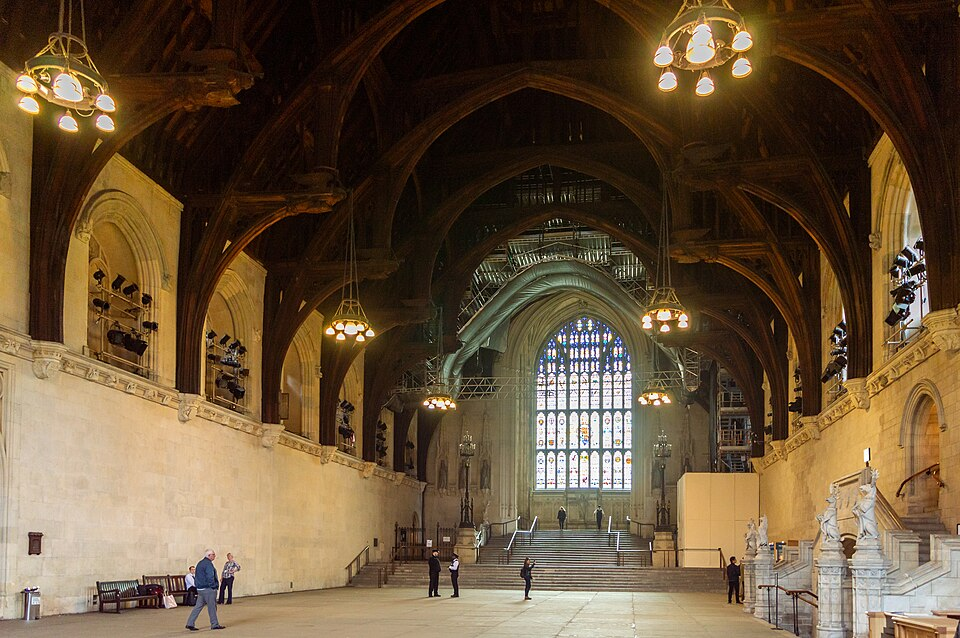
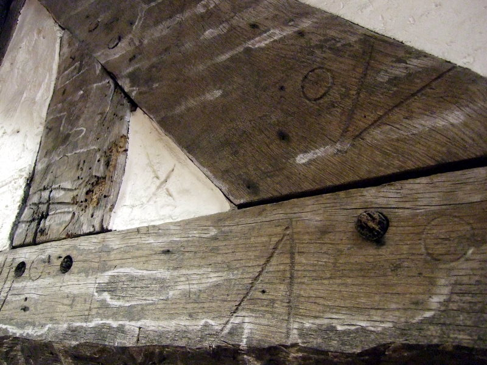

In 1393 **[Richard II](kloom:e/richard-ii-of-england)** ordered a new roof for the great hall of his palace at Westminster. **[Westminster Hall](kloom:e/westminster-hall)** had been built for William Rufus in 1097–99, and it was enormous: inside its walls the floor is about 20.8 meters across and some 73 long. Richard wanted it open, with no posts down the middle, and the man who gave it to him was his chief carpenter, **[Hugh Herland](kloom:e/hugh-herland)**, while the master mason **[Henry Yevele](kloom:e/henry-yevele)** refaced and buttressed the walls to carry it. The work ran from 1393 to about 1398, and Richard was deposed in the hall before it was finished. Herland's roof is still there, the largest medieval timber roof in northern Europe. How much wider it was than any hall before it depends on whom you read: Lynn Courtenay and Robert Mark say 50 per cent wider than any known hall in England; the carpenter and historian Robert Beech says nearly a third wider than the record holder, John of Gaunt's hall at Kenilworth.

## A roof made of short timbers

The obvious way to roof a hall is to lay a tie beam across from wall to wall and stand the rafters on it. At Westminster that beam would have been some 23 meters long and, by Beech's estimate, about twelve tons of oak, and no such trees were to be had. Herland used a **[hammerbeam roof](kloom:e/hammerbeam-roof)** instead: a tie beam with its middle cut out. From each wall a short, heavy hammer beam juts into the hall, propped from below by a curved brace off a post that runs down the wall. On the end of each hammer beam stands a hammer post that carries the rafters and the collar near the top. Westminster adds a huge arched rib, rising from the foot of the wall post, on a stone corbel far down the wall, to meet its partner under the middle of the collar. The figures drawn in the plate are the 1911 _Encyclopaedia Britannica_'s, as Wikipedia reproduces them:

| Measurement                            | Meters |
| -------------------------------------- | -----: |
| Span, wall to wall                     |   20.8 |
| Opening between the hammer beams' ends |   7.77 |
| Floor to the hammer beams              |  12.19 |
| Floor to the underside of the collar   |  19.35 |

By our arithmetic, each hammer beam reaches about 6.5 meters into the hall. Such a frame, as Beech puts it, is built of shorter timbers.

How the roof actually stands up has been argued over for a century and a half. In 1987 Courtenay and Mark tested a 1:10 timber model with strain gauges and then a computer model, and concluded that most of the weight goes into the walls at the corbels, nearly halfway down, through the hammer posts and the arched rib, and that the hammer beams are in tension, taking the outward push off the tops of the walls. In 2016 Beech, who with the carpenter Chris Dalton built the lower framing again in green oak at quarter scale, argued the opposite: that Herland meant the hammer-beam framing to do the work and the great ribs chiefly as ornament.

## Framed on the ground

The trusses were not made at Westminster. The oaks came from royal woods and parks in Hampshire, Hertfordshire and Surrey; one landowner at Stoke d'Abernon supplied over 600 trees. The building accounts, described to the House of Lords in 1914, name the King's park at Odiham among them. The carpenters worked them near Farnham in Surrey, about 56 kilometers away, and sent the jointed timbers to London by wagon and barge, perhaps 660 tons of them. That was ordinary medieval practice, in **[timber framing](kloom:e/timber-framing)** as on this grand scale:

| Step      | What the carpenters did                                                                  |
| --------- | ---------------------------------------------------------------------------------------- |
| Hew       | Square each log with axes: score it with notches, then chop down the grain to a face     |
| Lay out   | Lay the pieces of one truss flat on the framing ground, overlapping where they will meet |
| Scribe    | Mark each joint from the timbers themselves, so every mortise fits its own tenon         |
| Cut       | Cut the mortises and tenons and bore the holes for the oak pegs                          |
| Mark      | Cut matching numerals across each joint, with four written IIII                          |
| Dismantle | Take the truss apart and send it on                                                      |
| Raise     | Hoist the pieces into place and put each joint back together by its marks                |

Scribing is why the marks matter. No two oaks are alike, so no two joints are, and a scribed tenon fits one mortise only. Carpenters cut the numerals with a race knife, whose scooped end gouges a groove, and Historic England notes that four was written IIII, not IV, until well into the sixteenth century. A carpenter could lay out a truss, number its joints and know it would go together again at a height of twenty meters.

## Saved by steel

In 1913 the Office of Works examined the roof and found it eaten from inside by the larvae of the **[deathwatch beetle](kloom:e/deathwatch-beetle)**, worst at the joints, where the stresses gather. Some joints, the First Commissioner told the Lords, were "hollowed out to the merest shell". Between 1914 and 1923 the architect **[Frank Baines](kloom:e/frank-baines-architect)** hid a steel frame inside the roof, which now carries most of the load, and pieced in new oak only where the old had perished. The two accounts of how much survived are far apart: Parliament's history says less than ten per cent of the timber was replaced, and a conservation architect writing in 2016 estimated that about 80 per cent of the medieval timber remains. Either way, the oak Herland framed on the ground at Farnham is still up there.

The next frame puts the wind to work sawing the planks.
