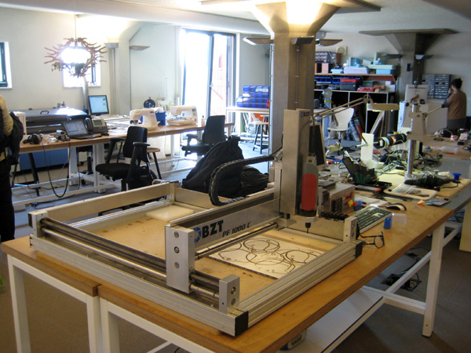
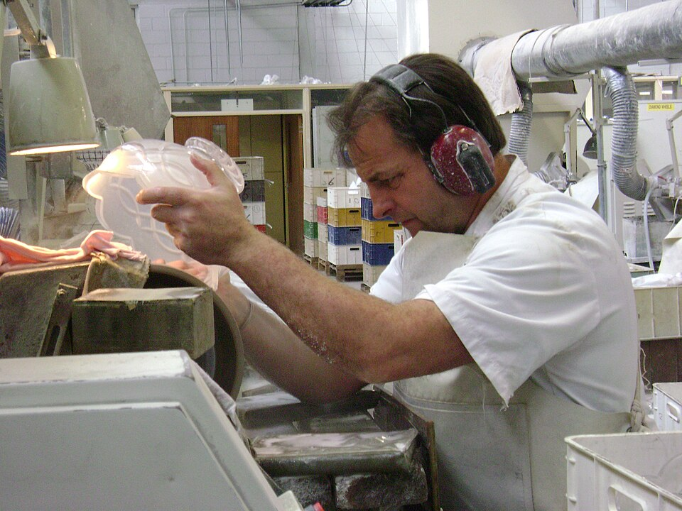

This frame describes making as of 30 September 2026. The subject began about 3.3 million years ago at Lomekwi, beside Lake Turkana, with a hand learning that a sharp edge comes from where and at what angle you strike a stone, not from how hard: **[knapping](kloom:e/knapping)**. Nothing measured that edge but the hand that used it. Today the finest machines lay one layer of a chip on another to within a nanometre. This frame sets out how the readings of this subject get from one to the other, and then looks at who, and what, makes things now.

## How fine

No single technique belongs to this frame. Its method is a table: the error each frame's makers could hold, put side by side. The numbers are the other frames' own, and the last column is ours.

| Frame                        | Year                  | What was held                     | Error                         | Fraction of the size   |
| ---------------------------- | --------------------- | --------------------------------- | ----------------------------- | ---------------------- |
| Knapping                     | 3.3 million years ago | where a blow lands on a platform  | not measured                  |                        |
| Wilkinson's boring machine   | 1776                  | a 50-inch cylinder's bore         | an old shilling, about 1.2 mm | under 1 in 1,000       |
| Maudslay's "Lord Chancellor" | before 1831           | a length on the bench             | 0.001 or 0.0001 inch          |                        |
| Johansson's gauge blocks     | 1909                  | the length of a stack of blocks   | steps of 1 µm                 | 1 in 100,000 at 100 mm |
| The Lego brick's moulds      | 2011                  | a stud's size, moulded in plastic | 5 µm                          | 1 in 1,000 of a stud   |
| ASML's NXE:3800E             | 2024                  | one chip layer on another         | 0.9 nm                        |                        |

From **[John Wilkinson](kloom:e/john-wilkinson-industrialist)**'s shilling to the layers of a chip, by our arithmetic, the error has shrunk about 1.3 million times in under 250 years. The sources disagree over **[Henry Maudslay](kloom:e/henry-maudslay)**'s measuring machine: his pupil James Nasmyth says it read to a thousandth of an inch, the Science Museum's catalogue a ten-thousandth, and the table gives both.

Each step needed something the step before had made. Wilkinson needed a bar straight enough to act as a ruler and stiff enough, held at both ends, not to sag. Maudslay needed a master screw that a lathe could copy, and flat plates made three at a time. **[Carl Edvard Johansson](kloom:e/carl-edvard-johansson)** needed lapping to make faces flat enough to wring, and a temperature, 20 °C, at which a length was true. The chip needs light of 13.5 nm, mirrors smooth to tens of picometres, and stages whose position is read to about 60 picometres. Each is a machine for making a better machine, the idea the boring bar began.

## Machines that make machines

Much of that making is now done by machines alone. The **[International Federation of Robotics](kloom:e/international-federation-of-robotics)** reported on 24 September 2026 that five million industrial robots were at work in the world's factories in 2025, more than twice as many as seven years before.

| Industrial robots, 2025        | Number        |
| ------------------------------ | ------------- |
| In operation worldwide         | 5 million     |
| Installed during the year      | over 600,000  |
| Installed in China             | 354,000       |
| Installed in the United States | almost 38,500 |
| Installed in Japan             | 36,219        |

China installed 59 per cent of them, and Chinese makers supplied 55 per cent of China's own. The machines that make the finest machines are fewer: ASML said in July 2026 that it could build about 65 of its 0.33 NA EUV machines that year, and planned 30 per cent more for 2027.

## Making at home

At the other end, making has come back to the bench. The **[fab lab](kloom:e/fab-lab)**, a workshop of computer-controlled tools open to anyone, began at MIT with a grant from the National Science Foundation in 2001 and grew out of a class there, "How To Make (Almost) Anything"; the first outside MIT opened at Vigyan Ashram in India in 2002. How many there are now depends on which page of the Fab Foundation's own site you read: "more than 2500", or "over 3000" started in 160 countries.

More of the tools have gone into homes. The market analysts CONTEXT counted over a million **[3D printers](kloom:e/3d-printing)** under $2,500 shipped in the first three months of 2025 alone, 95 per cent of them from Chinese makers, and in 2025 one firm, Bambu Lab of Shenzhen, shipped 37 per cent of all such printers; shipments of such printers rose 26 per cent over 2025, and 39 per cent in the first quarter of 2026 on a year before. By our arithmetic that is something like 1.4 million in that one quarter, if the first quarter of 2025 was not far over a million.

## What is still made by hand

Some things still need a hand. **[Heritage Crafts](kloom:e/heritage-crafts)**, a British charity, published the latest edition of its Red List of Endangered Crafts in May 2025. It counted 165 crafts at risk in the United Kingdom, 70 of them critically endangered, and added cut crystal glass to that category, with silver work such as lost-wax casting newly endangered. It also found that no craft had died out since 2023, and that mouth-blown flat glass, a craft thought lost a year before, was being revived. Some crafts, such as hazel basket making, it called resurgent for the first time.

So the newest way of making has not ended the oldest. A hand still learns where to strike, at a cutting wheel or an anvil, beside machines that measure in picometres. And knapping, where this subject began, is still learned the slow way: the students of the hand-axe frame practised it for 167 hours and their hand axes grew no thinner.
