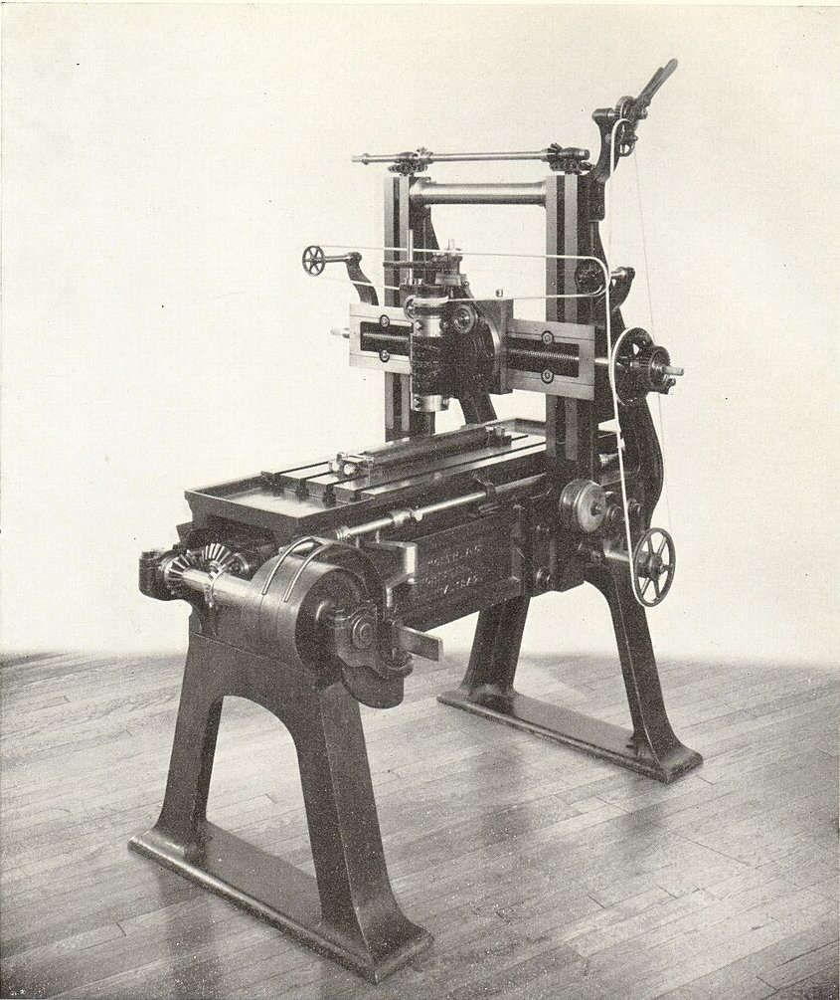

In 1840, at the meeting of the British Association in Glasgow, a [Manchester](kloom:e/manchester) toolmaker of thirty-six read a paper with a plain title, "On Plane Metallic Surfaces or True Planes". **[Joseph Whitworth](kloom:e/joseph-whitworth)** had been born in Stockport in 1803, learned machinery in his uncle's cotton mill, and gone to London to work for **[Henry Maudslay](kloom:e/henry-maudslay)**, for the Holtzapffels and for **[Joseph Clement](kloom:e/joseph-clement)**. In 1833 he went home to Manchester and put up a sign: "Joseph Whitworth, Tool Maker from London". His paper argued that almost nobody in Britain owned a truly flat surface, that the way everyone made one was wrong, and that the right way was cheap.

## Why two plates are not enough

A flat reference is where accuracy starts. A machine moves its parts in straight lines by sliding them on flat ways, and a lathe or a planing machine copies its own slides into everything it makes. As Whitworth put it in a footnote, errors in such machines "are propagated in an aggravated form".

The custom in 1840 was to file a plate as flat as a straight edge would show and then grind it against another with emery. Whitworth took the method apart. Suppose one plate is slightly concave and the other is true: grinding them together makes the true one convex to match. Two surfaces can only cancel each other's errors if they happen to be exact opposites. Grinding also wears the middle more than the edges, emery piles up at the edges and leaves them "bell-mouthed", and grit stays in the iron and wears it after. A letter from the locomotive superintendent of the Liverpool and Manchester Railway, which Whitworth printed, compared slide valves eight inches broad after five months' work: the ground ones were grooved an eighth of an inch deep and a sixteenth hollow, and the scraped ones were still true.

A concave plate and a convex one can fit each other perfectly, so two plates that agree prove nothing. Bring in a third. If all three fit one another in every pairing, none can be curved: the two that fit the first must be the same shape, and two plates of the same shape can lie face to face only if they are flat.

## Three plates, step by step

Whitworth's recipe was for three **[surface plates](kloom:e/surface-plate)**, as the trade called them, of hard cast iron, ribbed behind so they would not spring, each standing on three feet so that it was always supported at the same points. Planed first, they were left for two or three weeks to settle into their natural shape.

| Step | What is done                                                                                      |
| ---- | ------------------------------------------------------------------------------------------------- |
| 1    | Call one plate No. 1, the model. Scrape Nos. 2 and 3 until each fits it                           |
| 2    | Compare Nos. 2 and 3. If No. 1 was curved, they are both curved the same way, and show it doubled |
| 3    | Scrape equal amounts from corresponding places on Nos. 2 and 3 until they fit each other          |
| 4    | Scrape No. 1 to fit both, trying it on each in turn, so it settles between them                   |
| 5    | Take No. 1 as the model again and repeat, until no further gain can be seen                       |

The fitting is done by colour. A film of red ochre and oil on the model marks the high points of the plate rubbed on it, and those are taken down with a scraper, a hard steel blade made from an old file and kept keen on an oilstone. As the work nears truth, less colour is used, until a few particles spread by a finger show a dappled pattern of bearing points, which should be many and evenly spread. Two good plates, Whitworth noted, will float on a film of air when one is lowered onto the other, and, slid together dry, will cling.

Whitworth's paper does not say where the method came from. **[James Nasmyth](kloom:e/james-nasmyth)**, who also trained under Maudslay, wrote in 1883 that Maudslay's men had made their bench plates three at a time and finished them with scrapers, a "very old mechanical dodge". Wikipedia credits Whitworth with popularising it in the 1830s, after a time when the same three plates had been finished by polishing. What Whitworth did was publish it, explain why grinding failed, and make the mottled look of a scraped surface the sign of a true one.

## Threads and the millionth of an inch

In 1841 Whitworth turned to bolts. He told the **[Institution of Civil Engineers](kloom:e/institution-of-civil-engineers)** that he had collected screws from the principal workshops in England, averaged their threads and rounded the result into a scale, with one thread for each diameter and the sides of every thread at 55° to each other. Its top and bottom sixths are rounded off, so a thread's depth is about 0.64 of its pitch.

| Diameter | Threads per inch | Pitch, as a share of the diameter |
| -------- | ---------------: | --------------------------------: |
| ¼ inch   |               20 |                               1/5 |
| ½ inch   |               12 |                               1/6 |
| 1 inch   |                8 |                               1/8 |
| 4 inches |                3 |                              1/12 |
| 6 inches |               2½ |                              1/15 |

For a 1-inch bolt that is a pitch of 3.18 millimetres and a depth of about 2.03, by our arithmetic. The scale became **[British Standard Whitworth](kloom:e/british-standard-whitworth)**. In 1856 he showed engineers a machine that held a bar between two true planes moved by a fine screw, and said it could detect a difference in length of a millionth of an inch. In the workshop, he added, it was easier to work to a ten-thousandth from end measures than to a hundredth from the lines on a rule. The next frame takes that precision into a new machine, the milling machine.
