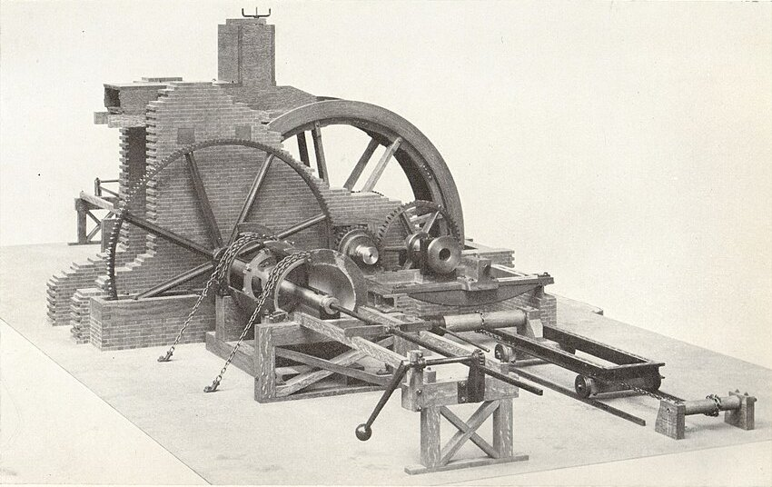

**[James Watt](kloom:e/james-watt)** had patented his separate condenser in 1769, and for years afterwards the engine would not hold its steam. Its piston had to slide in a hot, dry cylinder, and the cylinders that could be had were not round. He wrapped the piston, his biographer Samuel Smiles wrote, in cork, oiled rags, tow, old hat and paper, and the steam still got past. In London, the engineers around [John Smeaton](kloom:e/john-smeaton) decided that "neither the tools nor the workmen existed" to make such a machine. The tool, when it came, was made by an ironmaster who cast cannon: **[John Wilkinson](kloom:e/john-wilkinson-industrialist)** of Bersham, near Wrexham.

## Two machines

Wilkinson's patent of January 1774 was for guns. Cannon had been cast round a core and the rough hole then bored out; he cast them solid and bored them from the solid, turning the gun against a fixed cutter. The Board of Ordnance found his guns better, and in 1779 the patent was quashed on the ground of national need. His second machine, for the cylinders of steam engines, followed at the **[Bersham Ironworks](kloom:e/bersham-ironworks)**. John Farey, the engine historian, dated it to about 1775 in 1827; the Science Museum's catalog gives 1775; Wikipedia's article on Wilkinson puts it in 1774, the year of the gun patent.

## Boring against a ruler

**[Boring](kloom:e/boring-manufacturing)** is cutting the inside of a hole to size with a tool that turns within it. Before Wilkinson, cylinders were bored as Smeaton did it at the Carron ironworks in 1769: a cutter head on the end of a long bar, held only loosely at the driving end, with the cylinder pulled over it on a trolley. Nothing guided the head but the casting itself. Its own weight made it cut mostly along the bottom, and the bore followed whatever crookedness the casting had. To even it out the cylinder was bored four times, turned a quarter round between settings.

Wilkinson ran the bar right through the cylinder and gave it a bearing at each end. The cylinder was chained down in timber cradles and did not move. The bar turned, driven by a waterwheel, and the cutter head, keyed to it, slid along it, pulled by a rod inside the hollow bar through a slot, with a rack and a weighted lever setting the feed. Farey explained why it worked: the bar, "being made perfectly straight, serves as a sort of ruler", so that "if the cylinder is cast ever so crooked, the machine will bore it straight and true, provided there is metal enough". One of the Bersham bars survives in the Science Museum: 11⅞ inches thick and 14 feet 11 inches between its bearings, with a 4-inch hole down its middle.

|                          | Smeaton's overhung bar            | Wilkinson's bar, held at both ends               |
| ------------------------ | --------------------------------- | ------------------------------------------------ |
| What guides the cutter   | the rough casting                 | the straight bar                                 |
| Sag under a side force   | *FL*³ ÷ 3*EI*, at the free end    | *FL*³ ÷ 48*EI*, at mid-span: a sixteenth as much |
| The cutter head's weight | pulls the cut to the bottom       | carried by the bearings on either side           |
| The cylinder             | on a trolley, drawn over the head | chained down and still                           |

The formulas are the textbook ones for a beam of span _L_ and stiffness _EI_ under a force _F_, at the end of a cantilever and at the middle of a beam resting on two supports; the comparison, for the same bar and force, is ours. The cut itself was slow and patient. The historian Joseph Roe, describing the machine as drawn in an old encyclopedia, gives two roughing cuts and a finishing cut, at an average feed of 1/16 inch per turn. A cut along an invented eight-foot cylinder at that feed would take 1,536 turns of the bar, by our arithmetic, and the three cuts about 4,600.

## The thickness of an old shilling

The difference showed at once. In April 1776 Watt wrote to Smeaton that Wilkinson had so improved the boring that he would promise a 72-inch cylinder not further from truth "than the thickness of a thin sixpence in the worst part". That year **[Matthew Boulton](kloom:e/matthew-boulton)**, offering an engine to the Carron Company, boasted that Wilkinson had bored them several cylinders almost without error, and that one of 50 inches at Tipton "does not err the thickness of an old shilling in any part". Watt's earlier cylinder of 18 inches, Roe records, had been ⅜ inch longer across one way than the other: about 1 part in 48. A shilling as struck from 1816 weighed 5.655 grams and was 23.6 millimeters across, so with the density of silver it was about 1.2 millimeters thick, by our arithmetic, and an old, worn one less. On 50 inches, 1,270 millimeters, that is an error of under 1 part in 1,000.

The first engine [Boulton and Watt](kloom:e/boulton-and-watt) built at Soho went to blow Wilkinson's furnaces at Broseley in 1776, and for some twenty years he cast and bored nearly all their cylinders, until in 1795 his brother revealed that he had been building copies of their engines on the side. In the 1780s, at the Royal Arsenal in Woolwich, a boy called Maudslay was working near another horizontal borer, for cannon. The next frame is what he made of the idea of a tool guided by a machine, not a hand.
