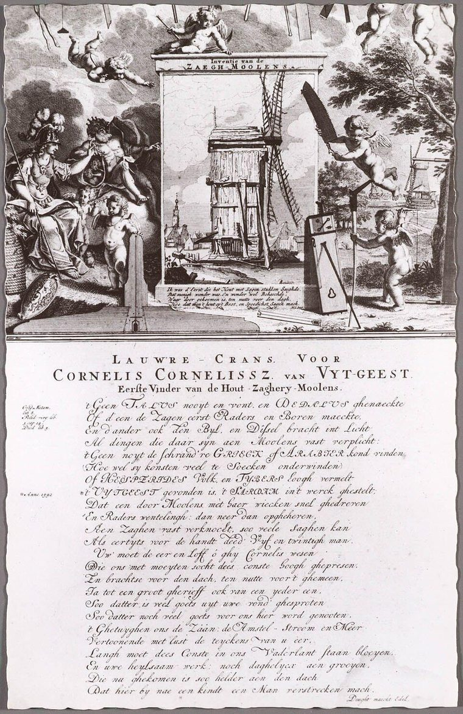
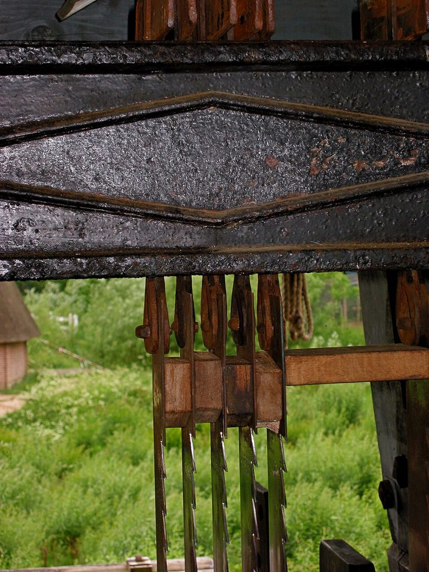

On 15 December 1593 the States of Holland granted a patent to a man from the village of Uitgeest, north of Amsterdam, who described himself, in Dutch, as "a poor countryman, burdened with wife and children". **[Cornelis Corneliszoon van Uitgeest](kloom:e/cornelis-corneliszoon-van-uitgeest)**, also called Krelis Lootjes, had found how to make a windmill saw wood. The idea of driving a saw from a turning shaft was old. What was new was a **[crankshaft](kloom:e/crankshaft)** in a windmill, turning the sails' rotation into the up-and-down stroke of a saw frame, and in the usual telling it made the Zaan district, along a river north of Amsterdam, the first industrial area in the world.

## Before the wind

For as long as there had been planks, most of them had been sawn by two men with a long saw over a pit, one standing on the log and one beneath it, the man on top following a chalk line. Machines that sawed were old too. A relief on a sarcophagus at Hierapolis, in Roman Asia Minor, from the second half of the third century AD, shows a waterwheel driving two frame saws through cranks and connecting rods, and the **[Hierapolis sawmill](kloom:e/hierapolis-sawmill)** is the earliest known machine to combine the two. Water-powered **[sawmills](kloom:e/sawmill)** for timber were at work in Germany and Norway by the sixteenth century, and German books described them.

When Cornelis built his first mill is disputed. The provincial heritage site of North Holland and an eighteenth-century print in his honour say 1592, before the patent; the English Wikipedia and the Twickel sawmill's history say 1594, a small mill on a raft called _Het Juffertje_, later sold and towed to Zaandam. In 1597 he was granted a second patent, for ten years, for a shaft with several cranks.

## Crank, rod and frame

The machine is a chain of conversions. The sails turn a shaft, gearing turns the crankshaft, each crank swings a connecting rod, and the rod drives a heavy wooden frame up and down between guides. Strung tight in the frame is a gang of saw blades, and between them, at top and bottom, sit wooden blocks whose thickness sets the thickness of the planks. One pass of the log through the frame turns it into as many boards as there are gaps. To saw a different thickness, every blade has to be taken out and strung again with different blocks.

| Part           | What it does                                                                            |
| -------------- | --------------------------------------------------------------------------------------- |
| Crankshaft     | Three cranks at 120°, so that one frame is always moving and the shaft never sticks     |
| Connecting rod | Hangs the frame from the crank; the frame weighs 800 to 1,500 kilograms                 |
| Frame and saws | Cut on the downstroke; profiled guides tilt the frame into the log only once it is fast |
| Spacer blocks  | Set the distance between blades, and so the plank                                       |
| Ratchet feed   | On each upstroke, pawl and ratchet wheel pull the log's carriage forward a tooth        |

Dutch Wikipedia's article on sawmills gives a working speed of about 80 sail passes a minute, 20 turns of a four-sailed mill, and an example at 77 to 78 passes with gearing of 1.83 to the crankshaft. By our arithmetic that is about 36 strokes a minute. The Twickel sawmill at Delden, which still saws, sets its feed at two to five metres an hour. Together, again by our arithmetic, the log moves forward roughly one to two and a half millimetres for each cut. Twickel's saws need sharpening after about forty metres, and their teeth are set alternately left and right so the kerf is wider than the blade.

## How much faster

Everyone agrees that it was much faster, and nobody agrees by how much. Wikipedia and Dutch heritage sites say thirty times faster than by hand. The eighteenth-century poem says one mill did the work of twenty-five men. The Nationaal Archief says four or five people could saw sixty trees into planks in a day. Wikipedia, citing a study, says sixty beams in four or five days against a hundred and twenty by hand, which by our arithmetic is about twenty-seven times. The figures may come from one original, retold; we have not found it.

The demand was there. The **[Dutch East India Company](kloom:e/dutch-east-india-company)** was founded in 1602, and one of its big return ships took some three thousand oak trunks. By 1630 there were 83 sawmills north of Amsterdam, 53 of them in the Zaan district, and by 1731 there were 450. More than two hundred of the Zaan's were _paltrok_ mills, whose whole body, saws and all, turns on a central post to face the wind.

## The crank, run backwards

A crank works both ways. Cornelis used it to turn rotation into a stroke. Nearly two centuries later **[James Watt](kloom:e/james-watt)** needed the reverse, to turn the rocking beam of his steam engine into rotation, and could not use a crank, because James Pickard held a patent on it. In 1781 Watt patented the **[sun-and-planet gear](kloom:e/sun-and-planet-gear)** instead.

The next frame takes the planks the wind could saw and bends them: steam and a steel strap.
