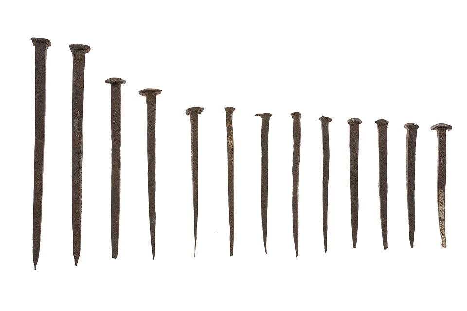
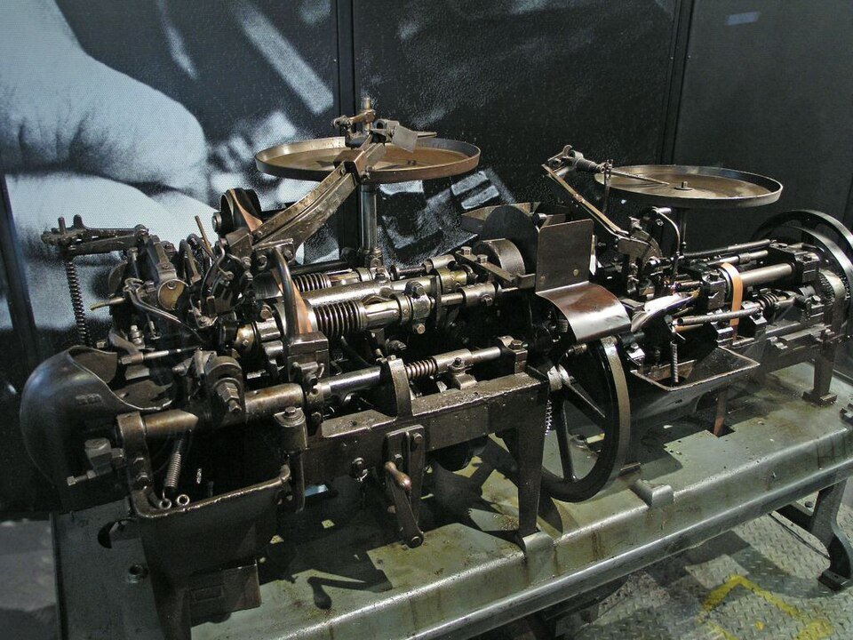

The joints of this trail hold wood with wood. A **[nail](kloom:e/nail-fastener)** or a **[screw](kloom:e/screw)** holds it with metal, and for most of history the metal was the hard part. In February 1645 the assembly of the **[Colony of Virginia](kloom:e/colony-of-virginia)** forbade settlers who abandoned a plantation to burn its "necessary houseing" on the way out, as they had been doing to recover the nails from the ashes. Instead the departing settler was to be paid in nails: as many "as may be computed by 2 indifferent men were expended about the building thereof". Nails were scarce, and colonists ordered them from England by the ton.

## A minute a nail

A wrought nail was made one at a time by a nailer, who drew a rod of iron to a point and hammered a head on it, taking about a minute for each, by the figure the economist Daniel Sichel quotes. In the 1790s **[Thomas Jefferson](kloom:e/thomas-jefferson)** set up a nailery at Monticello, first making nails by hand and from 1796 with a machine, and wrote that his "new trade of nail-making" was to him what a title of nobility was in Europe. The nailers were enslaved children. Lee Nelson of the National Park Service, who dated old buildings by their nails, found cut nails in America from the early 1790s: sheared from a strip of iron by a machine, then headed. Patents for nail machines had been granted in the United States since the 1770s and 1780s, by Sichel's count, and Jacob Perkins's of 1795 is the best known. Wire nails, cut from a coil of drawn wire, were made in Europe first; the first American patent was in 1877, and by 1892 the United States made more wire nails than cut ones. From the late 1700s to the middle of the twentieth century the real price of nails fell about tenfold. A typical machine now makes 300 to 450 a minute, the newest 2,000, and Sichel puts the gain in nails per minute of a worker's time at about 3,500 times.

## The screw

A metal screw was rare and made by hand until 1760, when Job and William Wyatt of Staffordshire patented a machine that cut the thread with a cutter guided by a lead screw and the slot with a rotary file. Their factory, running by 1776, failed, but under new owners it made 16,000 screws a day in the 1780s with 30 workers. Early screws had blunt ends, and a hole had to be bored for the whole length. Pointed screws came in the 1830s, Nelson says. They had a "gimlet point", whose turns crowded together towards the tip. In 1846 the New Yorker Thomas J. Sloan patented a point whose thread kept the same pitch while it grew shallower, so the point pulled in as fast as the body, and his patent explains why a screw grips: "each turn of the thread having its full hold, and each turn of the thread formed in the wood being fully sustained by the one above it". In 1854 the Nettlefolds, the family of **[Joseph Henry Nettlefold](kloom:e/joseph-henry-nettlefold)**, opened a screw works at Smethwick, near Birmingham. **[Joseph Chamberlain](kloom:e/joseph-chamberlain)** joined his uncle's firm at eighteen and became a partner, and Nettlefold and Chamberlain came to make two-thirds of the metal screws made in England. By 1875 Nettlefold was making wire nails there too.

The heads changed last. **[P. L. Robertson](kloom:e/p-l-robertson)**, a Canadian salesman whose screwdriver slipped from a slot and cut his hand, patented a tapered square socket in 1909 (Wikipedia's article on screws says 1908). John P. Thompson patented a cross-shaped recess in 1933, sold it to **[Henry F. Phillips](kloom:e/henry-f-phillips)**, and the Phillips screw went onto Cadillac's assembly line in 1936.

## Why a screw holds

The US Forest Products Laboratory's _Wood Handbook_ gives the rules. A wood screw's root, the core inside the thread, is about two-thirds of its shank diameter. The top board gets a clearance hole the size of the shank, so the thread "slips through the first board" and engages only the second, as a 1911 carpentry book for boys puts it, and the head pulls the boards together. The lower board gets a pilot hole for the thread, about 70 per cent of the root's diameter in softwood and 90 per cent in hardwood, the sizes at which its strength figures were measured. A screw should be turned in, never hammered, which tears the fibres.

The handbook's withdrawal loads are 108.25 × *G*² × _D_ × _L_ newtons for a screw and 54.12 × *G*²·⁵ × _D_ × _L_ for a smooth nail, where _G_ is the wood's specific gravity, _D_ the shank diameter and _L_ the penetration of the thread or nail, in millimetres. Here they are for a wood of specific gravity 0.5 (an invented example), by our arithmetic:

| Fastener         | _D_     | Pilot hole | _L_   | Withdrawal load |
| ---------------- | ------- | ---------- | ----- | --------------: |
| No. 8 wood screw | 4.17 mm | about 2 mm | 25 mm |    about 2.8 kN |
| 8d common nail   | 3.33 mm | none       | 38 mm |    about 1.2 kN |

The screw holds more than twice as hard with two-thirds the penetration. Back at the trail's anchor, Egyptian carpentry, the Khufu ship's planks were held with tenons and rope.
