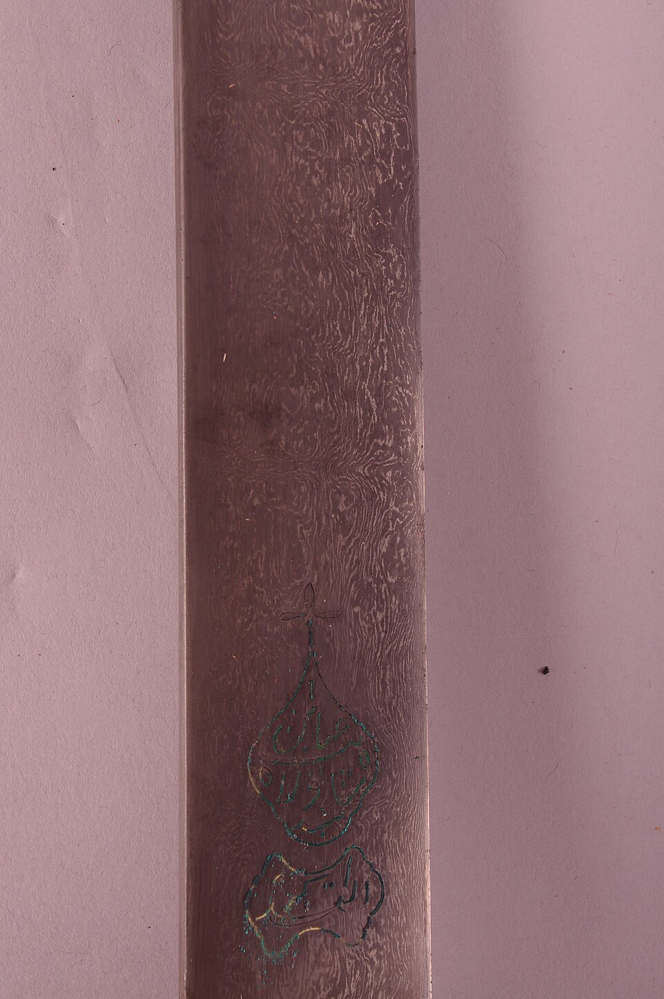

Late in the fifth century BC the Greek physician Ctesias, at the Persian court, wrote of wonderful swords of Indian steel presented to the king. Nobody can yet say how they were made. But at **[Kodumanal](kloom:e/kodumanal)**, an Iron Age site in Tamil Nadu of about the third century BC, excavators found furnaces stacked with glassy, vitrified crucibles, kept apart from the slag of ordinary ironmaking. That is the oldest trace so far of a way of making steel that south India and Sri Lanka kept for two thousand years: melting it in a sealed clay pot. The product reached Europe as **[wootz steel](kloom:e/wootz-steel)**, from a south Indian word for steel, and it was traded as small round cakes. Smiths in Persia and Syria forged the cakes into blades whose surface, polished and etched, showed a pattern like moving water, and Europeans called them **[Damascus steel](kloom:e/damascus-steel)**. The dates are argued: the metallurgist John Verhoeven would say only that the process began before AD 500, while others put it in the middle of the first millennium BC.

## A steel made liquid

Iron from a bloomery furnace is a spongy lump that never melts, full of slag, with uneven carbon. The crucible fixed all three faults. Nineteenth-century observers in south India saw closed crucibles charged with bloomery iron, in the Mysore region with plant matter to supply the carbon, stacked in a furnace and fired for 14 to 24 hours in a strongly reducing fire. As carbon soaked into the iron the charge melted, the slag floated off, and the steel settled into the bottom of the pot as a cake. In the Deccan, around Golconda, smiths fused a piece of cast iron with a piece of low-carbon iron instead. Golconda's steel was the best: in 1679 the French traveler **[Jean-Baptiste Tavernier](kloom:e/jean-baptiste-tavernier)** wrote that it was the only kind Persian smiths could damascene.

Sectioned and analyzed, the best blades are a remarkably pure steel of about 1.5 percent carbon. At that much carbon, iron cooling from red heat throws out hard particles of iron carbide, **[cementite](kloom:e/cementite)**. In a watered blade those particles, a few micrometers across, are gathered into sheets 30 to 70 micrometers apart lying in the plane of the blade. Etched, the cementite stays bright and the steel around it turns dark, and where the sheets cut the polished surface they draw the pattern.

## How the pattern is grown

Europeans tried for two centuries to copy it. **[Michael Faraday](kloom:e/michael-faraday)** experimented on wootz and on alloyed steels with the cutler James Stodart; others could not even forge the cakes. In 1985 a meeting of experts in New York agreed that no living smith could make a true watered blade. Verhoeven, at Iowa State, and the Florida bladesmith Alfred Pendray then spent about ten years on it, making small ingots in clay-graphite crucibles, with broken glass and oyster shells for a slag and green leaves packed on top. Their method, and what each step does:

| Step   | What is done                                                                   | Why it matters                                                          |
| ------ | ------------------------------------------------------------------------------ | ----------------------------------------------------------------------- |
| Melt   | iron and carbon sealed in a crucible and melted to a cake of about 1.5% carbon | trace elements gather in the sheets between the growing crystals        |
| Cool   | the cake left to cool slowly in the crucible                                   | the sheets, set by the crystals, will become the bands                  |
| Rim    | the cake packed in iron oxide and held at 1,100–1,200 °C for hours             | a low-carbon skin that will not crack when the brittle core is hammered |
| Forge  | many heats, each peaking 50 to 100 °C below about 1,000 °C                     | cementite partly dissolves and regrows each time, along the sheets      |
| Finish | the skin ground away and the blade etched                                      | the bands show                                                          |

Two things decided success. The first was an impurity. Bands formed only when the steel held a carbide-forming element such as **[vanadium](kloom:e/vanadium)**, at levels as low as 0.004 percent, which concentrates in the sheets as the cake freezes. Six of seven old blades they analyzed held 0.004 to 0.027 percent. The second was temperature. Heated above about 1,000 °C, all the cementite dissolves and the pattern vanishes; held at 1,200 °C for 18 hours, the vanadium spreads out evenly and the pattern can never return. Kept below that line, each heat dissolves the small carbide particles, and the vanadium-rich sheets hold on to theirs, so the bands sharpen with every cycle. In one test the bands returned after about six; a real blade took a few dozen heats to forge. The phosphorus in the cakes made them crumble under the hammer above about 970 °C, which, Verhoeven argues, is why smiths in Paris could not forge them. A pair of bars from the Alwar armory in Rajasthan, about 300 years old, carried the low-carbon rim of Pendray's trick: Indian smiths, it seems, knew it.

## Lost, and found again

Verhoeven puts the last blades with the finest patterns at about 1750, and the last poor ones in the early nineteenth century; Wikipedia's article gives the last account of patterned blades as 1903, in Sri Lanka. His explanation is the ore. No smith could see vanadium in a cake. If the mines that supplied it were worked out, the method would simply stop working, and those who knew it would die without teaching it.

In 2006 Marianne Reibold, Peter Paufler and colleagues at Dresden reported in _Nature_ that a seventeenth-century Damascus saber, dissolved in acid, held **[carbon nanotubes](kloom:e/carbon-nanotube)** wrapped around cementite wires, perhaps grown from the carbon in leaves. Verhoeven answered that cementite forms rods by itself, and that he would expect such structures in ordinary steel; the physicist Alex Zettl warned that microscopes themselves can carry nanotubes. The claim has not been confirmed.

Crucible steel was far ahead of anything Europe made. The At the forge trail shows the other way to put a pattern in a blade, by welding layers together. The next frame is a different answer to the same problem, from Japan: one steel hard, one soft, in one sword.
