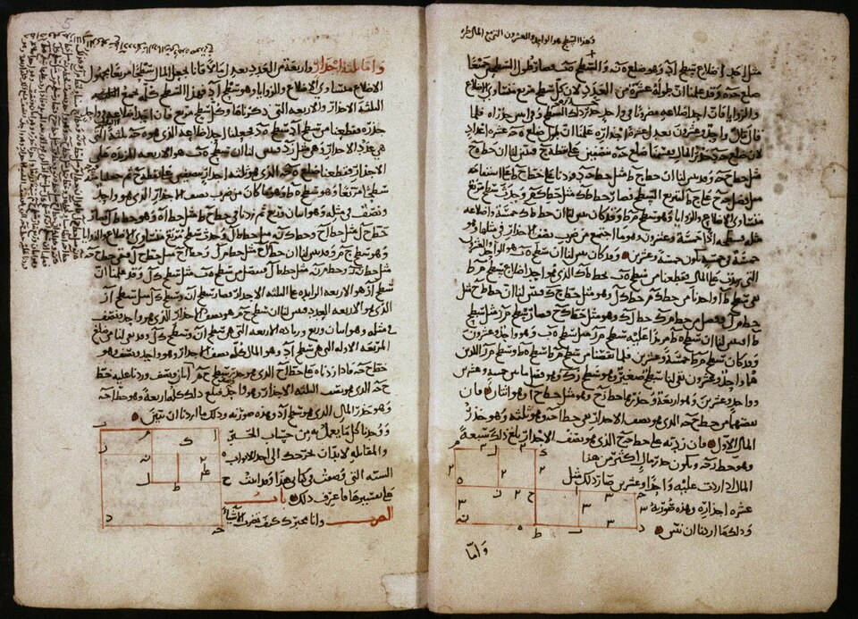

Some time around 820, in **[Baghdad](kloom:e/baghdad)**, **[Muhammad ibn Musa al-Khwarizmi](kloom:e/al-khwarizmi)**
wrote a short book on how to find an unknown number. Its preface thanks
the caliph **[al-Ma'mun](kloom:e/al-mamun)**, who ruled from 813 to 833, whose "fondness for
science" had encouraged him to write on "what is easiest and most useful
in arithmetic, such as men constantly require in cases of inheritance,
legacies, partition, law-suits, and trade", and in measuring land and
digging canals. The book is [_al-Kitāb al-mukhtaṣar fī ḥisāb al-jabr
wa-l-muqābala_](kloom:e/al-jabr), the "compendious book on calculation by completion and
balancing", and one word of its title, **_al-jabr_**, became our
_algebra_.

Almost nothing certain is known of the man. His name says he came from
Khwarazm, south of the Aral Sea; one early historian's version of it has
been read as placing his birth near Baghdad instead, and scholars still
disagree over which. He worked in Baghdad under al-Ma'mun as an
astronomer, and wrote on the astrolabe, on geography after Ptolemy, and
on the Indian way of reckoning. The traditional account puts him in the
caliph's **[House of Wisdom](kloom:e/house-of-wisdom)**, a library and academy where Greek, Persian
and Sanskrit books were put into Arabic. The Yale Arabist **Dimitri
Gutas** doubts the academy: none of the surviving translations mentions
it, and he reads the name as a mistranslation of a word for a storehouse
of books. Others think a great library in Baghdad likely. What is certain
is the translating itself, which through the ninth century put Greek
mathematics into Arabic, Euclid, Archimedes and Ptolemy among it.

## Roots, squares and numbers

The book has no symbols at all. Everything is in words. There are three
kinds of number, "roots, squares, and simple numbers", and al-Khwarizmi
reduces every problem to one of six forms, such as "squares and roots
equal to numbers". Two operations get them there. _Al-jabr_, restoring,
removes a quantity subtracted on one side by adding it to both, so that
_x_² = 40_x_ − 4_x_² becomes 5_x_² = 40_x_. _Al-muqābala_, balancing, cancels like quantities on the
two sides.

His first worked example is "one square, and ten roots of the same,
amount to thirty-nine dirhems", which we write _x_² + 10_x_ = 39. His
recipe, in the English of **Frederic Rosen**'s translation of 1831:
"you halve the number of the roots, which in the present instance yields
five. This you multiply by itself; the product is twenty-five. Add this
to thirty-nine; the sum is sixty-four. Now take the root of this, which
is eight, and subtract from it half the number of the roots, which is
five; the remainder is three."

Then he proves it, with a figure, and the plate draws both of the figures
he gives. In the first, the unknown square has side _x_. The ten roots
are laid round it as four strips, each _x_ long and 2½ wide. That shape
is 39 by the statement of the problem, and it lacks only four small
squares at its corners, each 2½ by 2½, to be a whole square: four times
6¼ is 25. Add them, and the great square is 39 + 25 = 64, so its side is 8. Take off the two strips' widths, 2½ at each end, and the side of the
unknown square is 8 − 5 = 3. The second figure does the same with the
ten roots in two strips of 5 and one corner of 25. This is
**[completing the square](kloom:e/completing-the-square)**, and it is the same step as the formula for
quadratic equations taught today.

| Step                     | In al-Khwarizmi's words        | In ours           |
| ------------------------ | ------------------------------ | ----------------- |
| The problem              | a square and ten roots are 39  | _x_² + 10_x_ = 39 |
| Halve the roots, square  | five, twenty-five              | (10/2)² = 25      |
| Complete the square      | add to thirty-nine: sixty-four | (_x_ + 5)² = 64   |
| Take the root            | eight                          | _x_ + 5 = 8       |
| Take away half the roots | the remainder is three         | _x_ = 3           |

Our algebra finds a second answer, −13, since (−13)² + 10 × (−13) = 39.
Al-Khwarizmi's does not: a square in his geometry has a side that is a
length, and his numbers, unlike Brahmagupta's, had no debts among them.

The only Arabic copy known to survive, made in 1342, is in the Bodleian
Library in Oxford; the pages shown hold the two figures.

## Two words

The book reached Latin Europe in the twelfth century. **Robert of
Chester** translated it at Segovia in 1145 as the _Liber algebrae et
almucabala_, and it became a university textbook.

Al-Khwarizmi's other book, on calculating with the Indian numerals, is
lost in Arabic. It survives in Latin, and its Latin opens "_Dixit
Algorizmi_", "thus spoke al-Khwarizmi". His name became _algorism_,
reckoning with written numerals, which English had by about 1225, and
then, under the influence of the Greek _arithmos_, "number", the
**[algorithm](kloom:e/algorithm)**: first a way of doing sums, now any exact procedure, such as
his own recipe for the square. Through it Latin scholars learned to
reckon with the nine figures and the zero. The merchant who made them the
arithmetic of trade was a Pisan, [Fibonacci](kloom:e/fibonacci).
