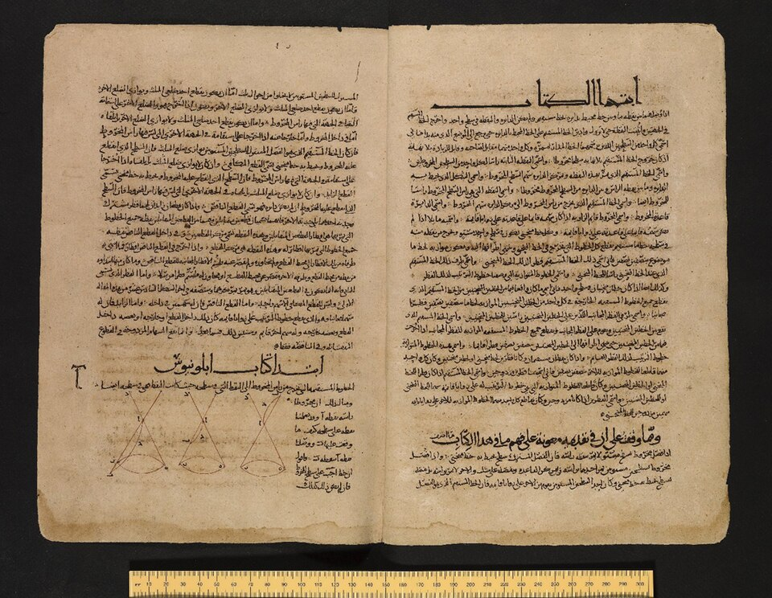

**[Apollonius of Perga](kloom:e/apollonius-of-perga)** came from a Greek city on the south coast of
Asia Minor, and studied at **[Alexandria](kloom:e/alexandria)** with the successors of Euclid.
He was born around 240 BC by the usual modern estimate, or around 260 BC
by an older one, and his contemporaries, according to the astronomer Geminus, called him "the
great geometer" for one book: the _Conics_, eight books on the curves
made by cutting a cone with a plane. He sent them one at a time, with
letters, to Eudemus of Pergamon and, after Eudemus died, to one Attalus.
Their names, _ellipse_, _parabola_ and _hyperbola_, are his.

## One cone, three curves

He did not discover the curves. **[Menaechmus](kloom:e/menaechmus)**, a pupil of Eudoxus, had
found them in the fourth century BC, while looking for a way to double a
cube, and until Apollonius they were named for the cones that made them.
A cone was cut by a plane at right angles to its side, and the curve
depended on the angle at the cone's tip: the "section of an acute-angled
cone", of a right-angled cone, and of an obtuse-angled one. Each cone
gave one curve.

Apollonius showed that one cone gives all three, as the plate draws it,
if the plane is tilted. Take a double cone, two cones tip to tip. A plane
less steep than the cone's side cuts a closed curve, the ellipse. A plane
exactly as steep as the side cuts a curve that never closes, the
parabola. A plane steeper than the side cuts both cones, and the curve,
the hyperbola, comes in two branches. His cone could even be oblique,
leaning to one side. Archimedes seems to have known that such cones would
do, Thomas Heath argued, but Apollonius built the whole theory on them.

## Falling short and going beyond

The names come from an old Greek technique, the _application of areas_,
which asks for a rectangle of a given area laid along a given line.
Apollonius proved that every point of the curve obeys one rule, which in
our notation, following Heath, reads _y_² = _px_ for the parabola. Here
_x_ is measured along a diameter of the curve from its vertex, _y_ is the
distance from the diameter to the curve, and _p_ is a fixed length, the
_latus rectum_. The square on _y_ is exactly the rectangle with sides
_x_ and _p_: it is "applied" to _p_, _parabolē_. For the ellipse the
square falls short of that rectangle, _elleipsis_; for the hyperbola it
exceeds it, _hyperbolē_. Both shortfall and excess are _px_²/_d_, where
_d_ is the diameter.

Here is the rule worked for one point on each curve, with numbers of our
own choosing: _p_ = 4, _d_ = 8, and _x_ = 2.

| Curve     | The rule         | Rectangle _px_ | Square _y_² |  So _y_ is |
| --------- | ---------------- | -------------: | ----------: | ---------: |
| Parabola  | _px_             |              8 |           8 |  √8 ≈ 2.83 |
| Ellipse   | _px_ − _px_²/_d_ |              8 |           6 |  √6 ≈ 2.45 |
| Hyperbola | _px_ + _px_²/_d_ |              8 |          10 | √10 ≈ 3.16 |

The sixth-century commentator **[Eutocius of Ascalon](kloom:e/eutocius-of-ascalon)** explained the names
differently, by angles of the cone and by the plane passing beyond its
tip. Heath thought him confused, since Apollonius ties each name to the
area rule in the very proposition that defines the curve. The _Conics_
itself is written without symbols: every one of these relations is said
in words about squares, rectangles and lines.

## Seven books of eight

Only the first four books survive in Greek, the elementary part, which
Eutocius wrote his commentary on. In the ninth century the three
brothers of the **[Banū Mūsā](kloom:e/banu-musa-brothers)** in Baghdad had the work translated into
Arabic, in a translation Wikipedia credits to Thābit ibn Qurra. Books V
to VII, among them Book V on the shortest and longest lines that can be
drawn from a point to a curve, survive only that way. The manuscript
pictured is an Arabic copy made in 1070, now in the Bodleian Library at
Oxford.

The eighth book is lost. In 1710 **[Edmond Halley](kloom:e/edmond-halley)**, the astronomer, at
Oxford, published all eight: the first four in Greek with
a Latin translation, Books V to VII in Latin from the Arabic, and Book
VIII restored from the lemmas that Pappus of Alexandria had written for
it. How much of Halley's eighth book Apollonius would recognise, nobody
can know.

## The second life of the curves

For eighteen centuries the conics belonged to geometers, who used them
to solve problems such as cubic equations, as Omar Khayyam did in Persia.
Then they turned out to be the paths of the planets. **[Johannes Kepler](kloom:e/johannes-kepler)** named
the _foci_ of a conic in 1604, and in the _Astronomia nova_ of 1609 he
put Mars on an ellipse with the Sun at one focus. **[Isaac Newton](kloom:e/isaac-newton)**, in
the _Principia_ of 1687, proved that a body pulled towards a centre by a force falling off as the
square of the distance moves on a conic section, and a planet on an
ellipse. It was Halley who had asked him the question, and who paid for
the book to be printed.

Between the two, in 1637, René Descartes's _La Géométrie_ had begun to
treat curves as equations, and Apollonius's curves are exactly those
whose equations are of the second degree: every rule in the table is one. The frame on Descartes's
_La Géométrie_ tells that story; the Greeks' next step, meanwhile, was
algebra of another kind, in Diophantus's _Arithmetica_.
