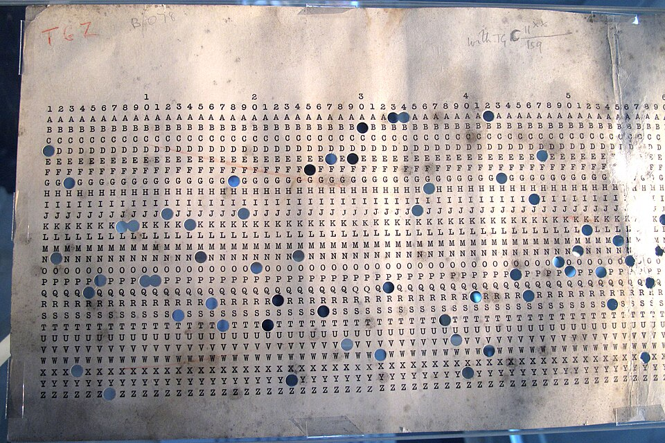

Bernoulli and de Moivre asked how a known cause shows itself in the
evidence: given the urn, what will the draws look like? The question that
matters in most of life runs the other way. Given what we have seen, how
likely is each possible cause? The eighteenth century called it _inverse
probability_. Its first answer was found in the papers of a dead
Presbyterian minister, and its rule, **[Bayes' theorem](kloom:e/bayes-theorem)**, is now used everywhere from medicine to machine learning.

## The essay, and its editor

**[Thomas Bayes](kloom:e/thomas-bayes)** was minister of the Mount Sion chapel in Tunbridge Wells
until 1752. He published only two works in his life, one on divine
benevolence and one defending Newton's calculus against Bishop Berkeley,
and died in 1761. His friend **[Richard Price](kloom:e/richard-price)**, a Nonconformist minister and mathematician, found among his papers an essay he thought "well deserves to be
preserved", edited it for two years, and sent it to the **Royal Society**,
where it was read on 23 December 1763. It appeared in the _Philosophical
Transactions_ volume for 1763 (Wikipedia's articles date it both 1763 and
the following year, when the volume came out).

Price's covering letter says exactly what was new. De Moivre, "after
Bernoulli", had shown how the proportion of successes in many trials
settles near the true chance. But Price knew "of no person who has shewn
how to deduce the solution of the converse problem": given the number of
times an unknown event "has happened and failed", to find the chance that
its probability lies between two given limits. Bayes solved it by
imagining a ball rolled at random across a level table, and he had to
assume that, before any trial, every value of the unknown chance was
equally likely: the _prior_, and the part of his argument that has been
argued over ever since. Price added an appendix with an example: someone
new to the world who has seen the Sun rise a million times.

Some historians think Price deserves a share of the name; Stephen Stigler
once argued, on Bayesian grounds, that the blind mathematician Nicholas
Saunderson found the result first, which others dispute.

## Laplace, and the quarrel

**[Pierre-Simon Laplace](kloom:e/pierre-simon-laplace)** found the rule for himself in 1774, apparently
without knowing of Bayes, stated it generally, and applied it to celestial mechanics, medical statistics and the law. His _rule of succession_ says that after _d_ successes in _d_
trials the chance of another is (_d_ + 1)/(_d_ + 2): for a Sun that had
risen every day for 5,000 years, odds of about 1,826,200 to 1 on tomorrow. Laplace himself said the true odds were far
higher for anyone who understood what makes the Sun rise.

In the twentieth century the prior became a scandal. **[Ronald Fisher](kloom:e/ronald-fisher)**
wrote in 1925 that "the theory of inverse probability is founded upon an
error, and must be wholly rejected", and his methods, and Jerzy Neyman's,
became the statistics most scientists learned. Harold Jeffreys defended
Bayes and Laplace in his _Theory of Probability_ (1939), and Leonard
Savage in 1954; the word "Bayesian" itself dates from the 1950s. The
quarrel is about what probability is: a frequency in the world, or a
degree of belief that evidence should move.

## Weighing evidence

The rule's most secret use came in the war. At **[Bletchley Park](kloom:e/bletchley-park)** in
1940, **[Alan Turing](kloom:e/alan-turing)** needed to judge which settings of the German naval
Enigma were likely, and wrote Bayes' theorem in the form of odds. In his
paper _The Applications of Probability to Cryptography_, declassified only in the 2010s, he calls it "the factor principle (or Bayes' Theorem)": the odds
after the evidence are the odds before it times the _factor_, the chance
of the evidence if the theory is true over its chance if the theory is
false. Independent pieces of evidence multiply their factors, so he added
their logarithms instead, in units of a tenth of a power of ten. He
called the unit a _deciban_, "in honor of the famous town of Banbury",
where the long punched sheets used in his method were printed. The method
was **[Banburismus](kloom:e/banburismus)**, and it saved bombe time by picking out the likeliest right-hand and middle wheels of the day before the bombes were set to work. Wikipedia credits the ban to
Turing with Jack Good in 1940, though Good joined Hut 8 only in May 1941.

Decibans make our own worked example easy to follow. Suppose, with
invented numbers, a condition that 1 person in 1,000 has, and a test that
detects 99% of those who have it but also flags 5% of those who do not.
You test positive. How likely is it that you have the condition?

| Of 100,000 people (invented) | Test positive | Test negative |
| ---------------------------- | ------------: | ------------: |
| 100 have the condition       |            99 |             1 |
| 99,900 do not                |         4,995 |        94,905 |

Of the 5,094 who test positive, 99 have it: about 2%, not 99%. In
Turing's units the prior odds, 1 to 999, are −30 decibans; the positive
result multiplies them by 0.99/0.05, a factor of 19.8, or +13 decibans;
the posterior is −17, odds of about 1 to 50. The plate draws both
reckonings. A second, independent positive adds another 13, and brings
the chance to about 28%. The test is excellent; the condition is rare,
and the rarity is evidence too.

Turing's decibans left the war with Good, who carried them into his
_Probability and the Weighing of Evidence_ (1950). The next frame follows
chance through time, one step depending on the last.
