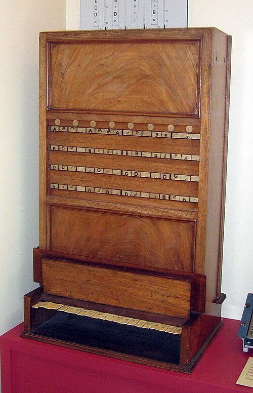

In the spring of 1847 a schoolmaster in Lincoln, **[George Boole](kloom:e/george-boole)**, followed a quarrel in the journals. The Scottish philosopher Sir William Hamilton and the London mathematician **[Augustus De Morgan](kloom:e/augustus-de-morgan)** were disputing which of them had first thought of "quantifying the predicate", a reform of Aristotle's syllogism, and whether mathematics had any business in logic at all. Boole, the self-taught son of a shoemaker, thought it had, and within months he had written a short book to show how: _The Mathematical Analysis of Logic_. By the usual account it came out on the same day as De Morgan's own _Formal Logic_. The AI subject tells how Boole hoped his algebra described the mind; this frame is about the algebra itself, and how it came to run in wires.

## Three laws

Boole let a letter such as _x_ stand for the act of picking out a class: the sheep, say, from a crowd of animals. Then _xy_ means picking out the _y_s and from them the _x_s, and he found that three laws are enough to make a calculus of it:

| Law                          | In Boole's words, more or less                                                    |
| ---------------------------- | --------------------------------------------------------------------------------- |
| _x_(_u_ + _v_) = _xu_ + _xv_ | Pick the _x_s from a whole, or from its two parts and put them together: the same |
| _xy_ = _yx_                  | Horned sheep: take the sheep, then the horned ones, or the horned, then the sheep |
| _x_² = _x_                   | Picking the _x_s twice gives nothing that picking them once did not               |

The first two are laws of ordinary algebra, so, Boole wrote, "all the processes of common algebra are applicable". The third he called the _index law_, and it is not: among numbers only 0 and 1 obey it. That is where logic and arithmetic part, and where Boole's 1 and 0 come from: the whole universe of things under discussion, and nothing. The class of things that are not _x_ is 1 − _x_. His _+_ joined only classes with no member in common, so that _x_ + _x_ meant nothing. In 1863 the economist **[William Stanley Jevons](kloom:e/william-stanley-jevons)** wrote to him that "or" should be allowed to overlap, which makes _x_ + _x_ = _x_; Boole, whose system rested on ordinary algebra, would have none of it and broke off the correspondence. Jevons printed the change in his _Pure Logic_ of 1864, and the modern version kept it.

Boole's fuller statement, **[_The Laws of Thought_](kloom:e/the-laws-of-thought)**, followed in 1854, from Cork, where in 1849 he had become the first professor of mathematics at the new Queen's College.

## One line of algebra

With Jevons's "or", written in Boole's own signs as _x_ + _y_ − _xy_, one of De Morgan's rules of logic becomes a line of school algebra: multiply out (1 − _x_)(1 − _y_) and it is 1 − _x_ − _y_ + _xy_, which is 1 − (_x_ + _y_ − _xy_). In words, what is neither _x_ nor _y_ is what is not "_x_ or _y_". Since each letter is 0 or 1, the whole claim can also be checked by trying every case:

| _x_ | _y_ | _x_ or _y_ = _x_ + _y_ − _xy_ | 1 − (_x_ + _y_ − _xy_) | (1 − _x_)(1 − _y_) |
| :-: | :-: | :---------------------------: | :--------------------: | :----------------: |
|  0  |  0  |               0               |           1            |         1          |
|  0  |  1  |               1               |           0            |         0          |
|  1  |  0  |               1               |           0            |         0          |
|  1  |  1  |               1               |           0            |         0          |

## Into machines

Once logic was a calculation, someone would build a machine to do it. Jevons had a clockmaker in Salford build his _logic piano_ in 1869. Its keys took the terms of an argument, and its face showed every combination of four terms and their negations, sixteen in all, dropping those the premises ruled out. It survives in the History of Science Museum at Oxford.

In 1880 the Cambridge logician **[John Venn](kloom:e/john-venn)** published the overlapping circles now named after him, drawn so that every combination of classes has a region of its own: a picture of the same combinations. And in a letter of 1886 the American philosopher **[Charles Sanders Peirce](kloom:e/charles-sanders-peirce)** told his former student Allan Marquand, who had built a logic machine of his own, that the same combinations could be made with electric switches. It lay unpublished for decades.

Half a century later **[Claude Shannon](kloom:e/claude-shannon)** made the idea exact in his MIT master's thesis of 1937, published in 1938. The plate draws the principle. Two switches in series pass current only if both are closed: that is the product _xy_. Two in parallel pass it if either is: _x_ + _y_ − _xy_, or "or". Shannon himself wrote it the other way round. He counted the _hindrance_ of a circuit, 0 when closed and 1 when open, so that in his paper series is _X_ + _Y_ and parallel _X_ · _Y_; by the duality De Morgan's laws express, the algebra is the same. Akira Nakashima in Japan and Victor Shestakov in the Soviet Union reached the same idea in the same years, and in Berlin **[Konrad Zuse](kloom:e/konrad-zuse)**, designing the relay logic of his computers, invented a notation for it, his "combinatorics of conditionals", and learned only after 1938 that logicians already had it.

Boole's classes were drawn from a universe that seemed to need no measuring. The next question was how big a class could be, and the answer was that infinity comes in sizes.
