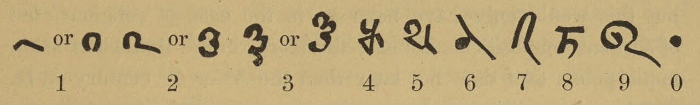
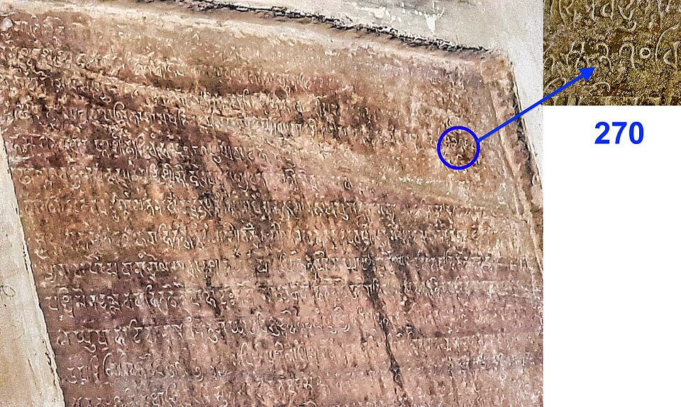

In 628, by his own account at the age of thirty, the astronomer
**[Brahmagupta](kloom:e/brahmagupta)** finished a book of 1,008 verses at Bhillamala, the modern
Bhinmal in Rajasthan. The **[_Brāhmasphuṭasiddhānta_](kloom:e/brahmasphutasiddhanta)**, the "correctly
established doctrine of Brahma", is mostly astronomy: the motions of the
planets, eclipses, the calendar. But its eighteenth chapter, on algebra,
does something no earlier book we have does. It treats **[zero](kloom:e/0)** as a
number in its own right, which can be added, subtracted, multiplied and
divided, and it gives the rules.

Zero as a place-holder was old. The Babylonians left a gap, or later a
sign, where a sixty-place was empty, and Indian writers had used a word
for "empty", _śūnya_, in their place-value numbers for at least a century
and a half before Brahmagupta. What was new was to ask what zero does in
a sum.

## Fortunes and debts

Brahmagupta's rules come in pairs, for positive and **[negative numbers](kloom:e/negative-number)**
alike. In Sanskrit a positive quantity was _dhana_, wealth, and a negative
one _ṛṇa_, a debt, and the rules read naturally as accounts. The Scottish
scholar **Henry Thomas Colebrooke** put them into English in 1817. Set out
as a table, from verses 31 to 36 of the chapter:

| Brahmagupta's rule (in Colebrooke's words, shortened)                | In our notation  |
| -------------------------------------------------------------------- | ---------------- |
| The sum of an affirmative and a negative is their difference         | 3 + (−5) = −2    |
| The sum of cipher and negative is negative                           | 0 + (−4) = −4    |
| Negative, taken from cipher, becomes positive                        | 0 − (−4) = 4     |
| The product of two negatives is positive                             | (−3) × (−4) = 12 |
| The product of cipher and negative, or affirmative, is nought        | 0 × 5 = 0        |
| Cipher, divided by cipher, is nought                                 | 0 ÷ 0 = 0        |
| Positive, divided by cipher, is a fraction with that for denominator | 5 ÷ 0 = 5/0      |

(The examples in the second column are ours.) The plate draws the first
and third rules on a line of fortunes and debts: a fortune of three and a
debt of five leave a debt of two, and a debt of four, taken away from
nothing, is a fortune of four.

Most of the table is still the arithmetic taught in schools. The last two
rows are not. We leave division by zero undefined, because no number
times zero gives five. Brahmagupta set 0 ÷ 0 at zero, which breaks the
rule that a quotient times the divisor gives back what was divided, and
he left 5 ÷ 0 as a fraction with zero below the line without saying what
it is worth. Five centuries later **Bhāskara II** called such a fraction
an "infinite quantity", which comes closer to our answer.

## The oldest zeros

Brahmagupta's zero was a word in a verse. The sign itself is harder to
date. The **[Bakhshali manuscript](kloom:e/bakhshali-manuscript)**, seventy damaged leaves of birch bark
found near Peshawar in 1881, in a field or a ruin (the accounts differ),
and kept at the **[Bodleian Library](kloom:e/bodleian-library)** in Oxford since 1902, is a book of arithmetic problems full of
zeros, each written as a dot.

In 2017 the library announced radiocarbon dates for three leaves that lay
centuries apart, the oldest from AD 224 to 383, and called it the oldest
recorded zero. Five historians of Indian mathematics, **Kim Plofker**
among them, objected at once, in print. The leaves are in one hand and one
script, they said, and the text runs straight on from a leaf dated to the
third century onto one dated to the seventh; if the book was written as
one work, its zeros are as young as its youngest leaf. Oxford's own
report of 2024 withdrew the early date. A second test on the leaf first put in the
third century gave 901 to 1032, the seventh-century leaf was set aside as
an outlier, and five leaves together put the making of the manuscript
between the ninth and the eleventh centuries.

A carved zero is easier to date. In 876 the builders of a small temple
cut into the rock of the fort at Gwalior, the **[Chaturbhuj Temple](kloom:e/chaturbhuj-temple-gwalior)**,
recorded that the community had planted a garden 187 by 270 _hastas_,
which gave the temple fifty garlands a day. The 0s of 270 and 50 are small
circles, close to our own, and this is the first zero drawn as a circle
whose date is not in doubt. The
oldest firmly dated zero anywhere is older still and not in India: a dot
in the year 605 of the Saka era, AD 683, on a stone from Sambor in
Cambodia.

## West to Baghdad

Brahmagupta's books travelled. An embassy from Sindh brought Indian
astronomy to the court of the caliph al-Mansur in Baghdad, who reigned
from 754 to 775, and it was put into Arabic as the _Sindhind_. Within fifty years a scholar in
Baghdad had written a book on reckoning with the Indian numerals, zero
among them, and another on solving equations: [al-Khwarizmi](kloom:e/al-khwarizmi).
