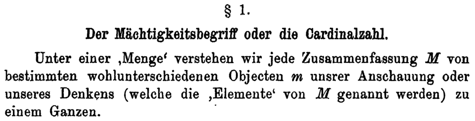

On 29 November 1873 a young professor at the University of Halle, **[Georg Cantor](kloom:e/georg-cantor)**, wrote to his friend **[Richard Dedekind](kloom:e/richard-dedekind)** with a question he could not answer. Can the whole numbers and the positive real numbers be paired off, so that each number of one collection has exactly one partner in the other? Dedekind could not answer it either. Within ten days Cantor had shown that the answer is no. Infinity, it turned out, comes in more than one size, and the study of those sizes, _set theory_, became the ground most of mathematics now stands on.

## Pairing off

Cantor's test of size is the one a child uses before she can count: match the things one to one, and see whether any are left over. The even numbers pair off with all the whole numbers (1 with 2, 2 with 4, _n_ with 2_n_), so there are as many evens as numbers. So do the fractions, once they are listed in a clever order. **[Galileo](kloom:e/galileo-galilei)** had noticed the same thing about the square numbers in 1638, and drawn a different lesson from it; the Infinity trail's second frame tells his story. Cantor drew the bold one: two infinite collections have the same size when they can be paired, and a collection that pairs with 1, 2, 3, … is _countable_.

His paper of 1874, in Crelle's _Journal_, proved that the real algebraic numbers are countable and the real numbers are not. Its title named only the first result. Cantor had discussed it with Karl Weierstrass, and the historians who have read his letters trace the caution to Weierstrass's doubts and to **[Leopold Kronecker](kloom:e/leopold-kronecker)**, an editor of the journal, who would not admit infinite sets at all. Whether Kronecker actually delayed the paper is disputed: one account says he did, another that there is no evidence of it.

The paper was not Cantor's alone. The proof that the algebraic numbers are countable came from Dedekind, and Cantor printed Dedekind's simpler version of his own second proof, thanking him in a letter but not in print. Dedekind stopped answering his letters until 1876. The historian José Ferreirós set out the case in 1993, and in March 2025 the mathematician Demian Goos found Dedekind's lost letter of 30 November 1873, holding the proof, in Halle's archive. _Quanta Magazine_, reporting the find, called the paper an act of plagiarism.

## The diagonal

In 1891 Cantor gave a second proof, far simpler, and it became one of the most borrowed ideas in mathematics. He took any two characters, _m_ and _w_, and every endless row of them. Suppose someone claims to have listed all such rows, as _E_₁, _E_₂, _E_₃ and so on. Build a new row _E_₀: for its first place, take the first place of _E_₁ and swap it; for its second, the second place of _E_₂, swapped; for the _n_th, the _n_th place of _E_ₙ, swapped. Then _E_₀ cannot be _E_₁, since they differ in the first place, nor _E_₂, since they differ in the second, nor any row at all. The list was not complete, and no list can be. The plate runs the argument on seven rows, the first three of them Cantor's own examples and the rest invented:

| Row         | Places 1 to 4 |
| ----------- | ------------- |
| _E_₁        | **m** m m m … |
| _E_₂        | w **w** w w … |
| _E_₃        | m w **m** w … |
| _E_₄        | w m m **w** … |
| _E_₀, swaps | w m w m …     |

Write 0 and 1 for _m_ and _w_, and each row becomes a binary fraction between 0 and 1; with a little care over the few numbers that have two such expansions, the argument shows that the real numbers are not countable. The same trick, turned on any collection and the collection of its subsets, shows that the second is always bigger. There is no largest infinity. **[Cantor's diagonal](kloom:e/cantors-diagonal-argument)** would come back in **[Kurt Gödel](kloom:e/kurt-godel)**'s incompleteness proof and in Alan Turing's machines.

In 1895 he opened his last great paper with the definition in the image: by a set he meant "any collection into a whole _M_ of definite and separate objects _m_ of our intuition or our thought". There he named the size of the whole numbers ℵ₀, _aleph-null_, from the first letter of the Hebrew alphabet, and wrote ℵ₀ + 1 = ℵ₀: an infinite set loses nothing by adding one more. He believed the real numbers were the next size up, and spent years failing to prove it; the Infinity trail ends with what became of that question.

## The paradise

Kronecker's opposition was personal as well as philosophical. By the account Cantor's biographer Joseph Dauben gives, he called Cantor a "scientific charlatan", a "renegade" and a "corrupter of youth". His first known depression came in May 1884, and every one of the 52 letters he wrote that year to the Swedish mathematician Gösta Mittag-Leffler mentions Kronecker. The old story that his critics broke him has been questioned: a psychiatrist who examined him called his illness cyclic manic-depression. He was in and out of sanatoria for the rest of his life, and died in one, at Halle, in January 1918, poor and underfed in the last year of the war.

By then the young had taken his side. In a lecture at Münster in June 1925, printed the next year, **[David Hilbert](kloom:e/david-hilbert)** promised to protect every fruitful idea, and wrote: "No one shall expel us from the paradise that Cantor has created for us." Others were already finding snakes in it. A set of all sets, it turned out, was a contradiction; the next frame is the letter that said so.
