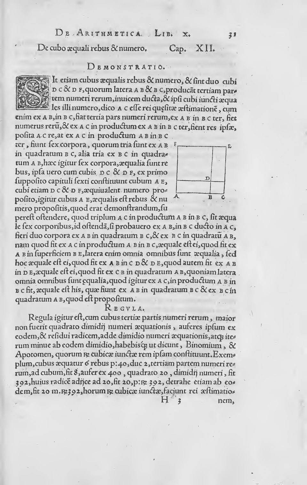

A quadratic equation had been solved by rule since Babylon. The cubic, an
equation in the cube of the unknown, had not, and in 1494 the friar Luca
Pacioli's _Summa_ of arithmetic and geometry said that no general rule for
it was possible. Within fifty years a handful of
Italian teachers had found one, fought over it in public, printed it, and
been led by it to numbers that could not exist.

## A secret and a contest

The first was **[Scipione del Ferro](kloom:e/scipione-del-ferro)**, who lectured on arithmetic and
geometry at Bologna from 1496. Some time around 1515 he found how to solve
"a cube and things equal to a number", in our notation _x_³ + _px_ = _q_.
He published nothing. Mathematicians of the day won posts and fees in
public contests, and a rule no rival knew was a weapon. He left it in a
notebook, which passed to his son-in-law Annibale della Nave, and he taught
it to a student, Antonio Maria Fior.

Fior used it. In 1535 he challenged **[Niccolò Tartaglia](kloom:e/nicolo-tartaglia)**, a self-taught
teacher in Venice whose nickname means "the stammerer": a French soldier's
sabre had cut his jaw in the sack of Brescia in 1512. Each man lodged thirty
problems with a notary. All of Fior's were cubes and things equal to a
number, dressed as puzzles: "A man sells a sapphire for 500 ducats, making a
profit of the cube root of his capital." In Tartaglia's own telling, printed
eleven years later, he found the general rule eight days before the
problems were exchanged, and solved all thirty in two hours; Fior made
little headway with his.

## The oath and the book

**[Gerolamo Cardano](kloom:e/gerolamo-cardano)**, a physician and lecturer in mathematics in Milan,
heard of the contest and wanted the rule for a book. In March 1539
Tartaglia visited him and, by his account, gave it up only after Cardano
swore "by the sacred Gospel" never to publish it and to keep it in cipher.
He gave it in verse, which begins, in MacTutor's translation, "When the
cube and things together / Are equal to some discreet number".

Cardano and his servant turned pupil **[Lodovico Ferrari](kloom:e/lodovico-ferrari)** worked it out
for every form of the cubic, and Ferrari used it to solve the quartic,
equations in the fourth power. In 1543 the two went to Bologna, where della
Nave showed them del Ferro's notebook. The rule was not Tartaglia's alone,
and Cardano decided the oath did not bind him. His **[_Ars Magna_](kloom:e/ars-magna-cardano-book)**, _The
Great Art_, printed at Nuremberg in 1545 by **[Johannes Petreius](kloom:e/johannes-petreius)**, who had
printed Copernicus's book on the heavens two years before, gives the rules
with their proofs and credits del Ferro, Tartaglia and Ferrari by
name.

The page shows the rule for _x_³ = _px_ + _q_, and a limit on it: it works
when the cube of a third of _p_ is "not greater than" the square of half of
_q_. Its example is _x_³ = 6_x_ + 40. A third of 6 is 2, cubed 8; half of
40 is 20, squared 400; 400 − 8 = 392, and _x_ is the cube root of 20 + √392
plus the cube root of 20 − √392. By our arithmetic that is 3.414 + 0.586, or
4, and 4³ = 64 = 24 + 40.

Tartaglia called it betrayal in print in 1546. Ferrari answered with public
challenges, and on 10 August 1548 the two met in a church in Milan;
Tartaglia left after the first day, and the contest went to Ferrari.
Wikipedia's editors write that the story of Tartaglia spending his life
trying to ruin Cardano appears to be fabricated, and the rule now carries both their names.

## Through the impossible

The limit on Cardano's page is where the cubic broke open. Take
_x_³ = 15_x_ + 4, the equation **[Rafael Bombelli](kloom:e/rafael-bombelli)**, a Bolognese engineer
who reclaimed marshland in the Papal States, worked in his _L'Algebra_ of 1572:

| Step                 | Worked                              |
| -------------------- | ----------------------------------- |
| Half of 4, squared   | 2² = 4                              |
| A third of 15, cubed | 5³ = 125                            |
| The difference       | 4 − 125 = −121                      |
| The rule's answer    | ∛(2 + √−121) + ∛(2 − √−121)         |
| Bombelli's cube root | (2 + √−1)³ = 2 + 11√−1 = 2 + √−121  |
| So                   | _x_ = (2 + √−1) + (2 − √−1) = **4** |

The answer is plainly 4, since 64 = 60 + 4, and the plate draws the cube and
the line crossing there and twice more; yet the rule reaches it only through
the square root of a negative number. Bombelli named such roots "plus of
minus" and "minus of minus", gave rules for multiplying them, and let them
cancel. He admitted the idea had seemed to him "more sophistic than true".

Cardano had met the case himself. In August 1539 he wrote to Tartaglia that
the rule would not fit a cube equal to nine things and ten, and got no
help. MacTutor's history says the equation that stopped him was
_x_³ = 15_x_ + 4; the letter as Tartaglia printed it names _x_³ = 9_x_ + 10. The roots of negatives that the _Ars Magna_ does
print come from another problem: two numbers that add to 10 and multiply to
40, 5 + √−15 and 5 − √−15, "as subtle as it is useless". MacTutor says they
came from a cubic; Wikipedia's article on the book calls that a common
misconception, and the numbers, which solve a quadratic, bear it out.

Historians argue over the credit too. MacTutor's biographer calls Bombelli
the inventor of **[complex numbers](kloom:e/complex-number)**; Jean Dieudonné thought such roots
had been used before him. What the frame on complex numbers takes up, from
Euler on, began here. In 1637 Descartes gave these roots the name they
kept, and meant it as a slight: imaginary.
