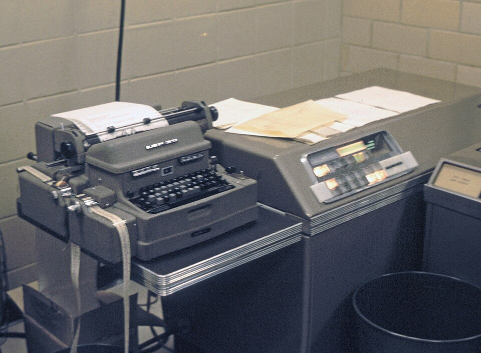

Newton's laws are deterministic: give them the present exactly, and they
fix the future. For two centuries that seemed to mean the future could be
computed. The mathematics of _chaos_ says why it often cannot. In a
chaotic system a tiny difference in the starting state grows, step by
step, until the two futures have nothing in common, and no measurement is
ever exact. It was found three times: by a mathematician who had made a
mistake, by a meteorologist who went for a coffee, and by a biologist
modelling insects.

## The prize and the error

Newton solved the motion of two bodies under gravity exactly. In the
_Principia_ (1687), Book I, Proposition 66, he took the first steps with
three, the Earth, the Moon and the Sun. The **[three-body
problem](kloom:e/three-body-problem)** was still open two hundred years later, when **[Henri Poincaré](kloom:e/henri-poincare)**
entered a competition set in 1885 for the sixtieth birthday of King Oscar
II of Sweden and Norway. Its judges were Hermite, Weierstrass and Gösta
Mittag-Leffler, the editor of _Acta Mathematica_; the prize was a gold
medal and 2,500 crowns. Poincaré's memoir on three bodies won it in 1889.

It was wrong. Lars Phragmén, Mittag-Leffler's young assistant, sent
Poincaré questions about passages he could not follow, and in December
1889 Poincaré wrote that the correction needed substantial changes. He had
followed the paths that leave an unstable orbit and the paths that return
to it, and assumed that where the two met they must coincide, as they do
for a pendulum balanced upside down. In his problem they cross instead,
and once they cross they must cross again and again, weaving what is now
called a _homoclinic tangle_: nearby starts are torn apart in it.

The issue had already been printed. Mittag-Leffler recalled it, and on a
surviving copy he wrote "The whole edition was destroyed." In the
mathematician Jean-Christophe Yoccoz's account, Poincaré paid for the
printing, 3,500 crowns, a thousand more than the prize; the mathematician
Richard Brent says only that the cost exceeded it. The corrected memoir,
270 pages, appeared in November 1890, and it is where the study of
dynamical systems begins.

## Lorenz's coffee

The second discovery is a story its finder told. **[Edward Lorenz](kloom:e/edward-norton-lorenz)**, a
meteorologist at MIT, acquired an **[LGP-30](kloom:e/lgp-30)** around 1958, a computer about
the size of a large desk. In his telling, in his Kyoto Prize lecture of
1991, he ran a weather model of twelve equations on it, one six-hour step
every ten seconds or so. One day he restarted a run from numbers typed in
from an earlier printout, and went out for a cup of coffee. When he came
back, the new run had drifted away from the old: the differences doubled
about every four simulated days, and after sixty days the two weathers
were unrecognisably different. The machine carried about six decimal
places; the printout, to fit twelve numbers on a line, gave three.
Wikipedia dates the day to 1961.

In 1963 Lorenz published a model cut down to three equations for a fluid
heated from below, with constants σ = 10, _r_ = 28 and _b_ = 8/3, stepped
on the LGP-30 at about one second per step. Almost none of its solutions
repeat, and, the abstract says, "slightly differing initial states can
evolve into considerably different states." The plate computes his
system: the path winds round one steady state, C, then the other, C′,
switching unpredictably. Below it, two runs we started 0.00001 apart keep
together for about twelve units of time, then part.

On 29 December 1972 Lorenz gave a talk to the American Association for
the Advancement of Science whose title, he
later said, a colleague had supplied: "Predictability: Does the Flap of a
Butterfly's Wings in Brazil Set Off a Tornado in Texas?" It gave the idea
its name, the **[butterfly effect](kloom:e/butterfly-effect)**.

## One line of algebra

The third discovery needed no computer at all. In _Nature_ in 1976 the
ecologist **[Robert May](kloom:e/robert-may-baron-may-of-oxford)** reviewed what the simplest model of an insect
population, one generation to the next, can do: the **[logistic map](kloom:e/logistic-map)**,
_x_ → _rx_(1 − _x_). For _r_ below 3 it settles; above 3 it cycles
between two values, then four, then eight; beyond about 3.57 it is chaotic.
May ended with an "evangelical plea" that the equation be taught in
elementary mathematics courses.

Here it is at work. Two runs of our own at _r_ = 4, started at 0.3 and
0.300001, differ in the sixth decimal place:

| Step | First run | Second run | Gap      |
| ---: | --------: | ---------: | -------- |
|    0 |  0.300000 |   0.300001 | 0.000001 |
|    5 |  0.087945 |   0.087926 | 0.00002  |
|   10 |  0.043422 |   0.042968 | 0.00045  |
|   15 |  0.176954 |   0.150514 | 0.026    |
|   20 |  0.941785 |   0.033125 | 0.91     |

The gap roughly doubles at every step, so, by our arithmetic, each extra correct digit at
the start buys only three or four more steps of forecast. At _r_ = 2.8 the
same two starts draw together instead, to within a billionth by
step 30.

In 1975 **[Mitchell Feigenbaum](kloom:e/mitchell-feigenbaum)**, at Los Alamos, measured on a programmable
calculator how fast the doublings come: the gaps between them shrink by a
factor that tends to 4.6692…. He then showed that the same number governs
every system that doubles its period this way on the road to chaos, a
claim Oscar Lanford proved, with a computer's help, in 1982.

The shapes that chaos leaves behind, sets like the Lorenz attractor that
are finer at every magnification, are the fractals of the Geometry
segment.
