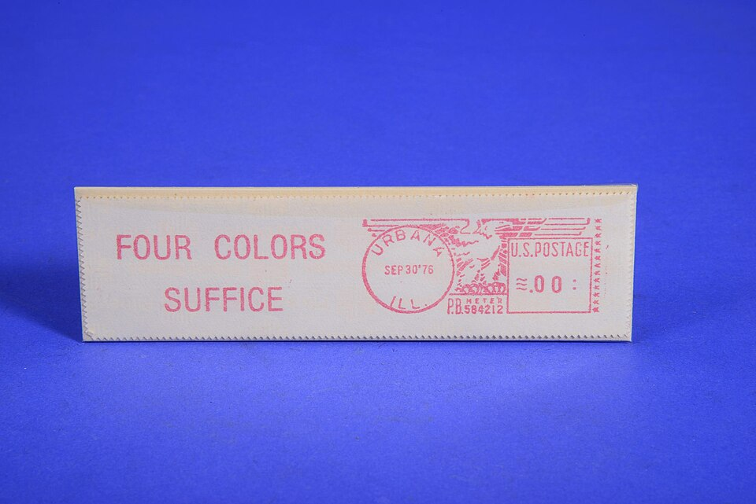

In the autumn of 1976 the mathematics department of the **University of
Illinois** at Urbana changed its postage meter. Beside the eagle and the
postmark, its envelopes now carried three words: FOUR COLORS
SUFFICE. Two of its mathematicians, **[Kenneth Appel](kloom:e/kenneth-appel)** and **[Wolfgang
Haken](kloom:e/wolfgang-haken)**, had proved a theorem that had defeated everyone for 124 years,
with a computer.

## A map that needs four

Color a map so that no two regions
sharing a border have the same color: how many colors can we be forced
to use? In 1852 **Francis Guthrie**, coloring the counties of England,
noticed that four always seemed enough, and the question reached
**Augustus De Morgan** in London. The **[four color theorem](kloom:e/four-color-theorem)** says that
four always is.

Why can't three do? The plate draws the smallest kind of proof. A region
in the middle has five neighbors, set in a ring. Go round the ring with
two colors, 1 and 2, alternating: five is odd, so the fifth region
borders two regions already colored 1 and 2, and needs a third. The
middle region touches all five, so it needs a fourth. The same reasoning
works for any region with an odd number of neighbors; the mainland
United States needs four colors for this reason around Nevada, which
has five. The hard part is showing that no map ever needs five.

Alfred Kempe's proof of 1879 stood for eleven years, until Percy Heawood
found its flaw. Its method survived: show that a smallest map needing
five colors must contain some small arrangement of regions, a
_configuration_, that could be removed, colored and put back, so that
the map was not the smallest after all.

## Fewer than two thousand cases

Appel and Haken, building on the German mathematician Heinrich Heesch,
found a list that was both unavoidable and reducible, announced in June 1976. The unavoidable half was argued by hand, in hundreds of pages
checked with the help of Haken's daughter Dorothea. The reducible half
was run by computer, over a thousand hours of it: every configuration's
possible colorings were checked one by one. Sources disagree on the
list's length. Their announcement of 1976 says "fewer than
2000"; the Smithsonian, which holds the meter strip, says 1,936; Robin
Thomas and his colleagues count 1,476 in Appel and Haken's final version,
and Wikipedia gives 1,834, later 1,482.

Many mathematicians were uneasy. The philosopher Thomas Tymoczko argued
in 1979 that a proof no person could check had a gap filled by "a
well-thought-out experiment", and was no traditional proof; Paul Teller
answered that checkability is a matter of degree. A student at Aachen found an error in the hand
part in 1981; Appel and Haken corrected it, and further errors, in a book
of 1989. In 1996 Neil Robertson, Daniel Sanders, Paul Seymour and Robin
Thomas gave a new proof with 633 configurations and 32 rules for
discharging, where Appel and Haken had used more than 300. It was
simpler, and still needed a computer.

## Referees who were 99 percent certain

Others followed.

| Year | Theorem                     | What the computer did                             |
| ---- | --------------------------- | ------------------------------------------------- |
| 1976 | Four color theorem          | Checked the colorings of each configuration       |
| 1996 | Robbins conjecture          | Found the proof itself, in eight days             |
| 1998 | Kepler conjecture           | Solved about 100,000 linear programs              |
| 2016 | Boolean Pythagorean triples | Searched every coloring; the proof is 200 TB long |

In 1998 **[Thomas Hales](kloom:e/thomas-callister-hales)** and his student Samuel Ferguson proved the
**[Kepler conjecture](kloom:e/kepler-conjecture)**, that no stacking of equal spheres is denser than
the grocer's pyramid of oranges. The _Annals of Mathematics_ set twelve
referees on it. After four years their head, Gábor Fejes Tóth, reported
that they were "99% certain" it was correct but could not check all of
the computation. Hales answered with Flyspeck, a project to check the
whole proof in the proof assistants HOL Light and Isabelle, finished on
10 August 2014.

In 1996 William McCune's program EQP proved the Robbins conjecture, on
the axioms of Boolean algebra, open since the 1930s. Herbert Simon and
Allen Newell, makers of the **[Logic Theorist](kloom:e/logic-theorist)**, had predicted in 1958
that a computer would "discover and prove an important new mathematical
theorem" within ten years. It took nearer forty. And in 2016 Marijn Heule
and his colleagues showed that the numbers 1 to 7,824 can be split into
two sets with no Pythagorean triple (like 3, 4, 5) inside either, but 1
to 7,825 cannot, in a proof of almost 200 terabytes.

## A computer that understands

The deeper change was the _proof assistant_, a program that checks every
step of a formal proof from the axioms up.
Nicolaas de Bruijn's Automath began it in 1967. In 2005 Georges Gonthier
and Benjamin Werner finished a proof of the four color theorem in Coq,
so that the only program to trust was Coq's small kernel. **[Lean](kloom:e/lean-proof-assistant)**,
launched by Leonardo de Moura in 2013, grew a shared library, _mathlib_,
which on 30 September 2026 held 289,504 theorems and 137,875 definitions,
written by 772 people.

In December 2020 **[Peter Scholze](kloom:e/peter-scholze)**, a Fields medallist, asked the Lean
community to check a theorem of his with Dustin Clausen. He had spent
much of 2019 "almost getting crazy over it", and thought that nobody else
had dared to read the details. Johan Commelin led the effort. By June
2021 the part Scholze doubted was checked, with two small slips found and
fixed. Who understood the proof now, he asked himself, besides its
authors? "I guess the computer does, as does Johan Commelin." The whole Liquid Tensor
Experiment was finished on 14 July 2022.

Computers first proved what no one could check, and then checked what
people proved. Where that has brought mathematics by September 2026, with
machines now proposing proofs of their own, is the last frame's subject.
