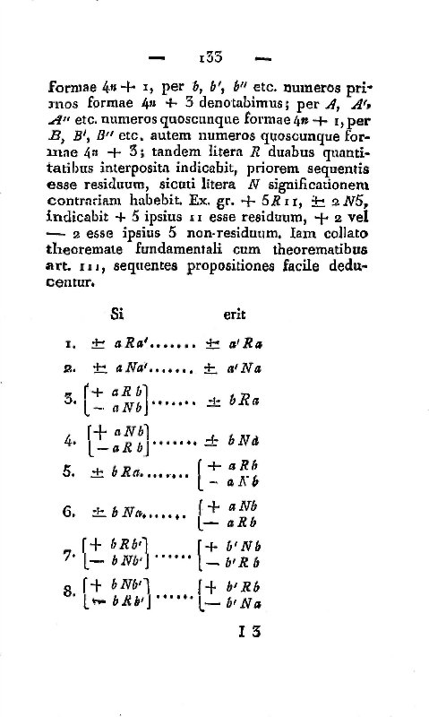
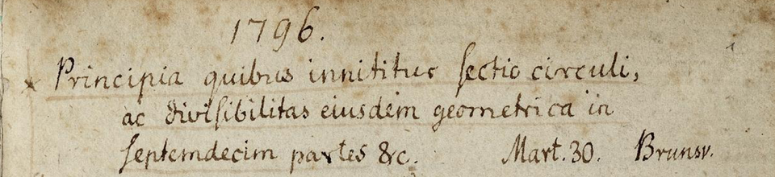

In 1801 a Leipzig bookseller brought out a Latin book of more than six
hundred pages called **[_Disquisitiones Arithmeticae_](kloom:e/disquisitiones-arithmeticae)**, "Arithmetical
Investigations". Its author, **[Carl Friedrich Gauss](kloom:e/carl-friedrich-gauss)**, was twenty-four,
from a poor family in Brunswick, and had been kept at school and
university by **[Charles William Ferdinand, Duke of Brunswick](kloom:e/charles-william-ferdinand-duke-of-brunswick)**. The
dedication, signed in July 1801, says that without the duke's favor he
could never have given himself to mathematics, and that the duke's
generosity had cleared away what was holding the printing up. Most of it
was written by 1798, when he was twenty-one. The book turned the study
of whole numbers, until then a scattering of theorems by Fermat,
**[Euler](kloom:e/leonhard-euler)**, Lagrange and others, into a subject with its own methods. Gauss called it the
"higher arithmetic".

His preface tells how it began. Early in 1795, he says, he knew nothing
of what others had done. He came upon one fine truth by chance (it is
the theorem of his article 108: −1 leaves a square remainder on division
by any prime of the form 4_n_ + 1), and could not leave the questions
alone. By the time he read Euler and Lagrange, he found that much of
what he had proved was already known. The printing was interrupted so
often that it dragged into its fourth year, and **[Adrien-Marie Legendre](kloom:e/adrien-marie-legendre)**'s
_Essai sur la théorie des nombres_ of 1798 reached him only when most of
the book was in type. The book grew so far beyond what he had planned
that a whole eighth section had to be cut.

## Counting round a circle

The book opens with a definition. Two numbers are _congruent_ modulo _m_
when _m_ divides their difference, and Gauss gave the idea the sign we
still write: −16 ≡ 9 (mod 5), his own first example, because 5 divides 25. He chose ≡, he says in a footnote, "because of the great analogy
between equality and congruence". A clock does **[modular arithmetic](kloom:e/modular-arithmetic)**
modulo 12: seventeen o'clock is five o'clock. The sign lets one add,
subtract and multiply remainders as freely as numbers, and much of the
book is algebra done in that arithmetic.

## The golden theorem

Its heart is a law about squares. Call _a_ a _quadratic residue_ of a
prime _p_ when some square leaves remainder _a_ on division by _p_. The
law, **[quadratic reciprocity](kloom:e/quadratic-reciprocity)**, ties two odd primes together: if either
is of the form 4_n_ + 1, each is a square modulo the other or neither
is; if both are of the form 4_n_ + 3, exactly one of them is. A worked
case, of our own choosing:

| Prime | Form   | Squares modulo it  | Contains the other prime? |
| ----: | ------ | ------------------ | ------------------------- |
|    13 | 4n + 1 | 1, 3, 4, 9, 10, 12 | 3: yes (4² = 16 ≡ 3)      |
|     3 | 4n + 3 | 1                  | 13 ≡ 1: yes               |
|     7 | 4n + 3 | 1, 2, 4            | 3: no                     |
|     3 | 4n + 3 | 1                  | 7 ≡ 1: yes                |

Nothing about squares modulo 13 seems to have anything to do with squares
modulo 3. Yet the law says the two answers must agree, and for 3 and 7,
both of the form 4_n_ + 3, must differ.

Euler had found the law by trying cases, and Legendre stated it and
believed he had proved it, but his proof assumed something he could not
show. Gauss proved it on 8 April 1796, as his diary records, and in the
book set it out as eight cases (article 131), naming it the "fundamental
theorem", which "must certainly be counted among the most elegant of its
kind" (article 151, in our translation). Privately he called it the
golden theorem. He published six proofs of it and left two more in his
papers. There are now more than 240.

## Seventeen sides

Gauss's mathematical diary opens with an entry dated 30 March 1796, at
Brunswick, a month before his nineteenth birthday: "The principles on
which the division of the circle rests, and its geometric divisibility
into seventeen parts, etc."

Euclid could draw a regular triangle and pentagon with ruler and compass,
and nothing had been added in two thousand years, as Gauss remarked. He
showed that a regular 17-gon can be drawn too, by showing that
cos(2π/17) needs only square roots:

cos(2π/17) = −1/16 + √17/16 + √(34 − 2√17)/16 + √(17 + 3√17 − √(34 − 2√17) − 2√(34 + 2√17))/8

Section VII of the book gives the rule behind it: a regular polygon can
be drawn when the odd primes in its number of sides are distinct primes
of the form 2^(2^k) + 1, such as 3, 5, 17, 257 and 65,537. He claimed
that no others could and gave no proof; Pierre Wantzel supplied one in 1837. Gauss left a formula, not a drawing. The plate follows the
construction that Herbert Richmond published in 1893: quarter an angle,
draw two circles, and two perpendiculars land on the third and fifth
vertices.

Gauss's arithmetic worked with remainders, exactly. In 1859 his former
doctoral student Bernhard Riemann took up the primes with the tools of
the calculus instead, in the frame on Riemann's hypothesis.
