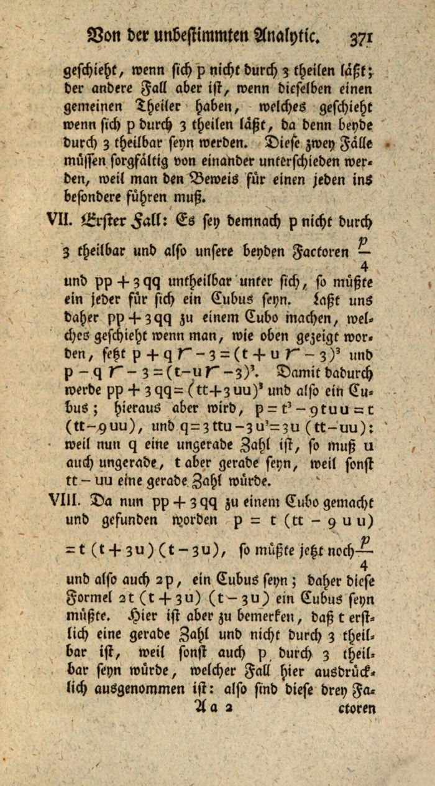

For more than a century after [Fermat](kloom:e/pierre-de-fermat), his claim was proved only for
fourth powers, by his own descent. **[Leonhard Euler](kloom:e/leonhard-euler)** gave his own proof of
that case in a paper of 1738, along lines that Fermat's note had
indicated. On 4 August 1753 he
wrote to **[Christian Goldbach](kloom:e/christian-goldbach)** that he could also prove it for cubes: no
two cubes add up to a cube. He did not print the proof until 1770, and
then not in a journal but in a textbook, the **[_Elements of Algebra_](kloom:e/elements-of-algebra)**.

It is a remarkable book to find a proof in. Euler had gone blind, and he
dictated it in St Petersburg to a young servant who had been trained as a
tailor and knew no mathematics beyond arithmetic. By the account of the
book's German editors, the young man learned algebra from the dictation
well enough to do the calculations himself. It appeared in Russian in
1768–69 and in German, from the Imperial Academy at St Petersburg, in 1770. Its French translator warned readers that a work "dictated, and
admitting of no revision from the author himself" would need correcting in
places.

## A descent through cubes

The proof is article 243 of the second part, and it is Fermat's method
again. Suppose _x_³ + _y_³ = _z_³ with no common factor. Two of the three
numbers are odd; call them _x_ and _y_, and write _p_ = (_x_ + _y_)/2 and
_q_ = (_x_ − _y_)/2. Then

_x_³ + _y_³ = (*p* + *q*)³ + (*p* − *q*)³ = 2_p_(_p_² + 3_q_²),

and this must be a cube. When the two factors share no divisor, each must
be a cube on its own. So Euler needs to know when _p_² + 3_q_² is a cube,
and here he does something bold. He splits it, as no one could with whole
numbers alone, into

_p_² + 3_q_² = (_p_ + *q*√−3)(_p_ − *q*√−3),

and says that it will be a cube if _p_ + *q*√−3 is itself the cube of some
_t_ + *u*√−3. Expanding the cube gives _p_ = _t_(_t_² − 9_u_²) and
*q* = 3_u_(_t_² − *u_²). Two lines later he has a new pair of cubes, made
from *t* + 3_u* and *t* − 3_u_, whose sum is again a cube and which are
much smaller than the first. As with Fermat, there is no end to the
shrinking, and so no first solution.

The forward step is sound, and a reader can check it with numbers of our
own. Take _t_ = 2 and _u_ = 1. Then _p_ = 2 × (4 − 9) = −10 and _q_ =
3 × (4 − 1) = 9, and

_p_² + 3_q_² = 100 + 243 = 343 = 7³, where 7 = _t_² + 3_u_².

## The gap

The trouble is the step back. The proof needs every _p_ and _q_ that make
_p_² + 3_q_² a cube to come from some _t_ and _u_ in this way, and Euler's
reason is that if a product of two factors with nothing in common is a
cube, each factor must be a cube. For whole numbers that follows from the
**[fundamental theorem of arithmetic](kloom:e/fundamental-theorem-of-arithmetic)**: every whole number breaks into
primes in only one way. For numbers of the form _a_ + *b*√−3 it is false.
The plate draws them as a lattice in the plane. The number 4 breaks up in
two ways:

4 = 2 × 2 = (1 + √−3)(1 − √−3).

Neither 2 nor 1 ± √−3 can be split further, because _a_² + 3_b_² = 2 has
no solution in whole numbers. So "prime factors" here are not unique, and
the rule Euler leaned on has no ground to stand on.

Euler met the danger and walked past it. In an earlier chapter of the same book his
method fails on the form 2_x_² − 5_y_², and he concluded that it could be
trusted whenever both numbers in the form are positive, as they are in
_p_² + 3_q_². That was not a proof. The historians John O'Connor and
Edmund Robertson call the step a fallacy: numbers of this form "do not
behave in the same way as the integers, which Euler did not seem to
appreciate".

## Mended, and a warning

The conclusion he needed is true. When _p_² + 3_q_² is odd, as it is in
the proof, _p_ and _q_ really do come from some _t_ and _u_, and Euler had
proved the fact he needed by other means elsewhere, so historians still
credit him with the first proof for cubes. One clean repair adds the
numbers halfway between the lattice's rows, _a_ + _b_ω with ω =
(−1 + √−3)/2, now called **[Eisenstein integers](kloom:e/eisenstein-integer)**: the small circles in the
plate. In that larger system factorization is unique again. **[Adrien-Marie
Legendre](kloom:e/adrien-marie-legendre)**, giving a new proof for cubes in his memoir of 1823, still
credited the case to Euler.

| Year | Case  | By                                  |
| ---- | ----- | ----------------------------------- |
| 1753 | cubes | Euler, claimed in a letter          |
| 1770 | cubes | Euler, in the _Elements of Algebra_ |
| 1802 | cubes | Kausler, an independent proof       |
| 1823 | cubes | Legendre, a new proof               |

The same trap waited on a larger scale. In 1847 Gabriel Lamé announced a
proof for every exponent by factoring _x_ⁿ + _y_ⁿ with the _n_-th roots of
one, and it failed at exactly Euler's step: the story of Kummer's ideal
numbers. Before that, between the two, came Sophie Germain.
