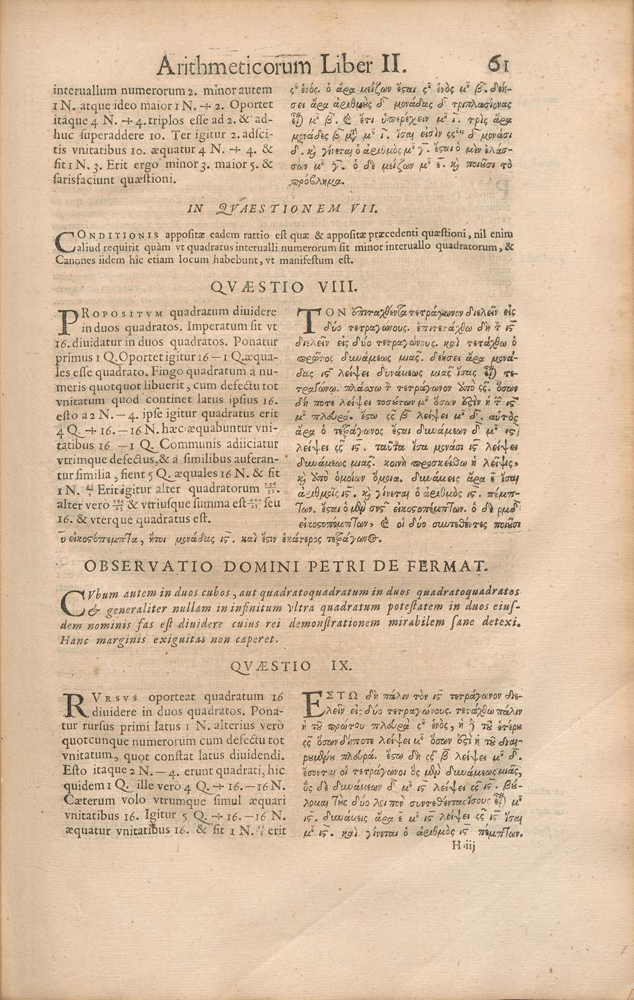
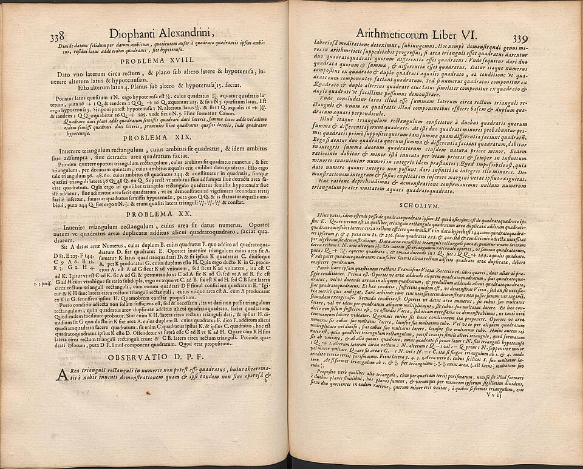

**[Pierre de Fermat](kloom:e/pierre-de-fermat)** was a lawyer. From 1631 until his death he was a
councillor of the Parlement of **[Toulouse](kloom:e/toulouse)**, one of the high courts of
France, and he did his mathematics in the evenings and in letters. He
published almost none of it. He sent results to friends in Paris, often as
challenges, and seldom with a proof. Some time in the 1630s he was working
through his copy of [Bachet](kloom:e/claude-gaspar-bachet-de-meziriac)'s edition of **[Diophantus](kloom:e/diophantus)**, and beside the
problem of dividing a square into two squares he wrote a note in Latin:

> On the other hand it is impossible to separate a cube into two cubes, or
> a biquadrate into two biquadrates, or generally any power except a
> square into two powers with the same exponent. I have discovered a truly
> marvellous proof of this, which however the margin is not large enough
> to contain.

That is Thomas Heath's translation of 1910. In modern terms: _x_ⁿ + _y_ⁿ =
_z_ⁿ has no solution in whole numbers when _n_ is greater than 2. The
claim became known as **[Fermat's Last Theorem](kloom:e/fermats-last-theorem)**, the last of his assertions
left unproved. For _n_ = 2 there are endless solutions, 3² + 4² = 5² among
them; the frame on Diophantus's _Arithmetica_ shows how Diophantus found
them, and how Bachet's edition reached Fermat.

## Found by his son

Nobody saw the note while Fermat lived. He died at Castres in January
1665, and his son **Clément-Samuel** collected his papers. In 1670 Samuel
reprinted Bachet's Diophantus at Toulouse with his father's marginal notes
set into the text, each headed _Observatio Domini Petri de Fermat_. The
copy Fermat wrote in is lost, so the printed page is all we have. Heath
judged the edition careless as a text of Diophantus and valuable only for
Fermat's additions.

When he wrote the note is not known either. Wikipedia gives "around 1637";
the MacTutor history, by John O'Connor and Edmund Robertson, says "almost
certainly" around 1630, when Fermat first studied the book. Both are
guesses from the book's date and his letters. He was not the first to
complain in that margin. Beside the same problem the Byzantine scholar
John Chortasmenos, around 1400, had written "Thy soul, Diophantus, be with
Satan because of the difficulty of your other theorems."

Did he have a proof? Almost certainly not of the general case. In the
thirty years he had left, he never mentioned it again. He did set the cases
of cubes and fourth powers to correspondents as challenges, which he would
not have done had he thought the whole claim proved, and in a letter of
1659 he said he could prove the case of cubes by his own method. The
proofs that finally came, three and a half centuries later, used
mathematics that did not exist in his time.

## The proof he did leave

One proof of Fermat's survives in any detail, and it is in the same book.
Beside the twentieth of the problems on right triangles that Bachet had
added to Book VI, he wrote that "the area of a right-angled triangle the
sides of which are rational numbers cannot be a square number", a
discovery made "not without much labour and hard thinking". He then
sketched why.

The method is his [_infinite descent_](kloom:e/proof-by-infinite-descent), the name he gave it himself. Suppose a right triangle with whole
sides _u_, _v_, _w_ had an area _uv_/2 equal to a square _s_². Adding and
subtracting 4 × area from _u_² + _v_² = _w_² gives

(_u_ + _v_)² = _w_² + 4_s_² and (_u_ − _v_)² = _w_² − 4_s_²,

and multiplying the two, (_u_² − _v_²)² = _w_⁴ − 16_s_⁴. So there would be
two fourth powers whose difference is a square. Fermat shows, by factoring
and by the rule that builds every right triangle from two numbers, that
such fourth powers would give a new right triangle with a square area,
made of smaller numbers. That one gives a smaller one again, and so on.
But whole numbers cannot get smaller for ever: below any of them there are
only finitely many. So there was no first triangle. The plate draws the
argument as a staircase of shrinking triangles that must hit the floor.

The claim is easy to test and impossible to exhaust. Here are the first
few right triangles in lowest terms:

| Sides      | Area | Nearest squares |
| ---------- | ---: | --------------- |
| 3, 4, 5    |    6 | 4 and 9         |
| 5, 12, 13  |   30 | 25 and 36       |
| 8, 15, 17  |   60 | 49 and 64       |
| 7, 24, 25  |   84 | 81 and 100      |
| 20, 21, 29 |  210 | 196 and 225     |

The theorem settles Fermat's claim for fourth powers at once. If _a_⁴ +
_b_⁴ = _c_⁴, then _c_⁴ − _b_⁴ = (_a_²)², a difference of fourth powers
equal to a square, which the descent forbids. And every _n_ greater than 2 is divisible
either by 4 or by an odd prime _p_, so that a solution for _n_ would give
one in fourth powers or in _p_-th powers: after Fermat, the claim needed
proving only for odd prime exponents. **[Fibonacci](kloom:e/fibonacci)** had stated a result
equivalent to the triangle theorem in 1225, without a satisfactory proof;
Fermat's is the first proof we have.

The note ends, in the printed Latin, with a familiar excuse: the margin is
too small to set the proof out in full. For the odd primes, the first
advance came from Euler, a century later, with the cubes.
