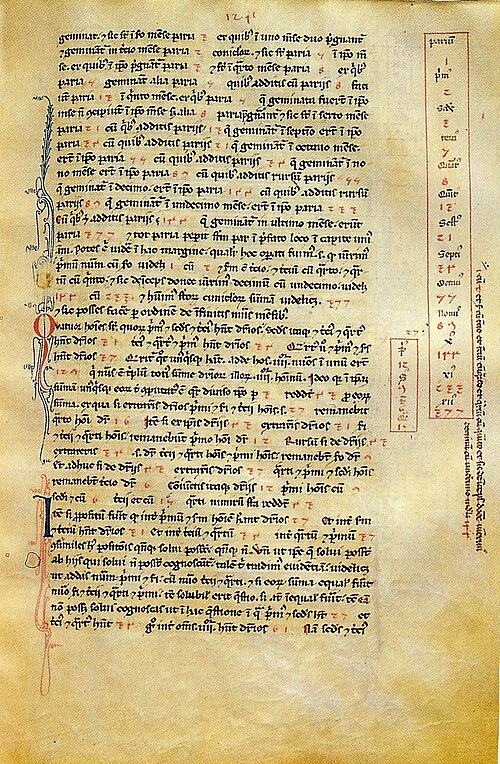

**[Leonardo of Pisa](kloom:e/fibonacci)**, the son of Bonacci, learned his arithmetic in North
Africa. In the prologue to his book he tells how it happened. His father,
a Pisan, was the public scribe at the customs house of **[Bugia](kloom:e/bejaia)**, the
modern Béjaïa in Algeria, for the merchants of **[Pisa](kloom:e/pisa)** who traded there,
and sent for his son as a boy to spend some days learning to reckon. There,
Leonardo writes (in our translation of his Latin), he was introduced "to
the art by the nine figures of the Indians", and liked it so much that he
went on to study it wherever his trading took him, in Egypt, Syria,
Greece, Sicily and Provence. All the other ways of reckoning he met there,
even the one called algorism, he came to count "almost an error" beside
"the method of the Indians".

The book he finished in Pisa in 1202 is the **[_Liber Abaci_](kloom:e/liber-abaci)**, the "book
of calculation"; no copy of that first text survives, and it is read in a
version of 1228. Its first chapter opens with
the numerals themselves: "The nine figures of the Indians are these: 9 8 7
6 5 4 3 2 1. With these nine figures, and with this sign 0, which in
Arabic is called _zephirum_, any number whatever is written." The Arabic
_ṣifr_, "empty", itself a translation of the Sanskrit _śūnya_, became the
Latin _zephirum_, and in time the Italian _zero_.

He was not called Fibonacci in his lifetime. The name, short for _filius
Bonacci_, is first found in a book of 1838. The city of Pisa, in 1240,
granted "Leonardo Bigollo" a salary for his services to it on accounts
and on teaching its citizens.

## Figures for merchants

Most of the _Liber Abaci_ is about trade: prices and barter, partnerships,
the alloying of coins, the exchange of currencies, all worked in the
**[Hindu–Arabic numerals](kloom:e/hindu-arabic-numeral-system)** on the page. That is the book's real change.
Europe had known the nine figures since the tenth century, but mostly as
marks on counters, and did its sums on a counting board and wrote the
results in Roman numerals. Leonardo's arithmetic needs no board: the
working is written down, and can be checked afterwards.

His readers were the Italian merchants. By the fifteenth century the
cities of northern and central Italy had "abacus schools", where children
of eleven to thirteen learned this arithmetic, and **[Florence](kloom:e/florence)**, the
banking capital, had more than seventy abacus masters in over twenty
schools. The
historian **Raffaele Danna** points out that the name misleads: the
schools' own manuals are written in Hindu–Arabic numerals and never show
a counting board. The earliest of them, from about 1290, begins by naming
"master Leonardo" of Pisa as its authority.

There was resistance, and it is often exaggerated. In 1299 the Florentine
guild of money-changers, the _Arte del Cambio_, told its members to write
sums in their account books "openly and in full by way of letters", not
in the manner of the abacus. It is often said that the new figures were
banned because a 0 is easily made into a 6; the historian **Philipp
Nothaft** has shown that no reason is given in the statute, and that
this was a guild's rule for its ledgers, not a ban. The story of two
warring camps, "abacists" against "algorists", which some histories still
tell, he traces to a German scholar's reading of the sources in 1905.

## A pair of rabbits

Among the puzzles of the book's twelfth chapter is this one. A man puts a
pair of rabbits in a walled place. Each pair bears a new pair every month,
starting in its second month. How many pairs are there after a year?
Leonardo works it month by month: 2, then 3, then 5, 8, 13, 21, 34, 55,
89, 144, 233, and at the year's end 377. His rule, as he explains it
beside the margin table in the manuscript, is to add each number to the
one before it. The same chapter has the old riddle of seven old women on
the road to Rome, each with seven mules, each mule carrying seven sacks.

The numbers are older than Leonardo. Indian scholars of poetry, counting
the rhythms that can be built from short syllables of one beat and long
ones of two, had found them centuries before: the prosodist **Virahanka**
set out the rule clearly around 700. The name **[Fibonacci sequence](kloom:e/fibonacci-sequence)** was
given in the nineteenth century, by the French mathematician Édouard
Lucas.

Divide each number by the one before it, and the ratios settle down:

| Ratio | 2/1 | 3/2 |   5/3 | 8/5 |  13/8 | 21/13 | 34/21 |  55/34 |  89/55 |
| ----- | --: | --: | ----: | --: | ----: | ----: | ----: | -----: | -----: |
| Value |   2 | 1.5 | 1.667 | 1.6 | 1.625 | 1.615 | 1.619 | 1.6176 | 1.6182 |

Why they settle where they do takes one line. If the ratio of each number
to the one before tends to some _r_, then dividing the rule
_F_ₙ₊₁ = _F_ₙ + _F_ₙ₋₁ by _F_ₙ gives _r_ = 1 + 1/_r_, so _r_² = _r_ + 1,
and _r_ = (1 + √5)/2 = 1.6180…, the **[golden ratio](kloom:e/golden-ratio)** of Euclid's
extreme and mean ratio. The plate draws both: squares on the numbers,
each fitting beside the last to make a rectangle ever nearer the golden
shape, and the ratios closing on it. Leonardo said nothing of this; Kepler
noticed it four centuries later.

Europe had its numerals now, and a merchant's algebra. Two centuries
later, in Kerala, on India's south-west coast, astronomers would sum
series that never end.
