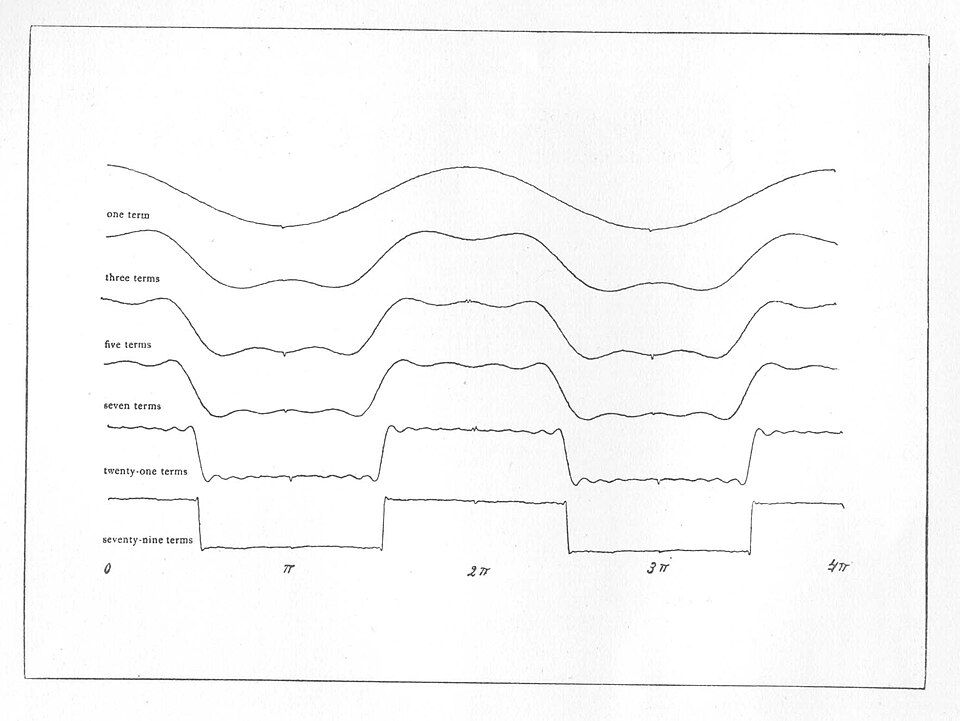

**[Joseph Fourier](kloom:e/joseph-fourier)** had gone to Egypt with Napoleon's army in 1798, and in 1801 Napoleon made
him prefect of the Isère, governing from Grenoble. There he began to study
how heat spreads through a solid, and on 21 December 1807 his memoir on it
was read to the Institute in Paris. Its central claim was astonishing. Any
function at all, even one "discontinuous and entirely arbitrary", could be
written as a sum of sines and cosines: waves of one frequency and its
multiples, each with its own size.

The committee that judged the memoir included **[Joseph-Louis Lagrange](kloom:e/joseph-louis-lagrange)**,
Laplace and Monge. Lagrange and Laplace objected in 1808 to exactly that
claim, and Fourier's patient answers did not move them. The Institute made
heat the subject of its prize for 1811; Fourier entered, and won, but the
report said his analysis "still leaves something to be desired on the score
of generality and even rigour". The whole work was not printed until 1822,
as the _Théorie analytique de la chaleur_. "Profound study of nature,"
its preface says, "is the most fertile source of mathematical
discoveries."

## A square wave from waves

The book gives its own example. In article 177 Fourier finds that

π/4 = cos _x_ − ⅓ cos 3*x* + ⅕ cos 5*x* − ⅐ cos 7*x* + …

for every _x_ between −π/2 and π/2, and that beyond them the sum is −π/4.
The curve the series draws is, in his words, "composed of separated
straight lines" joined by perpendiculars: a square wave, made of smooth
waves that never stop. The plate draws the first three waves apart, then
their sum, and the sum of eleven.

Set _x_ = 0 and every cosine is 1, so the series becomes
1 − ⅓ + ⅕ − ⅐ + …, which must equal π/4. Fourier warned that the sums
come in slowly, and they do, by our arithmetic:

| Terms | Sum at _x_ = 0 |
| ----: | -------------: |
|     1 |         1.0000 |
|     2 |         0.6667 |
|     3 |         0.8667 |
|     4 |         0.7238 |
|     5 |         0.8349 |
|   π/4 |         0.7854 |

At _x_ = π/2, where the wave jumps, every term is zero, and the series
lands half way between the two levels. In 1829 **[Peter Gustav Lejeune
Dirichlet](kloom:e/peter-gustav-lejeune-dirichlet)** gave the first proof of when such a series really converges:
for a function with finitely many jumps and turns it does, and at a jump
it settles on the midpoint. The rigour Fourier's judges wanted arrived
seven years after his book.

## The overshoot

Look again at the eleven-term sum in the plate. Beside each jump it
overshoots, by about 9 per cent of the jump. Adding terms squeezes the
overshoot closer to the jump but never shrinks it. Henry Wilbraham
described this in 1848, and was ignored.

In 1898 **[Albert A. Michelson](kloom:e/albert-a-michelson)** and Samuel Stratton built a harmonic
analyser, a machine that added waves together and drew their sum. A story often told says that its square waves wobbled
at the corners and Michelson blamed the machine. Their paper's figures
hardly show the wobble, and the paper does not mention it.

Correspondence in _Nature_ about the machine drew in **[Josiah Willard
Gibbs](kloom:e/josiah-willard-gibbs)**, who wrote a note on the question in 1898, described the limit
wrongly, and corrected himself in April 1899. Maxime Bôcher named the
effect after him in 1906. The **Gibbs phenomenon** is still there
whenever a sharp edge is cut down to a few waves: it rings beside edges in
filtered signals, and in scans of the spine it can mimic a disease.

## Fast

Computers work with samples, not curves. The Fourier transform of _N_
samples, done directly, takes about *N*² operations. In 1965 James Cooley
of IBM and **John Tukey** of Princeton and Bell Labs published an
algorithm that needs "less than 2*N* log₂ _N_". Tukey reportedly had the
idea at a meeting of President Kennedy's science advisers on detecting
Soviet nuclear tests from seismometers outside the country; Richard Garwin
of IBM passed it to Cooley. Their program for the IBM 7094 transformed
8,192 points in 0.13 minutes. It later emerged that **[Carl Friedrich
Gauss](kloom:e/carl-friedrich-gauss)** had used the same method in 1805, in unpublished work on the
orbits of the asteroids Pallas and Juno. The chart is our own arithmetic
from the paper's bound.

| Samples, _N_ | Direct, *N*² | Fast, 2*N* log₂ _N_ |
| -----------: | -----------: | ------------------: |
|        1,024 |    1,048,576 |              20,480 |
|        8,192 |   67,108,864 |             212,992 |
|    1,048,576 |   1.1 × 10¹² |          41,943,040 |

The **[fast Fourier transform](kloom:e/fast-fourier-transform)** is one of the most used algorithms there
is. A JPEG picture is stored as the weights of cosine waves over small
blocks of it, a scheme built in 1992 on Nasir Ahmed's discrete cosine
transform; an MRI scanner records the Fourier transform of a slice of the
body and computes the picture back from it. And in 1925 **[Werner
Heisenberg](kloom:e/werner-heisenberg)** began quantum mechanics from a Fourier series: the series for
an electron's orbit, whose terms he kept only for the frequencies an atom
actually gives out, labelling each by the two states of a jump. Those
terms became matrices.

Fourier had said that any function could be written his way. Saying which
functions, and what a limit of infinitely many waves even is, took the rest
of the century.
