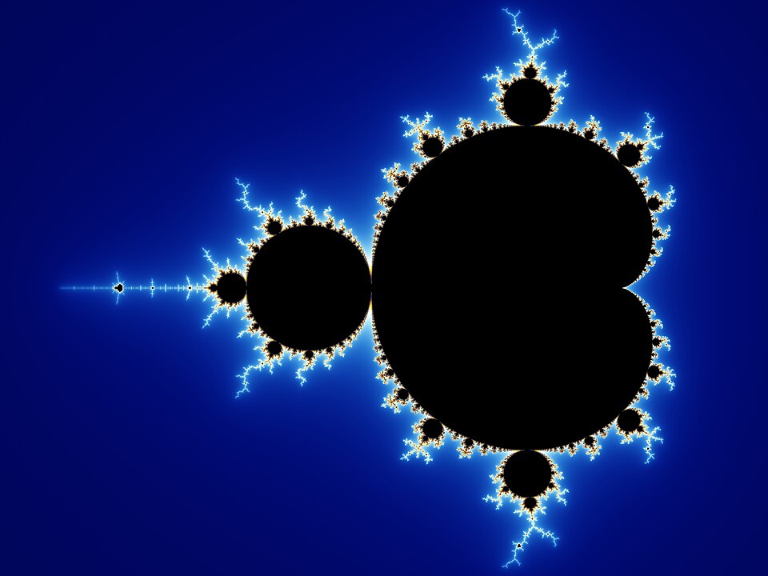

In 1967 **[Benoit Mandelbrot](kloom:e/benoit-mandelbrot)**, a mathematician on the research staff of **[IBM](kloom:e/ibm)** in Yorktown Heights, New York, published a three-page paper in _Science_ with a question for a title: "How long is the coast of Britain?" His answer was that the question has no answer. Measure a coastline with a shorter ruler and it comes out longer, without limit, because every bay has smaller bays in it. What a coast does have, he argued, is a number that says how rough it is, and that number is a dimension between 1 and 2. Eight years later he named the shapes that behave this way _fractals_, from the Latin _fractus_, broken.

## Monsters

The shapes were older than the name. In 1872 Karl Weierstrass showed the Berlin Academy a function whose graph is continuous everywhere and has a tangent nowhere. In 1883 **[Georg Cantor](kloom:e/georg-cantor)** described a set now named for him (Henry Smith had found it in 1874): remove the middle third of a line, then the middle third of each piece that is left, and go on for ever. What remains has no length at all, yet as many points as the line. Such things were called monsters.

In 1904 the Swedish mathematician **[Helge von Koch](kloom:e/helge-von-koch)** offered a monster that anyone could draw. Take a segment, cut it in thirds, and raise an equilateral triangle on the middle third; then do the same to each of the four new segments, and so on. The plate draws the first stages, and the fourth in full. The limit is a curve without a tangent at any point, as he meant it to be.

Here is the mathematics. At each step every segment becomes four segments a third as long, so the length is multiplied by 4/3:

| Step _n_ | Segments, 4ⁿ | Each one | Total length, (4/3)ⁿ |
| -------: | -----------: | -------: | -------------------: |
|        0 |            1 |        1 |                    1 |
|        1 |            4 |      1/3 |                1.333 |
|        2 |           16 |      1/9 |                1.778 |
|        3 |           64 |     1/27 |                2.370 |
|        4 |          256 |     1/81 |                3.160 |
|       10 |    1,048,576 |  1/59049 |                17.76 |

The length grows without bound, while the curve never leaves a small triangle drawn on its base. Now ask how the curve's copies of itself scale. A line cut into 3 pieces a third as long gives 3 = 3¹ copies; a square cut the same way gives 9 = 3² copies; the exponent is the dimension. The Koch curve gives 4 copies at a third the size, so its dimension _D_ solves 3ᴰ = 4: _D_ = log 4 / log 3 ≈ 1.26. By the same reckoning, Cantor's set has dimension log 2 / log 3 ≈ 0.63. **[Felix Hausdorff](kloom:e/felix-hausdorff)** gave a definition of dimension that allows such fractions in 1918, and it was printed the next year. The numbers in the table and these two dimensions are our own arithmetic.

The famous snowflake, three Koch curves around a triangle, is credited to Koch, even on Swedish stamps of 2000, but it is not in his papers. The historian Yann Demichel went looking in 2024 and found the name, and probably the shape, with Edward Kasner of Columbia University, whose popular book with James Newman, _Mathematics and Imagination_ (1940), made it widely known. Kasner's student Jesse Douglas remembered one pinned on Kasner's noticeboard, drawn as a polygon of 3,072 sides: the fifth stage, 3 × 4⁵.

## Rulers and coasts

Mandelbrot's evidence came from **[Lewis Fry Richardson](kloom:e/lewis-fry-richardson)**, an English meteorologist who around 1950 was studying whether the length of the border two countries share has to do with their going to war. Neighbours did not even agree: by Wikipedia's account Portugal put its border with Spain at 987 kilometres and Spain at 1,214. Richardson measured maps with dividers set to shorter and shorter steps, and found that the length _L_ grew with the step _G_ as _L_ = _F_ × _G_¹⁻ᴰ, with a different _D_ for every border. His paper appeared in 1961, after his death, and attracted no attention until Mandelbrot read it as a measurement of dimension:

| Frontier (Richardson's data)  |  _D_ |
| ----------------------------- | ---: |
| Coast of South Africa         | 1.02 |
| Coast of Australia            | 1.13 |
| Land frontier, Spain–Portugal | 1.14 |
| Land frontier of Germany      | 1.15 |
| West coast of Britain         | 1.25 |

In notes added decades later, Mandelbrot called the paper a Trojan horse: in his telling, no one had a stake in coastlines, so a fractional dimension could win readers there first.

## The set

The other road ran through iteration. In 1917 and 1918 **[Gaston Julia](kloom:e/gaston-julia)** and Pierre Fatou, working separately, studied what happens when a function of a complex number, such as _z_² + _c_, is applied again and again, and found boundaries of great complication that could then be drawn only crudely, by hand. Julia later taught Mandelbrot at the École Polytechnique. Mandelbrot came back to the question with IBM's computers, and in 1980 published pictures of the set of numbers _c_ for which the iteration of _z_² + _c_ starting from 0 stays bounded. Adrien Douady and John Hubbard, who proved much of what is known about it, named it the **[Mandelbrot set](kloom:e/mandelbrot-set)**.

When he first saw it is told two ways. Wikipedia's article on the set gives 1 March 1980, at IBM; its article on Mandelbrot says he began plotting it in late 1979, as a visiting professor at Harvard. And he was not the first. At a 1978 conference at Stony Brook, Robert Brooks and Peter Matelski had printed a computer drawing of the region where _z_² + _c_ has a stable cycle, the heart of the same set, in a paper on another subject; it was published in the proceedings in 1981.

Mandelbrot's _The Fractal Geometry of Nature_ (1982) made the idea popular, and its pictures made it famous. The spine now leaves shape for chance: a game of dice broken off before its end, and the letters Pascal and Fermat wrote about how to share the stakes.
