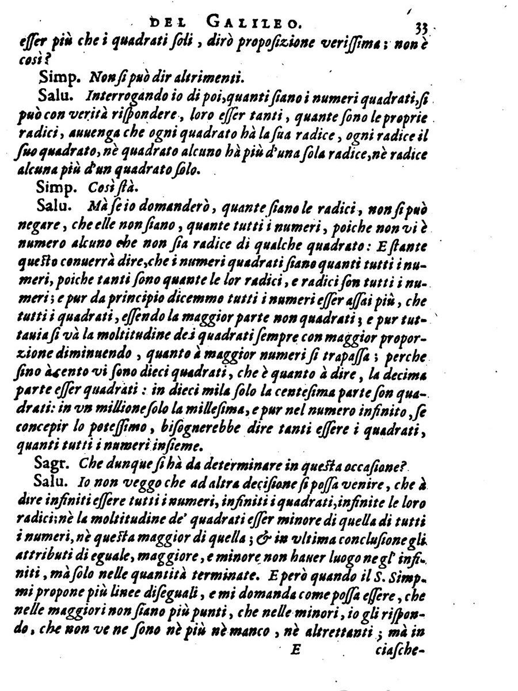

In 1638, under house arrest at Arcetri, outside Florence, **[Galileo](kloom:e/galileo-galilei)** saw his last book printed by the Elzevirs at Leiden, beyond the reach of the Inquisition. [_Two New Sciences_](kloom:e/two-new-sciences) is remembered for its third and fourth days, on falling bodies and projectiles. But on its first day, while the three speakers argue about what holds a solid together, they stray into the infinite, and Galileo's spokesman Salviati sets out an argument about whole numbers that nobody had better answered for two hundred and forty years.

## Lines made of points

The argument starts from a question about matter. Salviati has been suggesting that a line, like a solid, might be built out of infinitely many indivisible parts, points with no size. The Aristotelian Simplicio objects. A long line and a short one both contain infinitely many points, yet the long one must contain more, and so "within one and the same class, we may have something greater than infinity", which "is quite beyond my comprehension". Salviati answers that this is what happens when "we attempt, with our finite minds, to discuss the infinite, assigning to it those properties which we give to the finite and limited". To prove it he turns from lines to numbers. (The translation here is Henry Crew and Alfonso de Salvio's, of 1914.)

## The squares

Some whole numbers are squares, 1, 4, 9, 16, and most are not, so all the numbers together must be more than the squares alone. Simplicio agrees: "Most certainly." But every square has its own root, every root its own square, and every number is the root of some square. Pair each number with its square, and neither side runs out:

| Number | 1   | 2   | 3   | 4   | 5   | 6   | 7   | …   | _n_  |
| ------ | --- | --- | --- | --- | --- | --- | --- | --- | ---- |
| Square | 1   | 4   | 9   | 16  | 25  | 36  | 49  | …   | _n_² |

So there are as many squares as numbers. Yet the squares thin out as the numbers grow, and Salviati counts them: up to 100 there are 10 squares, a tenth of the numbers; up to 10,000, a hundredth; up to a million, a thousandth.

| Numbers up to | Squares among them | Share of the numbers |
| ------------: | -----------------: | -------------------: |
|           100 |                 10 |                 1/10 |
|        10,000 |                100 |                1/100 |
|     1,000,000 |              1,000 |              1/1,000 |

The plate draws the pairing: the numbers from one to ten set out evenly above, and a line from each to its square on a number line below, where the squares spread ever further apart. Both descriptions are true. Salviati's conclusion is that the words are at fault: "the attributes 'equal,' 'greater,' and 'less,' are not applicable to infinite, but only to finite, quantities."

The page of the 1638 edition holds the heart of it, ending in the conclusion that "equal, greater and less" have no place "negl' infiniti", among the infinite. Galileo pushes further than most readers remember: a few pages on, Salviati argues that if any number could be called infinite, it would be one, which is at once a square, a cube and every other power.

**[Galileo's paradox](kloom:e/galileos-paradox)** was not new with Galileo. Around 1302 the philosopher John Duns Scotus had compared the even numbers with all the numbers in the same way. But Galileo's was the version later mathematicians read.

## The same infinite, falling

The infinite came back to the book two days later. In the third day, Sagredo is troubled that a stone falling from rest must pass through every degree of speed, however small, and Simplicio puts the objection as Zeno would have: "if the number of degrees of greater and greater slowness is limitless, they will never be all exhausted". Salviati's answer is Aristotle's to Zeno, applied to speed. The stone does not stay at any degree for any length of time, "but merely passes each point without delaying more than an instant", and since any interval of time "may be divided into an infinite number of instants", there are enough instants for all the degrees.

## A paradox becomes a definition

**[Bernard Bolzano](kloom:e/bernard-bolzano)**, a Prague priest dismissed from his university chair in 1819 for his views, took the question up again in his _Paradoxes of the Infinite_, which his pupil and friend František Příhonský published in 1851, three years after his death. Bolzano gave two examples of pairing that Galileo did not: the quantities between 0 and 5 pair off with those between 0 and 12 by the rule 5_y_ = 12_x_, and the points of a short segment with those of a long one. But he drew Galileo's lesson more firmly still. That two infinite collections pair off, he wrote, is not enough to conclude that they are equal in multitude, when one is plainly a part of the other.

In 1878 **[Georg Cantor](kloom:e/georg-cantor)** did the opposite, and made pairing the definition of equal size, as the frame on Cantor's infinities tells. Ten years later **[Richard Dedekind](kloom:e/richard-dedekind)** turned Galileo's paradox inside out. In _Was sind und was sollen die Zahlen?_ (1888) he defined an infinite set as one that can be paired with a part of itself, as the numbers pair with their squares. What Galileo took as proof that "greater" means nothing among infinite quantities became the mark that a quantity is infinite.

With a sense of "as many" that worked, a harder question was waiting: whether a sense of "as much", of length, area and volume, could be made to work for every collection of points. The answer came in 1924, and it was no.
