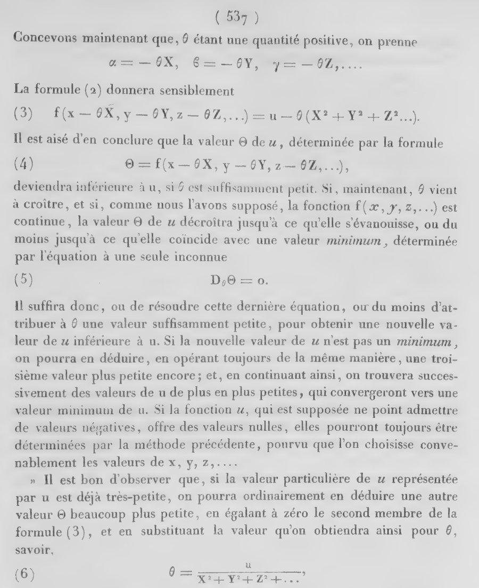

On 18 October 1847 the _Comptes rendus_ of the Paris Academy of Sciences
printed a note of less than three pages by **[Augustin-Louis Cauchy](kloom:e/augustin-louis-cauchy)**, who
that year was sending the Academy a paper almost every week. It proposed a method so simple that it
barely looked like mathematics: if you want the lowest point of a
landscape, feel which way the ground slopes and take a step downhill. The
method is now called **[gradient descent](kloom:e/gradient-descent)**, and the large neural networks of today
are trained by its descendants.

## Where the slope is zero

The older way to find a best value was to look for the place where the
slope vanishes. Around 1636 **[Pierre de Fermat](kloom:e/pierre-de-fermat)** circulated a treatise on
maxima and minima. One of his examples divides a length _b_ into two parts
whose product _x_(_b_ − _x_) is as large as possible. Replace _x_ by
_x_ + _e_, compare the two products as if they were equal, cancel, divide
by _e_ and then let _e_ vanish: what is left is _b_ − 2_x_ = 0, so the best
cut is at the middle. At a maximum or a minimum the
derivative is zero.

In his _Mécanique analytique_ of 1788, **[Joseph-Louis Lagrange](kloom:e/joseph-louis-lagrange)** extended
the rule to a best value found under a constraint: add each constraint to
the function with an unknown multiplier, and set every derivative of the
sum to zero.

Both rules end in equations to be solved, and equations in many
unknowns often cannot be.

## Cauchy's note

That was Cauchy's starting point. To find the orbit of a planet or a comet
from observations, he wanted to solve for its six orbital elements
directly, from equations that elimination could not reduce. So he turned
the problem around. Take a function _u_ of the unknowns _x_, _y_, _z_ that
is never negative and vanishes at the answer, and then, in his words, "it
will suffice to make the function _u_ decrease indefinitely, until it
vanishes."

Let _X_, _Y_, _Z_ be the derivatives of _u_ at the point you are at, and
move each unknown against its own derivative, by the same small multiple
θ: to _x_ − θ_X_, _y_ − θ_Y_, _z_ − θ_Z_. To first order _u_ falls by
θ(_X_² + _Y_² + _Z_²), which is positive unless you are already at the
bottom. Repeat, and the values fall "smaller and smaller". For several
equations at once, _u_ = 0, _v_ = 0, _w_ = 0, he minimized
_u_² + _v_² + _w_², the sum of squares that Legendre and Gauss had argued
over forty years before, a quarrel the frame on the normal distribution
tells.

Cauchy promised a fuller memoir, and it never appeared. The optimizer
Claude Lemaréchal, in 2012, bet that Cauchy had
underestimated the problem: his hope that the method always finds a zero
is false, since a sum of squares can have false valleys, and the choice of
a "small enough" θ is delicate. Jacques Hadamard proposed a similar method
in 1907; Haskell Curry first studied when it converges, in 1944.

## A step too far

A small example of our own shows why θ matters. Take the bowl _f_(_x_, _y_) = _x_² + 4_y_², four times steeper across
than along, and start at (4, 1), where *f* = 20. The gradient is
(2_x_, 8_y_), so a step multiplies _x_ by 1 − 2θ and _y_ by 1 − 8θ.

| Steps | θ = 0.05 (too small) | θ = 0.2 | θ = 0.3 (too large) |
| ----: | -------------------: | ------: | ------------------: |
|     0 |                   20 |      20 |                  20 |
|     1 |                 14.4 |     7.2 |                10.4 |
|     2 |                 11.0 |    2.59 |                15.8 |
|     3 |                 8.69 |   0.933 |                30.2 |
|     5 |                 5.60 |   0.121 |                 116 |
|    10 |                 1.95 |   0.001 |               3,347 |

With θ = 0.3, 1 − 8θ is −1.4: each step jumps the steep valley and
lands higher than it started. The plate draws both walks over the bowl's contour lines. Any
θ above ¼ fails this way, and one too small crawls. The best fixed step,
0.2, shrinks both directions by the same factor, 0.6, each time.

## From 1847 to a trillion parameters

In 1951 **[Herbert Robbins](kloom:e/herbert-robbins)** and Sutton Monro at the University of North
Carolina asked how to find where an unknown function reaches a target
when every measurement is noisy, as when each trial of a dose says only
whether a subject responded. Their answer steps
against each noisy reading with steps shrinking like 1/_n_, and it
converges all the same. This _stochastic approximation_ is the ancestor of
stochastic gradient descent, which steps on the gradient of one example,
or a small batch, at a time.

**[Bernard Widrow](kloom:e/bernard-widrow)** and Ted Hoff's learning rule of 1960 was exactly that.
Widrow later described their error surface as a bowl and training as
descending it to "the bottom of the bowl", the shape the plate draws. In
1986 **[backpropagation](kloom:e/backpropagation)** supplied the missing part for networks of many
layers: "To minimize _E_ by gradient descent", its authors wrote, it is
necessary to compute the derivative of the error with respect to every
weight, and their backward pass does that in one sweep.

The optimizers now in use change the step, not the idea. Adam (2014) keeps
running averages of the gradients and scales each parameter's step.
Moonshot AI's Kimi K2, a model with a trillion parameters, was trained in
2025 with an optimizer called MuonClip, whose every step begins from the
gradient. The reason a method from 1847 still wins is cost.
Backpropagation delivers the whole gradient in one backward sweep through
the network. Newton's method,
which Cauchy suggested for the final approach, needs the second
derivatives, and for a trillion parameters, by our arithmetic, that table
would have 10²⁴ entries.

A descent shrinks its errors at every step, whenever θ is small enough. The
next frame is about equations that do the opposite.
