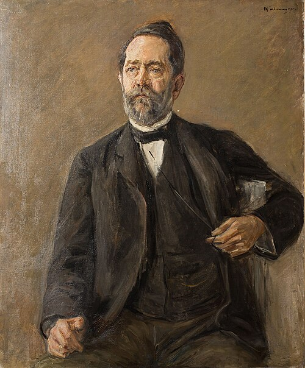

For **[Évariste Galois](kloom:e/evariste-galois)** a group was a set of shuffles of the roots of an
equation, closed in one way: do one shuffle and then another, and the
result is again in the set. Over the next forty years mathematicians found
the same pattern in the turns of a crystal, the moves of a solid body and
the arithmetic of remainders, and asked what it was in itself. The answer
made _group_ one of the few words that every branch of mathematics shares,
and in the twentieth century physics took it up as the grammar of its laws.

## Cayley's table

In 1854 **[Arthur Cayley](kloom:e/arthur-cayley)**, then a conveyancing lawyer at Lincoln's Inn who
did his mathematics in his spare time, published "On the theory of groups,
as depending on the symbolic equation θⁿ = 1" in the _Philosophical
Magazine_. He began not with roots but with any "symbol of operation", on
any operand, and called a set of such symbols a group if the product of any
two of them belonged to the set. What the symbols act on no longer matters,
only how they combine, and all of that fits in a table. Cayley observed
that in the table "each line as each column" contains every symbol once. A
footnote gave Galois the credit: the idea of a group of substitutions, he
wrote, "may be considered as marking an epoch".

The symmetries of an equilateral triangle make his table easy to see. Call
leaving it alone _e_; turning it a third of the way round anticlockwise
_r_, and two thirds _r_²; and flipping it over the mirror line through
corner 1, 2 or 3 _a_, _b_ or _c_. The plate draws the triangle, its three
mirrors and its turn. Doing one move and then another is always one of the
six:

| Then ↓, first → | _e_  | _r_  | _r_² | _a_  | _b_  | _c_  |
| --------------- | ---- | ---- | ---- | ---- | ---- | ---- |
| _e_             | _e_  | _r_  | _r_² | _a_  | _b_  | _c_  |
| _r_             | _r_  | _r_² | _e_  | _c_  | _a_  | _b_  |
| _r_²            | _r_² | _e_  | _r_  | _b_  | _c_  | _a_  |
| _a_             | _a_  | _b_  | _c_  | _e_  | _r_  | _r_² |
| _b_             | _b_  | _c_  | _a_  | _r_² | _e_  | _r_  |
| _c_             | _c_  | _a_  | _b_  | _r_  | _r_² | _e_  |

Every row and every column holds each move exactly once, as Cayley said
they must. Each move can be undone (a flip by itself, a turn by the other
turn). And order matters: flip over _a_ and then turn, and you get _c_;
turn and then flip, and you get _b_. The table was worked out for this
frame, with corners numbered anticlockwise, and a reader can check any
square of it with a paper triangle. Cayley showed in the same paper that
there are only two groups of six members, this one and the six turns of a
hexagon, and the group of the equation _x_³ − 2, whose three roots sit at
the corners of an equilateral triangle in the complex plane, is this one.

## A geometry is a group

**[Felix Klein](kloom:e/felix-klein)** was 23 when he joined the faculty at Erlangen in 1872, and
the program he printed for the occasion put groups at the center of
geometry. The century had produced too many geometries: Euclid's,
projective geometry, the new non-Euclidean ones. Klein proposed that each
is fixed by a group of transformations, and is the study of what that
group leaves unchanged. "Given a manifoldness and a group of
transformations of the same," he wrote, in the English of 1893, the task
is to investigate its figures "with regard to such properties as are not
altered by the transformations of the group." Euclid's geometry keeps
lengths and angles under turns, slides and reflections; projective
geometry allows more transformations and keeps less, not lengths or
angles but which points lie on which lines. The pamphlet, Klein wrote
later, had "but a limited circulation at first"; the **[Erlangen program](kloom:e/erlangen-program)**,
as it came to be called, is still how geometries are told apart.

Klein's closest ally was the Norwegian **[Sophus Lie](kloom:e/sophus-lie)**, whom he met in
Berlin in 1869. (In 1870, when war broke out between France and Prussia,
Lie was arrested at Fontainebleau as a German spy, and freed after a month
through the French mathematician Gaston Darboux.) Lie's groups were
continuous: not six moves of a triangle but every turn of a circle through
any angle at all. He meant them to do for differential equations what
Galois's groups had done for algebraic ones, and set them out with
Friedrich Engel in the three volumes of _Theorie der
Transformationsgruppen_ (1888–93). They are now called Lie groups.

## The groups of physics

The turns of a circle form the group U(1). The group SU(_n_) is made of
_n_ × _n_ tables of complex numbers, matrices of a special kind, that turn
an _n_-dimensional complex space without stretching it. In 1961 **[Murray
Gell-Mann](kloom:e/murray-gell-mann)**, and independently Yuval Ne'eman, sorted the particles called
hadrons into families of eight and ten by the symmetry of SU(3), the
**[Eightfold Way](kloom:e/eightfold-way-physics)**, and predicted a missing member that was found in 1964.
The **[Standard Model](kloom:e/standard-model)** of particle physics, completed in the 1970s, is
defined by its symmetry group, SU(3) × SU(2) × U(1): SU(3) for the strong
force, acting on the three "colours" of a quark (not Gell-Mann's SU(3) of flavors, but the same group put to another use), and SU(2) × U(1) for the weak and electromagnetic forces.

Why a symmetry of the laws should matter so much to physics was answered
in 1918 by Emmy Noether, whose theorem ties each continuous symmetry to a
quantity that is conserved; her frame tells it. The groups of physics are
groups of matrices, and matrices, too, were given their algebra by Cayley.
