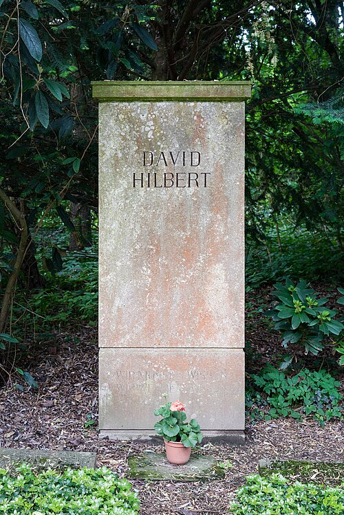

On 8 August 1900, at the Sorbonne in Paris, a thirty-eight-year-old professor from the **[University of Göttingen](kloom:e/university-of-gottingen)** stood up at the second **[International Congress of Mathematicians](kloom:e/international-congress-of-mathematicians)** and talked about the future. **[David Hilbert](kloom:e/david-hilbert)** did not report on work he had done. He set out work for others to do: "Who of us would not be glad to lift the veil behind which the future lies hidden?" There was not time to read the whole list, so he read ten problems aloud. The full twenty-three, **[Hilbert's problems](kloom:e/hilberts-problems)**, were printed in Göttingen that year and in English, in Mary Winston Newson's translation, in 1902.

He meant them as a program for the century, and one account has him wanting, too, to match Henri Poincaré, the star of the first congress three years before. Behind the list was a conviction he put in one line: "in mathematics there is no _ignorabimus_", nothing we shall never know. Every definite problem, he said, must end in an answer or in a proof that no answer is possible.

## Twenty-three problems

The problems ranged from the precise to the programmatic. The first was Cantor's question about the size of the continuum; the second asked for a proof that the axioms of arithmetic never contradict one another; the eighth held the Riemann hypothesis. Some are settled, some are argued over, some are open, and two were never precise enough to settle.

| Status, as counted in September 2026             | Problems                             |
| ------------------------------------------------ | ------------------------------------ |
| Resolved, by consensus                           | 3, 6a, 7, 10, 11, 14, 17, 18, 19, 21 |
| Results exist, whether they resolve it is argued | 1, 2, 5, 6b, 8c, 13, 15              |
| Unresolved                                       | 8a (Riemann), 8b, 9, 12, 16, 20, 22  |
| Too vague to be called solved                    | 4, 23                                |

The count is Wikipedia's editors', and so is the splitting of problems 6 and 8 into parts; other historians count differently. The third was the first to fall, in 1900 itself. The sixth asked for physics built on axioms, as geometry was: its half on probability was answered by Kolmogorov in 1933, and a 2025 paper claiming the other half was, as of September 2026, still under review. Hilbert practiced the sixth himself. In November 1915 his paper "The Foundations of Physics" gave an axiomatic derivation of the field equations of gravitation, nearly at the moment Einstein reached them.

## The tenth problem

The tenth asked for "a process according to which it can be determined by a finite number of operations" whether an equation in whole numbers has a whole-number solution. Take two such equations. Does _x_² − 2_y_² = 0 have a solution in positive whole numbers? No: it would make _x_/_y_ equal to √2, which is not a ratio of whole numbers. Does _x_² − 2_y_² = 1? Yes: 3² − 2·2² = 9 − 8 = 1, and 17² − 2·12² = 289 − 288 = 1. The plate draws the second curve across the lattice of whole numbers and rings the points it passes through exactly.

Each answer took its own argument. Hilbert asked for one procedure that would settle every such equation, and he expected one to exist. In 1970 **[Yuri Matiyasevich](kloom:e/yuri-matiyasevich)**, then twenty-two, completed work by Martin Davis, Hilary Putnam and Julia Robinson that proved there is none. Whether Hilbert would have counted that as an _ignorabimus_ is still argued.

## The program

After the First World War the paradoxes of set theory, and the intuitionists' doubts about infinite sets, made the second problem urgent. **[Hilbert's program](kloom:e/hilberts-program)**, set out in the 1920s with his assistants Paul Bernays and Wilhelm Ackermann, was to write all of mathematics as a formal system of symbols and rules, and then to prove by finite, checkable reasoning about those symbols that no contradiction could ever be derived. In 1929, on the strength of Ackermann's work, Hilbert believed the consistency of arithmetic had been shown. In 1928 he and Ackermann had asked, too, for a procedure to decide which statements of logic are valid, a question the frame on the _Entscheidungsproblem_ follows.

## We must know

In September 1930 Hilbert, retired from Göttingen at sixty-eight, was honored by **[Königsberg](kloom:e/konigsberg)**, the city where he was born and educated. On 8 September he opened the meeting of the Society of German Scientists and Physicians there, and afterwards read the end of his speech for German radio, a recording of about four minutes that survives. "For us there is no _ignorabimus_," he said, "and in my opinion even none whatever in natural science. In place of the foolish _ignorabimus_ let stand our slogan: We must know, We will know." The words are on his grave in Göttingen, where he died in 1943.

The day before, in the same city, at a conference held with the same meetings, a young logician from Vienna had said something quietly at a round table that made the slogan's first half harder to keep.
