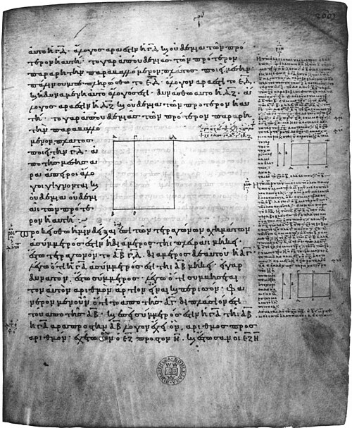

The Babylonian scribes who wrote YBC 7289 knew the diagonal of a square
to within a part in two million, and treated it as a number to be worked
out. Some time before 400 BC a Greek found that it could never be
worked out exactly. However finely you divide the side of a square, no
unit, however small, will measure both the side and the diagonal a whole
number of times. The two are _incommensurable_, and in modern terms the
**[square root of 2](kloom:e/square-root-of-2)** is not a ratio of whole numbers.

Who found it, and when, no one knows. **[Pythagoras](kloom:e/pythagoras)** settled at Croton in
southern Italy around 530 BC, and his followers held that numbers, by
which they meant whole numbers, lay at the heart of everything. The
discovery is credited to them. Thomas Heath, in 1908, gave it to
Pythagoras or his school. Wilbur Knorr, in 1975, read the same sources as
putting it between 430 and 410 BC, among later Pythagoreans, a century
after Pythagoras died.

## Odd and even

The proof is short. **[Aristotle](kloom:e/aristotle)** gave it, around 350 BC, as his example
of proving something by showing the opposite is impossible: "the diagonal
of the square is incommensurate with the side, because odd numbers are
equal to evens if it is supposed to be commensurate." Filled out, it runs
like this.

Suppose the diagonal and the side are as two whole numbers, _a_ to _b_,
taken as small as they can be, so that they are not both even. The square
on the diagonal is twice the square on the side, so _a_² = 2_b_². Then
_a_² is even, and so *a* is even, since an odd number squared is odd.
Write *a* = 2_c_. Then 4_c_² = 2_b_², so _b_² = 2_c_², and _b_ is even
too. Both are even, which is what we ruled out. No such pair exists.

This argument once stood in Euclid's _Elements_ as Book X, Proposition 117. Editors now print it in an appendix, as a later addition, and this
page from a manuscript of AD 888, now in the Bodleian Library in Oxford,
holds it. Its first line, in our translation, proposes "to prove that in
square figures the diagonal is incommensurable in length with the side."

The plate draws a second proof, in the form Tom Apostol published in 2000.
Swing the leg _AB_ of a right isosceles triangle about _A_ onto the
hypotenuse, at _D_, and raise a perpendicular at _D_ to meet _BC_ at _F_.
The triangle _FDC_ has the same shape, and its legs are the hypotenuse
less the leg. If the first triangle's sides were whole numbers, the second
one's would be whole numbers too, and smaller, and so on forever, as the
inset shows at four times the size. Whole numbers cannot shrink forever.
A test with 99 and 70, numbers chosen for the example, shows
how the descent breaks down:

| Hypotenuse | Legs | Next hypotenuse, 2 × leg − hypotenuse | Next legs, hypotenuse − leg |
| ---------: | ---: | ------------------------------------: | --------------------------: |
|         99 |   70 |                                    41 |                          29 |
|         41 |   29 |                                    17 |                          12 |
|         17 |   12 |                                     7 |                           5 |
|          7 |    5 |                                     3 |                           2 |
|          3 |    2 |                                     1 |                           1 |
|          1 |    1 |                                     1 |                           0 |

A triangle whose hypotenuse equals its leg is no triangle, so 99 to 70,
close as it is, is not the ratio. The pairs in the table, 1 and 1, 3 and
2, 7 and 5, are the "side and diagonal numbers" that the Pythagoreans used
to come ever closer to the root of two.

## Hippasus, and the sea

A story grew up around the discovery. Pappus, some seven centuries later,
says the knowledge of the irrational began among the Pythagoreans, and
that the one who first let the secret out drowned. Iamblichus tells it
several ways: in one it was **[Hippasus](kloom:e/hippasus)** of Metapontum who drowned, but for
revealing how to build the dodecahedron in a sphere. No ancient writer
says that Hippasus found the irrational. The murder at sea is a legend,
assembled from these later tellings.

## Beyond the root of two

What came after is better attested. **[Plato](kloom:e/plato)** named one of his dialogues
for **[Theaetetus](kloom:e/theaetetus-mathematician)**, and in it the young man says that his teacher **[Theodorus of
Cyrene](kloom:e/theodorus-of-cyrene)** "was writing out for us something about roots, such as the roots
of three or five, showing that they are incommensurable by the unit: he
selected other examples up to seventeen—there he stopped." Theaetetus
went on to the general rule, that the side of a square is commensurable
with the unit only if the square's area is a square number. It is Book X,
Proposition 9 of the _Elements_, and an ancient note in the margin credits
it to him.

The harder question was what a ratio could mean when there was no common
measure. **[Eudoxus of Cnidus](kloom:e/eudoxus-of-cnidus)**, in the fourth century BC, answered it
without numbers at all. In the definition Euclid kept as Book V,
Definition 5, _a_ is to _b_ as _c_ is to _d_ if, for every pair of whole
numbers _m_ and _n_, _m_ times _a_ is greater than, equal to or less than
_n_ times _b_ exactly when _m_ times _c_ is so against _n_ times _d_. It
works for any lengths, commensurable or not, and it inspired Richard
Dedekind's definition of the real numbers, published in 1872. For two thousand years it also steered Greek
mathematics toward geometry, where lengths could be compared without being
counted.

Euclid gathered all of it, from the odd-and-even argument to Eudoxus's
proportion, into the thirteen books of the _Elements_.
